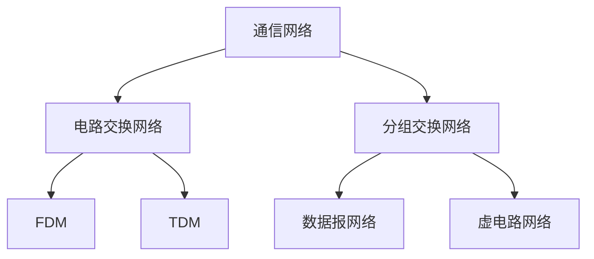

> [!warning] 杂糅了中科大（学习过程）与南大（考前复习）的课件而成的笔记，排版与质量可能不保证

## 1 Internet

### 1.1 具体构成角度

- **节点**
  - 主机及其上的应用程序
  - 路由器、交换机等网络交换设备
- **边**：通信链路
  - 接入网链路：主机连接到互联网的链路
  - 主干链路：路由器间的链路
- **协议**

数以亿计的、互联计算设备：

- 主机 = 端系统
- 在边缘运行着网络应用程序

分组交换设备：转发分组（数据块）

- 路由器，交换机，SDN 交换机

通信链路

- 光纤、同轴电缆、无线电、卫星
- 传输速率 = 带宽（bps）

网络

- 设备的结合，路由器、链路：被一些机构所管理

互联网：“网络的网络”

- 互联着的 ISPs

协议

- 控制着（各层）报文的发送和接收

### 1.2 协议

网络协议

- 标准：所有互联网中的通信行为都被协议所控制

> 协议定义了在两个或多个通信实体之间交换的**报文格式和次序**，以及在报文传输/接收或其他时间方面所采取的**动作**

### 1.3 从服务的角度

- 基础设施为应用提供服务
  - 远程应用借助基础设施提供的服务，交互报文，实现应用
- 为分布式应用提供编程接口
  - 允许发送/接收进程接到接口上，使用基础设施（互联网传输层）提供的服务
  - 有不同的服务，类似于邮政服务（面向连接、无连接）
  - 应用之间交互的方式：P2P、C/S

### 1.4 网络结构

- **网络边缘**
  - 主机
  - 应用程序（客户端和服务器）
- **网络核心**
  - 互联着的路由器
  - 网络的网络
- **接入网、物理媒体**
  - 有线或者无线通信链路

## 2 网络边缘

- 端系统（主机）
  - 运行应用程序
  - 如 Web、email
  - 在 “网络的边缘”

### 2.1 应用程序之间的通信模式

- 客户端/服务器模式（C/S）
  - 客户端主动向服务器发起请求
  - 服务器被动等待并响应客户端的请求
  - 主从关系
- 对等模式（P2P）
  - 很少甚至没有专门的服务器
  - 对等体既是客户端又是服务器

---

基础设施为应用程序提供的两种服务：

### 2.2 采用网络设施的面向连接服务

目标：在端系统之间传输数据

- 握手：在数据传输之前做好准备
  - 两个通信主机之间为连接建立状态
- **TCP：传输控制协议**（Transmission Control Protocol）
  - Internet 上面向连接的服务
- TCP 服务
  - 可靠地、按顺序地传送数据
    - 确认和重传
  - 流量控制
    - 发送方不会淹没接收方
  - 拥塞控制
    - 当网络拥塞时，发送方降低发生速率

使用 TCP 的应用：

- ==HTTP（Web）、FTP（文件传送）、 Telnet（远程登录）、SMTP（email）==

### 2.3 采用基础设施的无连接服务

目标：在端系统之间传输数据

- UDP：用户数据报协议（User Datagram Protocol）
  - 无连接（没有握手）
  - 不可靠
  - 无流量控制
  - 无拥塞控制

使用 UDP 的应用：

- ==流媒体、远程会议、DNS、Internet 电话==

## 3 网络核心

网络核心：路由器的网状网络

基本问题：数据怎么通过网络从源主机传输到目的主机？

- 电路交换
  - 为每个呼叫预留一条专有电路，如电话网
- 分组交换
  - 数据被分成分组
  - 分组从一个路由器传到相邻路由器（hop），一段段最终从源端传到目标端
  - 每段采用链路的最大传输能力（带宽）

### 3.1 电路交换

**端到端的资源被分配给从源端到目标端的呼叫**

- 独享资源，不同享
  - 每个呼叫一旦建立起来就能够保证性能
- 如果呼叫没有数据发送，被分配的资源就会被浪费
- 通常被传统电话网络使用

为呼叫预留端-端资源

- 链路带宽、交换能力
- 专用资源：不共享
- 保证性能
- 要求建立呼叫连接

网络资源（带宽）被分成片

- 为呼叫分配片
- 如果某个呼叫没有数据，则其资源片处于空闲状态（不共享）

将带宽分成片

- 频分（FDM）
- 时分（TDM）

**电路交换不适合计算机之间的通信**

- 连接建立时间长
- 计算机之间的通信具有突发性，若使用电路交换，浪费的片较多
  - 即使这个呼叫没有数据传递，其所占据的片也不能被其他呼叫使用
- 可靠性不高（单点故障）

### 3.2 分组交换

==以分组为单位**存储-转发**方式==

- 网络带宽资源不再分片，传输时使用全部带宽
- 主机之间传输的数据被分为一个个分组

资源共享，按序使用

- 存储-转发：分组每次移动一跳（hop）
  - 在转发之前，节点必须收到整个分组
  - 延迟比电路交换更大
  - 排队时间

**==被传输到下一个链路之前，整个分组必须到达路由器：存储-转发==**

在一个速率为 R bps 的链路上传输一个 L bit 的分组

- 存储转发延时 L/R s（整个分组都要到达）
- 经过 n 个链路（n-1 个路由器）就有 n 个存储转发延时

排队和延迟：

- 如果到达速率 > 链路的输出速率：
  - 分组将会排队，等待传输（排队延迟不确定）
  - 如果路由器的缓存用完了，分组将会被抛弃

路由：决定分组采用的从源到目标的路径

转发：将分组从路由器的输入链路转移到输出链路

### 3.3 电路交换 vs 分组交换

分组交换允许更多用户使用网络

- 1 Mb/s 的链路
- 每个用户
  - 活动时 100 kb/s
  - 10% 的时间活动（计算机通信具有突发性）

电路交换：最多支持 10 个用户

分组交换：

- 35 用户时，$>=10$ 个用户活动的概率为

$$1 - \sum_{k=0}^{9} \binom{35}{k} (0.1)^k (0.9)^{35-k}=0.004$$

---

> 分组交换是 “突发数据的胜利者？”

- 适合突发数据传输
  - 资源共享
  - 简单，不必建立呼叫
- 过度使用会造成网络拥塞：分组延迟和丢失
  - 对可靠地数据传输需要协议来约束：拥塞控制
- 怎样提供类似电路交换的服务？
  - 保证音频/视频需要的宽带

### 3.4 分组交换网络：存储-转发

分组交换: 分组的存储转发一段一段从源端传到目标端，按照有无网络层的连接，分成：

1. 数据报网络（无连接）：
   - ==分组的目标地址决定下一跳==
   - ==在不同的阶段，路由可以改变（"问路"）==
   - Internent
2. 虚电路网络（有连接）：
   - 每个分组都带标签（虚电路标识 VC ID），标签决定下一跳
   - ==在呼叫建立时决定路径，在整个呼叫中路径保持不变==
   - 路由器维持每个呼叫的状态信息
   - X.25 和 ATM

数据报（datagram）的工作原理

- 在通信之前，无须建立起一个连接，有数据就传输
- 每一个分组都独立路由（路径不一样，可能会失序）
- 路由器根据分组的目标地址进行路由

> 虚电路的工作原理（查每个节点的虚电路表）略

- 虚电路网络 “有连接”：不仅是端系统之间的连接，也是路由器（节点）之间的连接
- TCP “面向连接”：仅体现在源和目标端系统的 TCP 实体上，中间不维护连接状态

### 3.5 网络分类

## 4 接入网和物理媒体

怎样将端系统和边缘路由器连接

- 住宅接入网络
- 单位接入网络（学校、公司）
- 无线（移动）接入网络

### 4.1 接入网

#### 住宅接入：modem（已淘汰）

将上网数据**调制**加载音频信号上，在**电话线**上传输，在局端将其中的数据**解调**出来；反之亦然（复用电话线，运营商无需铺设新线路）

- 调频
- 调幅
- 调相位
- 综合调制

拨号调制解调器（modem）

- 不能同时上网和打电话；不能总是在线

#### digital subscriber line (DSL)

语音，数据在专享线路的不同频段传输

- 采用现存的到交换局 DSLAM 的电话线
  - DSL线路上的数据被传到互联网
  - DSL线路上的语音被传到电话网

#### 线缆网络

**有线电视信号线缆**双向改造

FDM: 在不同频段传输不同信道的数据，数字电视和上网数据（上下行）

- HFC（混合光纤同轴电缆）
- 线缆和光纤网络将个家庭用户接入到 ISP 路由器
- 各用户共享到线缆头端的接入网络
  - 与 DSL 不同，DSL 每个用户一个专用线路到 CO（central office）

#### 住宅接入：电缆模式

#### 家庭网络

#### 企业接入网络(Ethernet)

- 经常被企业或者大学等机构采用
  - 现在，端系统经常直接接到以太网络交换机上

#### 无线接入网络

- 各无线端系统共享无线接入网络（端系统到无线路由器）
  - 通过基站或者叫接入点
- 无线 LANs:
  - 建筑物内部 (100 ft)
  - 802.11b/g (WiFi)
- 广域无线接入
  - 由电信运营商提供 (cellular)，10’s km
  - 1 到 10 Mbps
  - 3G, 4G: LTE

### 4.2 物理媒体

Bit: 在发送-接收对间传播

**物理链路：连接每个发送-接收对之间的物理媒体**

导引型媒体:

- 信号沿着固体媒介被导引：同轴电缆、光纤、 双绞线

非导引型媒体:

- 开放的空间传输电磁波或者光信号，在电磁或者光信号中承载数字数据

双绞线 (TP)
  
- 两根绝缘铜导线拧合

#### 同轴电缆、光纤

- 同轴电缆
  - 双向
  - 基带电缆：
    - 电缆上一个单个信道
    - Ethernet
  - 宽带电缆：
    - 电缆上有多个信道
    - HFC
- 光纤和光缆：
  - 光脉冲，每个脉冲表示一个bit，在玻璃纤维中传输
  - **高速**：点到点的高速传输
  - **低误码率**：在两个中继器之间可以有很长的距离，不受电磁噪声的干扰
  - **安全**

#### 无线链路

- 开放空间传输电磁波，携带要传输的数据
- 无需物理 “线缆”
- 双向
- 传播环境效应：
  - 反射
  - 吸收
  - 干扰

无线链路类型:

- 地面微波
- LAN (e.g., WiFi)
- wide-area (e.g., 蜂窝)
- 卫星

## 5 Internet 结构和 ISP

> 前面的对 Internet 的划分按照节点和链路的类型：网络边缘、网络核心、接入网

### 5.1 互联网络结构：网络的网络

- 端系统通过**接入 ISPs**（Internet Service Providers）连接到互联网
- 接入 ISPs 是互联的
  - 任何两个端系统可相互发送分组到对方

将每两个 ISPs 直接相连？

- 不可扩展
- 需要 $O(N^2)$ 连接

选项: 将每个接入ISP都连接到全局ISP（全局范围内覆盖）

- 客户ISPs和提供者ISPs有经济合约

竞争：但如果全局ISP是有利可为的业务，那会有竞争者

合作：通过ISP之间的合作可以完成业务的扩展，肯定会有互联，对等互联的结算关系

然后业务会细分（全球接入和区域接入），区域网络将出现，用与将接入ISPs连接到全局ISPs

然后内容提供商网络 (Internet Content Providers, e.g. Google) 可能会构建它们自己的网络，将它们的服务、内容更加靠近端用户，向用户提供更好的服务，减少自己的运营支出

- 很多内容提供商可能会部署自己的网络，连接自己的在各地的 DC（数据中心），走自己的数据
- 连接若干local ISP和各级（包括一层）ISP，更加靠近用户

- 在网络的最中心，一些为数不多的充分连接的大范围网络（分布广、节点有限、
但是之间有着多重连接）
  - “tier-1” commercial ISPs (e.g., Level 3, Sprint, AT&T, NTT), 国家或者国际范围的覆盖
  - content provider network (e.g., Google): 将它们的数据中心接入ISP，方便周边用户的访问；通常私有网络之间用专网绕过第一层ISP和区域ISPs
- 松散的层次模型

**中心：第一层ISP**（如UUNet, BBN/Genuity, Sprint, AT&T）国家/国际覆盖，速率极高

- 直接与其他第一层ISP相连
- 与大量的第二层ISP和其他客户网络相连

第二层ISP: 更小些的 (通常是区域性的) ISP

- 与一个或多个第一层ISPs，也可能与其他第二层ISP

第三层 ISP 与其他本地 ISP

- 接入网 (与端系统最近)

---

ISP之间的连接：

- POP: 高层ISP面向客户网络的接入点，涉及费用结算
  - 如一个低层ISP接入多个高层ISP，多宿（multi home）
- 对等接入：2个ISP对等互接，不涉及费用结算
- IXP：多个对等ISP互联互通之处，通常不涉及费用结算
  - 对等接入
- ICP自己部署专用网络，同时和各级ISP连接

## 6 分组延时、丢失和吞吐量

分组丢失：

- ==分组到达链路的速率超过了链路输出的能力==
- ==分组到达时，如果没有可用的缓冲区，则该分组被丢掉==

### 6.1 四种分组延时

1. **节点处理延时**
   - 检查bit级差错
   - 检查分组首部和决定将分组导向何处
2. **排队延时**
   - 在输出链路上等待传输的时间
   - 依赖于路由器的拥塞程度
3. **传输延时**（推送完整一个分组）
   - R = 链路带宽（bps）
   - L = 分组长度（bits）
   - 将分组发送到链路上的时间 = L/R
   - 存储转发延时
4. **传播延时**
   - d = 物理链路长度
   - s = 在媒体上的传播速度（~ $2\times 10^8$ m/s）
   - 传播延时 = d/s

节点延时：$$d_{nodal} = d_{proc} + d_{queue} + d_{trans} + d_{prop}$$

---

> 原课件未提

排队延时取决于流量强度 La/R (a = 分组到达队列的平均速率)

$L \cdot a$：代表单位时间内到达队列的比特总数（入队速度）
$R$：代表单位时间内队列能处理的比特总数（出队速度）

- La/R -> 0: 排队延时小
- La/R -> 1: 排队延时大
- La/R > 1: 到达队列的速率超过了从该队列输出的速率，排队延时无限大

设计系统时流量强度不能大于 1

---

> Internet 的延时和路由：Traceroute 诊断程序

### 6.2 分组丢失

- 链路的队列缓冲区容量有限
- 当分组到达一个满的队列时，该分组将会丢失
- 丢失的分组可能会被前一个节点或源端系统重传，或根本不重传

（无限长的队列无意义 -> 排队延时无限大）

### 6.3 吞吐量

吞吐量: 在源端和目标端之间传输的速率（数据量/单位时间）

- 瞬间吞吐量: 在一个时间点的速率
- 平均吞吐量: 在一个长时间内平均值

端到端平均吞吐 $= min\{R_1, R_2, … , R_n\}$ (受限于瓶颈链路)

互联网场景的吞吐量

每个连接上的端到端吞吐: $min\{R_c, R_s, R/n\}$

## 7 协议层次及服务模型

### 7.1 层次化方式实现复杂网络功能

- 将网络复杂的功能分层为功能明确的层次，每一层实现了其中一个或一组功能，功能中有其上层可以使用的功能：服务
- 本层协议实体相互交互执行本层的协议动作，目的是实现本层功能，通过接口为上层提供更好的服务
- 在实现本层协议的时候，直接**利用了下层所提供的服务**
- 本层的服务：借助下层服务实现的本层协议实体之间交互带来的**新功能**（上层可以利用的）+ 更下层所提供的服务

**分层处理和实现复杂系统的好处**：

- 概念化：==结构清晰，便于标示网络组件，以及描述其相互关系==
- 结构化：模块化更易于维护和系统升级
  - ==改变某一层服务的实现不影响系统中的其他层次==

### 7.2 服务和服务访问点

- 服务：低层实体向上层实体提供它们之间的通信的能力
- 原语：上层使用下层服务的形式，高层使用低层提供的服务，以及低层向高层提供服务都是通过服务访问原语来进行交互的
- 服务访问点 SAP：上层使用下层提供的服务通过层间的接口
  - 地址：下层的一个实体支撑着上层的多个实体，SAP 有**标志不同上层实体**的作用
  - 例子：传输层的 SAP: 端口(port)

### 7.3 服务的类型

面向连接的服务和无连接的服务 —— 方式

- 面向连接的服务
  - 连接：两个通信实体为进行通信而建立的一种结合
  - 面向连接的服务通信的过程：建立连接，通信，拆除连接
  - 面向连接的服务的例子：网络层的连接被称为虚电路
  - 适用范围：对于大的数据块要传输；不适合小的零星报文
  - 特点：保序
  - 服务类型:
    - 可靠的信息流 传送页面(可靠的获得，通过接收方的确认)
    - 可靠的字节流 远程登录
    - 不可靠的连接 数字化声音
- 无连接的服务
  - 无连接服务：两个对等层实体在通信前不需要建立一个连接，不预留资源；不需要通信双方都是活跃
  - 特点：不可靠、可能重复、可能失序
  - IP分组，数据包；
  - 适用范围：适合传送零星数据；
  - 服务类型：
    - 不可靠的数据报 电子方式的函件
    - 有确认的数据报 挂号信
    - 请求回答 信息查询

### 7.4 服务和协议

- **服务与协议的区别**
  - ==服务：低层实体向上层实体提供它们之间的通信的能力，是通过原语来操作的，垂直==
  - ==协议：对等层实体之间在相互通信的过程中，需要遵循的规则的集合，水平==
- **服务与协议的联系**
  - ==本层协议的实现要靠下层提供的服务来实现==
  - ==本层实体通过协议为上层提供更高级的服务==

### 7.5 Internet 协议栈

- **应用层**: ==网络应用==
  - 为人类用户或者其他应用进程提供网络应用服务
  - FTP, SMTP, HTTP, DNS
- **传输层**: ==主机之间的数据传输==
  - 在网络层提供的端到端通信基础上，细分为==进程到进程==，将不可靠的通信变成可靠地通信
  - TCP, UDP
- **网络层**: ==为数据报从源到目的选择路由==
  - 主机到主机之间的通信，==端到端==通信，不可靠
  - IP, 路由协议
- **链路层**: ==相邻网络节点间的数据传输==
  - 相邻 2 点的通信，点到点通信，可靠或不可靠
  - 点对对协议 PPP, 802.11(wifi), Ethernet
- **物理层**: ==在线路上传送 bit==

各层次的协议数据单元（DU）

- 应用层：报文(message)
- 传输层：报文段(segment)：TCP段，UDP数据报
- 网络层：分组packet（如果无连接方式：数据报datagram）
- 链路层：帧(frame)
- 物理层：位(bit)

**封装与解封装**：

---

> 原课件补充

---

请归类：

– 属于网络边缘的是：A B E G
– 属于接入网络的是： D F H
– 属于网络核心的是： C I

A 笔记本电脑； B 手机； C 路由器；
D 双绞线；E 智能家具； F 无线路由器；
G 服务器； H 同轴电缆； I 交换机

---

电路交换（Circuit Switching）

1. 源端向目标端发送预留请求
2. 交换机在准入控制后创建电路
3. 源端发送数据
4. 源端发送拆除请求

- 预留机制在交换机内部建立一条“电路”

• 优点

- 性能可预测
- 交换简单/快速（一旦电路建立）

• 缺点

- 电路建立/拆除复杂
- 资源专用：流量突发时效率低
- 电路建立增加延迟
- 交换机故障 → 其电路也故障

分组交换（Packet Switching）

• 优点

- 高效利用网络资源
- 实现更简单
- 健壮：可以“绕开故障”路由

• 缺点

- 性能不可预测
- 需要缓冲区管理和拥塞控制

---

|  | 电路交换 | 数据报分组交换 | 虚电路分组交换 |
| --- | --- | --- | --- |
| **传输通路** | 专用 | 非专用 | 非专用 |
| **连续性** | 连续传输 | 分组传输 | 分组传输 |
| **带宽** | 固定 | 动态使用 | 动态使用 |
| **路由** | 固定 | 动态 | 固定 |
| **时延** | 实时（只有呼叫建立时延） | 分组传输时延 | 分组传输时延 + 呼叫建立时延 |
| **扩展性** | 差（接入用户有上限） | 好（用户数量可动态扩充） | 较好（用户数量动态，由拥塞控制来保证服务质量） |

---

- IP 是分层沙漏模型的窄腰

- 单一的网络层协议（IP）
- 允许任意网络互通
  - 任何支持 IP 的网络都可以交换分组
- ==将应用与底层网络技术**解耦**==
  - 应用可在所有网络上运行
- 支持 IP 之上和之下的同步创新
- 但改变 IP 本身很困难（如 `IPv4 → IPv6`）

分层的优缺点

- 为什么分层？
  - ==降低复杂性==
  - ==提高灵活性==
- 为什么不？
  - ==更高的开销==
  - ==跨层信息往往很有用==

---

