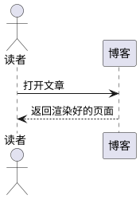
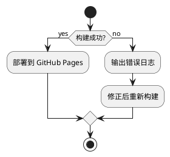
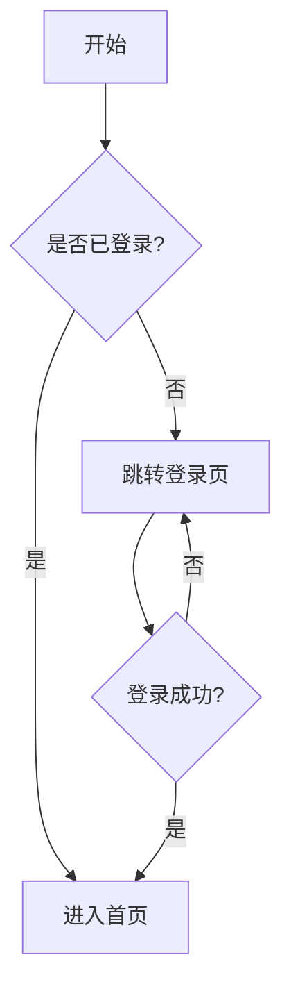
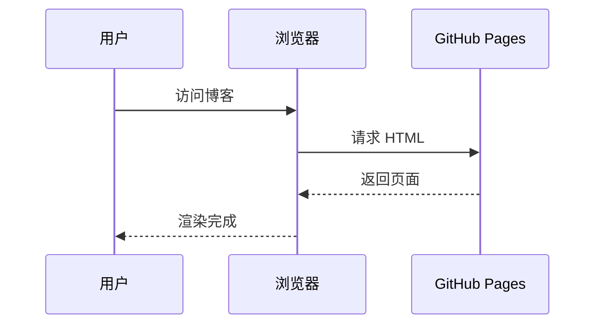

这是我的第一篇博客！这个站点是**完全自定义构建**的静态博客，不依赖任何博客框架。

## 荧光笔高亮

用 `==` 包裹文本即可实现荧光笔效果，例如：

- 这是 ==重要的内容==，请重点关注
- 代码里有一处 ==bug== 需要修复
- ==任何你想强调的句子== 都会变成荧光笔样式

## 提示框（MPE 风格）

支持 `[!note]` 等 9 种提示框类型，用 blockquote 语法书写：

> [!note] 备注
> 这是一个 note 类型的提示框，适合放补充说明。

> [!info]
> 没有标题的提示框也可以，正文直接写在标记下面。

> [!tip] 小技巧
> tip 类型通常用于给读者提供有用的建议。

> [!warning] 注意
> warning 类型用于提醒潜在的风险或注意事项。

> [!success] 完成
> 表示某个操作成功了。

> [!question] 疑问
> 提出问题或值得思考的点。

> [!example] 示例
> 展示一个具体例子。

> [!quote] 引用
> 放名人名言或需要强调的原话。

> [!important] 重要
> 非常重要的信息，比如安全提示。

## PlantUML 图

用 ` ```plantuml ` 代码块写 PlantUML 图，部署后会自动渲染为图片：



再画一个流程图：



## 普通代码块

```js
function hello(name) {
  console.log(`Hello, ${name}!`);
}
```

## 数学公式（MathJax）

行内公式用单个 `$` 包裹，例如 `$E = mc^2$` 是最著名的质能方程。

块级公式用 `$$` 包裹，自动居中显示：

$$ \int_{-\infty}^{+\infty} e^{-x^2} dx = \sqrt{\pi} $$

欧拉恒等式：

$$ e^{i\pi} + 1 = 0 $$

> [!note] 说明
> 公式内下划线不会触发 Markdown 斜体，`\$` 可转义为普通美元符号。

## Mermaid 图

用 ` ```mermaid ` 代码块画图，部署后自动渲染（跟随明暗主题）：



时序图：


