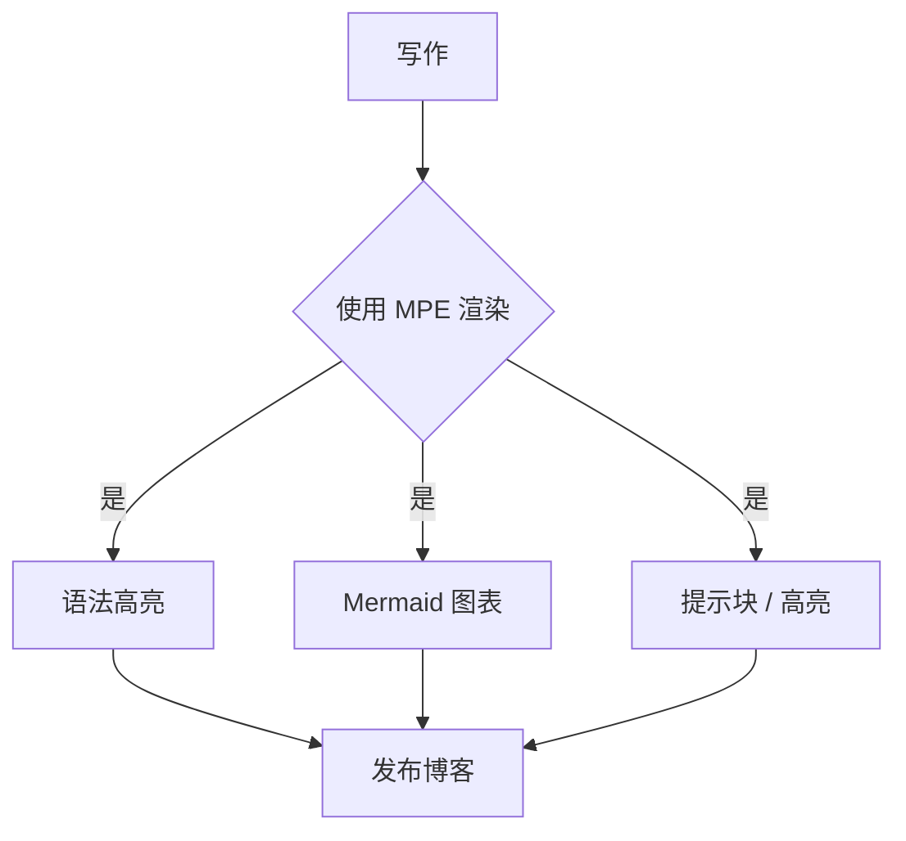

这是一段普通正文。你可以用 ==荧光笔高亮== 圈出重点，用 ~~删除线~~ 标记过时内容，还可以使用 ==第二种颜色的高亮== 来区分信息等级 —— 这正是 MPE 插件带来的写作体验。

> [!note] 📝 Note
> 这是 `[!note]` 提示块。MPE / Obsidian 风格的提示框会被渲染成带图标与底色的大块区域，适合补充说明。

## 一、带语法高亮的代码

代码块通过 highlight.js 渲染，支持 200+ 种语言。下面这段 Python 展示了一个带类型注解的斐波那契生成器：

```python
from typing import Generator


def fib(n: int) -> Generator[int, None, None]:
    """Generate the first n Fibonacci numbers."""
    a, b = 0, 1
    for _ in range(n):
        yield a
        a, b = b, a + b


if __name__ == "__main__":
    for i, v in enumerate(fib(10)):
        print(f"fib({i}) = {v}")
```

> [!tip] 测试一下看看
> 小技巧：把 Markdown 里的 `==高亮==` 渲染为 `<mark>` 标签，再配上 CSS，就能做出荧光笔效果。

## 二、Mermaid 图表

在 Markdown 中用 ````mermaid```` 围栏书写，即可渲染流程图、时序图、甘特图等。下面是一个内容发布流程图：



> [!warning] ⚠️ Warning
> 注意：Mermaid 依赖浏览器端 JS 渲染。若主题未开启 `startOnLoad`，需要手动调用 `mermaid.run()`。

## 三、列表与表格

列表与表格是技术文档的常客，排版时需要留意对齐与间距：

- 无序列表项一：内容排版的基础元素
- 无序列表项二：支持嵌套子项
  - 子项 A
  - 子项 B

1. 有序列表第一步：确定主题基调
2. 有序列表第二步：统一组件样式
3. 有序列表第三步：打磨排版细节

| 功能 | 支持 | Markdown 写法 |
| --- | --- | --- |
| 荧光笔高亮 | ✅ | `==文本==` → `<mark>` |
| 提示块 | ✅ | `[!note]` / `[!warning]` / `[!tip]` |
| Mermaid | ✅ | ````mermaid```` 围栏代码块 |
| 代码高亮 | ✅ | highlight.js / Prism |

> 「内容决定排版，排版影响阅读。好的主题应当让正文自己说话。」 —— 佚名

## 四、小结

这篇示例文章承载了博客最常用的元素：==正文排版==、==第二种颜色的高亮==、提示块、代码块、Mermaid 图表、列表与表格。把同一份内容套上 20 套不同的样式，就能直观对比每种风格的气质。