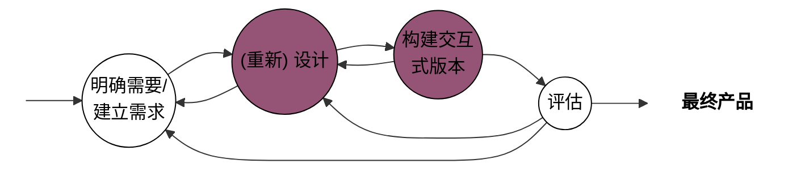
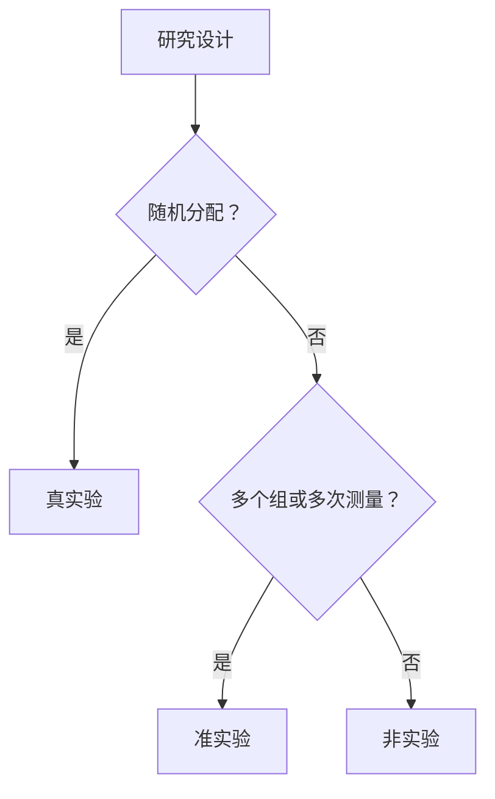

## 1 人机交互概述

### 什么是人机交互

人机交互是一门关注面向人类使用的==交互式计算系统的设计、评估与实现==，并==研究围绕这些系统的主要现象==的学科

#### HCI 的重要

- **市场角度**
  - ==用户期望简单==易用的系统
  - 对设计低劣系统的容忍度越来越差
- **企业角度**
  - 提高员工的==生产效率==
  - 降低产品的==开发成本==
  - 降低产品的==后续支持成本==
- **用户角度**
  - 获得较高的==主观满意度==
  - 减少时间、金钱、生命损失

#### HCI 相关领域

HCI 是**交叉学科**，连接了“人”（心理学、人类学、生理学）、“机”（计算机科学、工程学）和“环境/设计”（社会学、艺术设计、传播学）

### 人机交互的发展历史

#### 旧的交互形式作为特例保存下来

- **核心论点**：新的界面变革会包含旧的界面作为特例，旧交互方式有其存在的必要性。
- **原因**：
  1. 技术发展的包容性。
  2. 旧用户习惯的延续性。
  3. 特定场景下的有效性。
- **典型例子**：图形用户界面（GUI）普及后，命令行界面（CLI）依然作为高级功能或专业工具被保留和使用。

> - 批处理卡片
>   - 编写程序使用以 01 串表示的机器语⾔
> - 联机终端（命令⾏）
> - 图形用户界面（GUI）
>   - 优点：依ᩢ识别而非记忆
> - 未来的⼈机交互
>   - 多媒体界面
>   - 虚拟现实、语音交互、脑机交互

### 人机交互与软件工程

#### 前者是对后者的促进和补充

- **方法学比较**：软件工程师 ≈ 土木工程师；交互设计师 ≈ 建筑师
- **HCI 是软件工程人员需要掌握的核心知识领域之一**

#### 二者结合存在许多困难

- **结合困难**：二者在方法论、关注点上有本质差异

## 2 人机交互的基础知识

### 交互框架

#### 执行/评估活动周期 EEC

> 最有影响力的交互框架

活动的四个组成部分

- **目标 ≠ 意图**（单个目标可对应多个意图，“删除” -> “菜单删除”、“按钮删除”）
- **执行**
- **客观因素**
- **评估**

- EEC 七个阶段：1-4 执行阶段，5-7 评估阶段

EEC 模型可解释为什么有些界面的使用存在问题

- **执行隔阂**
  - 用户为==达目标而制定的动作==与==系统允许的动作==之间的差别
  - *我想做这件事，但我不知道在这个界面上该怎么操作。*
- **评估隔阂**
  - 系统状态的==实际表现==与==用户预期==之间的差别
  - *我操作完了，但界面目前的反馈让我搞不清到底成功了没有，或者系统现在到底处于什么状态。*

### 交互形式*

#### 1. 直接操纵

直接操纵是指用户通过在屏幕上直接与视觉对象进行物理上的互动（如点击、拖拽、滑动等），而不是通过输入复杂的代码或命令来完成任务。

* **核心特征**：
  * **对象可见性**：用户感兴趣的对象和动作始终以图形化的方式显示在界面上。
  * **即时反馈**：用户的每一个操作都会立即在界面上产生可见的响应（如拖动物体时，物体跟着鼠标移动）。
* **操作可逆性**：动作通常是渐进的、可逆的（如随时可以撤销或把拖出去的文件放回原处）。

- **典型例子**：在桌面上将一个文件**拖拽**到另一个文件夹中；在手机地图上用双指**捏合**来缩放地图；在画图软件中**拉伸**图形的边缘来改变大小。

* **优点**：学习成本极低，符合人类直觉，容易产生沉浸感和掌控感。

#### 2. 隐喻

界面隐喻是指将真实世界中人们已经熟悉的物理对象、动作或概念，借用到计算机软件界面中，以帮助用户快速理解系统的功能和操作逻辑。

* **核心特征**：
  * **利用先验知识**：通过唤起用户在现实生活中的记忆，降低学习新系统的认知门槛。
  * **建立心智模型**：让用户潜意识里知道“这个东西该怎么用”。

- **典型例子**：
  * **“桌面”隐喻**：操作系统的主界面被称为“桌面”，上面有“文件夹”、“文件”和“回收站”。
  * **“购物车”隐喻**：电商网站用手推车图标表示待结算的商品集合。
  * **“书架”隐喻**：电子书阅读器将电子书排列在木纹质感的虚拟书架上。

* **优点**：能极大地消除用户对陌生软件的恐惧感，让复杂的技术概念变得易于理解。

#### 3. 问答

问答式交互（有时也称为对话式或向导式交互）是一种由系统主导的、一步一步进行的交互过程。系统提出问题或给出选项，用户输入答案或做出选择，然后系统根据输入进入下一步。

* **核心特征**：
  * **系统主导**：交互的节奏和路径由计算机控制。
  * **单步线性**：通常一次只关注一个特定的决策或信息输入。

- **典型例子**：
  * **安装向导 (Wizards)**：安装软件时经常遇到的“下一步、下一步”流程，系统会询问安装路径、是否创建桌面快捷方式等。
  * **命令行提示**：如终端中提示 `Do you want to continue? [Y/n]`。
  * **调查问卷/表单**：系统抛出特定问题，用户填空或单选。

* **优点**：对新手极其友好，能够防止用户在复杂操作中迷失方向，非常适合那些偶尔执行且必须保证正确率的任务（如系统配置、网络重置）。

### 信息处理模型

#### 人类处理机模型

- 包含三个交互式组件：
  - **感知处理器**：信息将被输出到==声音存储==和==视觉存储==区域
  - **认知处理器**：输入将被输出到==工作记忆==
  - **动作处理器**：执行动作
- 存在的问题：
  - 把认知过程描述为一系列处理步骤
  - 仅关注单个人和单个任务的执行过程
    - 忽视了复杂操作执行中人与人之间及任务与任务之间的互动
  - ==忽视了环境和其他人可能带来的影响==

#### 格式塔心理学

1. **相近性原则**：空间上比较靠近的物体容易被视为整体

- 应用：让界面层次清晰有序（列表页设计，组间界限，组内靠拢）

2. **相似性原则**：习惯将看上去相似的物体看成一个整体

- 应用：使用==不同的大小、颜色、形状来创建对比==或视觉权重，呈现出不一样的视觉效果，以达到弱化（降低视觉）或凸显（强化视觉）某些内容

3. **连续性原则**：共线或具有相同方向的物体会被组合在一起

- 应用：将组件**对齐**，更有助于增强用户的主观感知效果

4. **对称性原则**：相互对称且能够组合为有意义单元的物体会被组合在一起

5. **完整和闭合性原则**：人们倾向于忽视轮廓的间隙而将其视作一个完整的整体

- 应用：页面上的==空白可帮助实现分组==

#### 记忆特性

| 记忆类型 | 持续时间 | 容量 | 特点 |
|----------|----------|------|------|
| **感觉记忆** | ≈1秒 | — | 瞬时记忆；帮助组合连续图像产生动态影像 |
| **短时记忆** | ≈30秒 | **7±2个信息单元** | 工作记忆；信息加工系统核心；类比为计算机内存 |
| **长时记忆** | 几乎永久 | 几乎无限 | 需要与已有信息建立联系才能进入 |

##### 7±2法则与交互设计
- ❌ 误解：菜单中最多只能有7个选项
- ✅ 事实：浏览菜单基于**识别**功能，人们识别事物的能力远胜于回忆
- **设计启发**：尽可能减小对用户的记忆需求；通过上下文减少信息单元数目

##### 遗忘与错误
- 遗忘 = 长时记忆某些信息无法提取（不代表信息丢失）
- "人为错误"定义：人未发挥自身所具备的功能而产生的失误
- **大部分交互问题都源于系统设计本身！**

## 3 交互设计目标与原则

### 可用性目标

| 属性 | 核心要点 |
|------|----------|
| **易学性** | 使用系统的难易；"10 分钟法则"；对应学习曲线开头 |
| **易记性** |  5 个影响因素：意义、位置、分组、惯例、冗余 |
| **高效率** | 用户熟练后（曲线平坦）应具更高的生产力水平 |
| **效用性** | 产品是否提供了正确的功能让用户做需要/想做的事 |
| **安全性** |避免危险和不好情形；提供出错恢复方法 |

> 安全菜单：保存 和 退出 不能放在一起

### 用户体验目标

- 用户体验目标是多样性的，涵盖了一系列情绪和感受体验

> 在特定的时间和地点使用或与一个产品交互时，选择传达用户的感受、目前状态、情绪、感觉等最佳词汇的过程，可以帮助设计者了解用户体验的多面性变化性的本质

> 一张表格，表名为 “用户体验好和不好的方面”，表头为 “好的方面”，内容有 “满意的、有趣的、迷人的...”

**体验和可用性的关系**

- 体验：主观；可用性：客观
- 矛盾性
  - 许多玩家喜欢找最具挑战、非简单的游戏：违反可用性
- 有些可用性和用户体验目标是不兼容的
  - 既安全又有趣的过程控制系统
- 认识和理解可用性和其他用户体验目标之间的关系是交互设计的核心

### 简易可用性工程

- 以**提高产品的可用性为目标**的先进的产品开发方法论
- 强调**以人为中心来**进行交互式产品的设计研发

#### 可用性度量*

| 核心维度 | 核心关注点 | 常见度量指标 | 数据收集方式 |
| --- | --- | --- | --- |
| **有效性** | 用户能否准确、完整地达成既定目标 | 任务完成率、错误率、任务结果质量 | 系统日志、可用性测试观察 |
| **效率** | 成功达成目标所消耗的资源与精力 | 任务耗时、点击/交互次数、达到熟练的学习时间 | 计时记录、点击流分析 |
| **满意度** | 用户在使用前、中、后的主观感受与态度 | SUS整体可用性得分、SEQ单题难度评分、NPS净推荐值 | 标准化问卷、用户访谈 |

####  四种主要技术

- **用户和任务观察**
  - 直接与用户接触
- **场景**
  - 使用简单的==原型工具==
  - 水平原型：减少功能的深度并获得界面的表层
  - 垂直原型：减少功能的数量而对所选功能进行完整实现
- **边做边说** ⚠️
  - 让真实用户在使用系统执行一组特定任务的时候，讲出他们的所思所想
  - **最有价值的单个可用性工程方法**
  - ==可了解用户为什么这样做（原因）==，并确定其可能对系统产生的误解
  - 实验人员需要不断地提示用户，或请他们事先观摩
- **启发式评估** ⚠️
  - *涉及一些定量的问题（5 个专家发现 80% 的可用性问题）*
  - 能够发现许多可用性问题
  - 为==避免个人的偏见，应当让多个不同的人==来进行经验性评估

###  交互设计原则

#### 十条启发式原则

| 编号 | 规则 | 说明 |
|------|------|------|
| 1 | **系统状态的可见度** | 长于3-5秒的操作需显式反馈（==进度条==等） |
| 2 | **系统和现实世界的吻合** | 使用==用户熟悉的词汇和概念== |
| 3 | **用户享有控制权和自主权** | 提供==撤销/重做/返回==方法 |
| 4 | **一致性和标准化** | ==术语一致==、无歧义图标、颜色/布局/字体一致 |
| 5 | **避免出错** | 从设计层面预防用户出错 |
| 6 | **依赖识别而非记忆** | 减少用户记忆负担 |
| 7 | **使用的灵活性和高效性** | 新手、专家、老年人 |
| 8 | **帮助用户识别、诊断和恢复错误** | ==错误信息用通俗语言==，精确指出问题并建议解决方案 |
| 9 | **帮助和文档** | 提供帮助/手册，使用简单标准化术语 |
| 10 | **审美感和最小化设计** | 不过多不相关信息；标准控件；适合屏幕显示的字体 |

#### 黄金规则

| 编号 | 规则 | 核心要点 |
|------|------|----------|
| 1 | **尽可能保证一致** | 最容易被违背的原则；相似操作下一致的动作序列、术语、颜色、布局 |
| 2 | **符合普遍可用性** | 专家用户→快捷键；新手用户→引导性帮助 |
| 3 | **提供信息丰富的反馈** | 常用操作反馈简短，不常用操作反馈丰富 |
| 4 | **设计说明对话框以生成结束信息** | 让用户知道任务完成；产生满足感和轻松感 |
| 5 | **预防并处理错误** | 灰色屏蔽不适当选项；提供有建设性的恢复指导 |
| 6 | **让操作容易撤销** | 减轻焦虑，鼓励尝试新选项 |
| 7 | **支持内部控制点** | 用户是主动者而非响应者；避免模态对话框 |
| 8 | **减轻短时记忆负担** | 界面简单、风格统一、减少窗口移动 |

## 4 交互设计过程

## 5 交互式系统的需求

### 产品特性

| 维度 | 说明 |
|------|------|
| **功能** | 智能冰箱提示牛奶用完；字处理器支持多种格式 |
| **物理条件** | 移动设备应尽可能小，屏幕显示限制 |
| **使用环境** | 物理环境（采光/噪音/尘土）、社会环境（共享/同步/异步）、组织环境（支持/培训）、技术环境（平台/兼容性） |

### 用户特性

##### 1. 体验水平差异

| 用户类型 | 特点 | 设计要点 |
|----------|------|----------|
| **新手用户** | 敏感，容易在开始有挫折感 | 不能让新手状态成为目标；学习过程快速有针对性；向导对话框；菜单项解释性 |
| **中间用户** | 数目最多、最稳定、最重要；需要工具；知道如何使用参考资料 | **工具提示**是最适合的习惯用法；在线帮助是极佳工具；常用工具放在前端和中心 |
| **专家用户** | 对缺少经验的用户有异乎寻常的影响；欣赏更新更强大的功能 | 快速访问经常使用的工具集 |

**核心设计目标**：让新手快速无痛苦成为中间用户；避免为想成为专家的用户设置障碍；让中间用户感到愉快

##### 2. 年龄差异
- **老年人**：65岁以上多数有某种残疾；设计必须清楚、简单且容许出错；利用冗余
- **儿童**：让他们参加设计很重要；允许多种输入模式（触觉/手写）；冗余显示增强体验

##### 3. 文化差异
- 符号：√ 和 X 在不同文化有不同意思
- 姿势：点头 vs 摇头
- 颜色：红色和绿色在不同国家意味不同
- 解决方案：通过冗余阐明特定颜色的指定意义

##### 4. 健康差异
- 视觉损伤：辅以声音和触觉
- 听觉损伤：给听觉内容加文字描述
- 身体损伤：语音输入输出、姿势和眼球移动跟踪
- 语音损伤：合成语音和基于文本的通信
- 诵读困难：拼写更正、一致性导航结构和清晰标识

### 用户建模 ⚠️

#### 人物角色

##### 定义

- 不是真实的人
- 基于观察到的真实人的行为和动机，在整个设计过程中代表真实的人
- 在人口统计学调查收集到的实际用户行为数据基础上形成的**综合原型**

##### 作用（解决3个设计问题）
1. **弹性用户**：为弹性用户设计赋予开发者按自己意愿编码的许可
2. **自参考设计**：设计者将自己的目标、动机、技巧及心智模型投射到产品中
3. **边缘情况设计**：必须考虑边缘情况，但它们不应成为设计关注点

##### 建模过程

- **拼凑**：头脑风暴，产生一些零碎概念或模型的片段，先不考虑细节
- **组织**：将这些片段进行分组和分类，归并或删除那些冗余
- **细节**：建立和完善相应描述，补充遗漏的数据
- **求精**：对模型进行推敲，以便改进和完善
- 以上过程循环反复

### 需求获取、分析和验证

#### 观察和场景（==需求获取==）

##### 直接观察 vs 间接观察

- 直接观察：陪同用户工作直接获得信息（可能影响日常活动）
- 间接观察：用==视频/录音==获得信息（观察者更舒适）

##### 场景

- 定义：表示任务和工作结构的 "非正式的叙述性描述"
- 形式：类似故事、小品或按时间顺序的情节
- "讲故事" 是人们解释自己做什么的最自然方式
- 场景焦点：用户希望达到的目标

> [!info] 人物角色 + 场景剧本 → 需求
> |需求定义的 5 个 步骤 | 内容 |
> |------|------|
> | **1. 创建问题和前景综述** | 问题综述反映需要改变的情况；前景综述是问题综述的倒置 |
> | **2. 头脑风暴** | "说反话"；去除成见；开放灵活；不受约束不评判 |
> | **3. 确定人物角色期望** | 态度/经历/渴望；对产品体验的期待；数据基本单元认知 |
> | **4. 构造情境场景剧本** | 关注人物角色活动及心理模型和动机；广而浅；高层次描述 |
> | **5. 确立需求** | 数据需求（对象和信息）、功能需求（操作）、其他需求 |
> 
> 迭代的过程，直到需求变得稳定

#### 层次化任务分析 HTA（需求分析）

> 把任务分解为若干子任务，再进一步分解为更细致的子任务，之后组织成 "执行次序"

##### 文字和图形描述

终止规则

- 任务包含复杂机械响应的地方
  - 如鼠标移动 → 分解无价值，终止
- 涉及内部决断的地方：
  - 若决断和外部动作相关 → 分解
  - 若为纯粹认知性 → 终止

#### 原型（==需求验证==）

##### 原型的重要性

- ==评估和反馈==是交互设计的核心
- ==用户==不能准确描述需要，但==看到后就能立即知道不需要什么==
- 与文档相比，涉众==更容易与原型交互==
- 团队成员能==有效沟通==

##### 低保真原型 vs 高保真原型

| 维度 | 低保真原型 | 高保真原型 |
|------|-----------|-----------|
| **相似度** | 与最终产品不太相似 | 与最终产品更为接近 |
| **材料** | 不同材料（纸张、纸板） | 相同材料 |
| **优点** | 简单、快速、便宜、易于制作修改 | 更真实地体验交互 |
| **缺点** | 不能完全展示交互 | 制作时间长、难以修改、风险 |
| **地位** | **多数项目的首选** | — |

##### 低保真原型形式

- **草图**：每张卡片代表一个屏幕或屏幕的一部分（常用于网站开发）
- **故事板**：一系列草图展示用户如何使用设备完成任务（通常与场景一起使用）
- **绿野仙踪法(Wizard-of-Oz)**：用户认为与计算系统交互，实际是开发人员响应

## 6 交互式系统的设计

### 设计框架

| 步骤 | 名称 | 核心内容 |
|------|------|----------|
| 1 | 定义**外形因素和输入方法** | 设计什么样的产品？产品输入方法？取决于外形和人物角色的能力喜好 |
| 2 | 定义**功能和数据**元素 | 数据元素（基本主体）+ 功能元素（操作工具）；用场景剧本检验 |
| 3 | 决定**功能组合**层次 | 哪些元素需要大片区域、一起使用、相邻放置 |
| 4 | 勾画**大致设计框架** | **方块图阶段**：粗略方块图表达每个视图，加标签和注解 |
| 5 | 构建**关键情景场景剧本** | 描述人物角色最频繁使用界面的主要路径，重点在任务层（可用故事版） |
| 6 | 通过**验证性场景剧本**检查设计 | "如果怎样，将怎样"；关键线路变种；必须使用场景；边缘情形场景 |

### 简化交互设计策略

#### 策略一：删除

> 最明显的简化设计方法

**如何删除？**

- **关注核心**：与新增功能相比，客户更关注基本功能的改进
- **砍掉残缺功能**：警惕 "沉没成本误区"
  - 反问 "为什么要留着它？" 而非 "为什么应该去掉它"
- **不盲目假设用户需求与盲从用户要求**

**删除视觉混乱**：

- 使用空白或轻微背景划分页面，不要使用线条
- 尽可能少使用强调，别使用粗黑线
- 控制信息层次：标题 → 子标题 → 正文
- 减少元素大小和形状的变化

**删减文字**：

- 删除引见性文字
- 删除不必要的说明
- 删除繁琐的解释
- 使用描述性链接（非"单击这里"/"更多内容"）

**精简句子**：让文字变得更加简洁、清晰、有说服力

**不要删减过多**：人们希望自己能够掌控局面（启发式原则）

#### 策略二：组织

> 最快捷的简化设计方式

- **分块："7 ± 2 法则"**
  - 名词：可按字母表、时间或空间顺序排列
  - 动词：围绕行为进行组织
- 确定清晰的**分类**标准（多找用户询问分类标准）
- 利用不可见的网格对齐界面元素
- 大小和位置：
  - 重要元素要大一些
  - 相似元素放在一起
- 感知分层：眯起眼睛观察能否区分不同层
- 期望路径：不要被自己规划图中清晰的线条和整洁的布局所迷惑

#### 策略三：隐藏

> 低成本简化方案

- 隐藏什么：主流用户很少使用但需要更新的功能、细节、选项和偏好、特定地区信息
- **自定义**：一般不应让用户自定义软件
  - 费时，除非被自定义者简单
- **渐进展示**：核心功能 + 扩展功能模式；比自定义效果好
  - 对于用户期望的功能，要在正确的环境下给出明确的提示
- **适时出现**：尽可能彻底隐藏；在合适时机、合适位置显示
- **让功能易于发现**：为隐藏功能打上标签（更多/高级）；标签位置比大小重要

#### 策略四：转移

- **在设备之间转移**：利用两个平台优势各司其职（移动 vs 桌面）
- **把复杂的工作留给用户**：让用户创建文件夹并自由命名，每个用户做适合自己的规划
- **用户擅长的事情**：搞清楚什么交给计算机，什么留给用户
- **菜刀与钢琴**：简单界面的最高境界 —— 专家和主流用户都感觉好用

### 设计中的折中

| 主题 | 要点 |
|------|------|
| **个性化 vs 配置** | 个性化：人们喜欢改变使之适合自己，必须简单易用、可预览、易撤销 |
| **本地化 vs 国际化** | 国际化=与特定语言及地区脱钩（做一次）； 本地化=加上与特定区域相关的信息（各做一次） |
| **审美 vs 实用** | 漂亮界面不一定好；先实现良好基本布局，再改进美学效果 |

### 细节

#### 让软件体贴

- 有趣的用语
- 直直白白（反例：安装容易卸载难）

#### 加快响应时间

- 利用程序空闲时间：对用户可能操作作出假设

#### 减轻记忆负担

- 两类记忆：和软件操作相关、和领域知识相关
- 好的软件通过==回忆用户上次行为预测用户可能的操作==
- ==使用用户以前的设置作为默认值==

#### 减少等待感

- 以反馈让用户了解操作进度和状态（如进度对话框）
- 以渐进方式呈现处理结果
- 给用户分配任务分散注意力
- 减低用户期望值

#### 交互设计模式

- **模式定义**："模式就是某个情形下某个问题的解决方案"
- ==模式捕捉的是良好设计中不变的特性==，具体实现取决于环境和设计者创造性
- 模式==不是拿来即用的==商品，每次运用都有所不同
- 主导航模式、二级导航模式
- **轮播模式**：优点（充分使用屏幕空间、当前信息清晰可见）；缺点（用户几乎不使用、通常仅关注第一幅画面）

## 7 交互设计模型与理论

### 预测模型

- 不需要对用户做实际测试即可预测执行情况
- 特别==适合于无法进行用户测试的情形==

| 模型 | 关注方面 |
|------|----------|
| GOMS | 认知-动作型任务如何执行，任务多层次细化 |
| KLM | 任务性能的时间方面（仅时间） |
| Fitts 定律 | 使用定位设备指向目标的时间 |

#### GOMS

##### 全称与含义

| 字母 | 全称 | 含义 |
|------|------|------|
| **G** | Goal（目标） | 用户要达到什么目的 |
| **O** | Operator（操作） | 任务执行的底层行为，不能分解（如点击鼠标） |
| **M** | Method（方法） | 如何完成目标的过程（子目标序列+所需操作） |
| **S** | Selection（选择规则） | 确定当有多种方法时如何选择（选择不是随机的） |

##### 方法步骤

1. 选出最高层的用户目标
2. 写出具体的完成目标的方法（激活子目标）
3. 写出子目标的方法（递归分解到最底层操作）
4. 子目标关系：顺序关系、选择关系（以select引导）

#### 优缺点

- **优点**：容易对不同界面或系统进行比较分析
- **局限性**：
  - 设用户完全按正确方式进行交互，没有错误处理
  - ==只针对不犯任何错误的专家用户==
  - 任务间关系描述过于简单
  - 忽略了用户间的个体差异

#### KLM（击键层次模型） ⚠️

##### 定义

对用户执行情况进行**量化预测**，仅涉及任务性能的一个方面：**时间**

##### 用途

预测无错误情况下专家用户在给定输入前提下完成任务的时间

##### 执行时间公式

$T_{execute} = T_K + T_P + T_H + T_D + T_M + T_R$

##### 操作符

##### 编码举例

- **DOS下执行 ipconfig 命令**：
  - M K[i] K[p] K[c] K[o] K[n] K[f] K[i] K[g] K[回车]
  - M9K[ipconfig回车]（简略表达）
  - $T_{execute} = 1.35 + 9×0.28 = 3.87s$
- **菜单选择**：
  - H[鼠标] M P[网络连接图标] P1[右键] P[修复] P1[左键]
  - $T_{execute}= 0.40 + 1.35 + 2P + 2K = 4.35s$

举例：替换文字编辑器中长度为5个字符的单词  

- 任务准备 `M`  
- 将手放在鼠标上 `H_{mouse}`  
- 将鼠标移到单词 `P_{word}`  
- 选择单词 `P_1 P`  
- 回到键盘 `H_{keyboard}`  
- 准备键入 `M`  
- 键入新的5字符单词 `5K_{word}`  

$T_{execute} = 2M + 2H + P + P_1 + P + 4K$  
$\quad = 2.70 + 0.80 + 1.10 + 0.20 + 1.10 + 0.88 = 6.78\text{s}$

##### 放置 M 操作符的启发规则

| 规则 | 说明 |
|------|------|
| **规则1** | 在每一步需要访问长时记忆区的操作前放置一个 M |
| **规则2** | 在==所有 K 和 P 之前放置 M==：K→MK; P→MP（初始规则） |
| **规则3** | ==删除键入单词或字符串之间的 M==：MKMKMK → MKKK |
| **规则4** | ==删除复合操作之间的M==：MPMP₁ → MPP₁（如选中 P 和点击 P₁） |

##### KLM 分析的局限

没有考虑：错误、学习性、功能性、回忆、专注程度、疲劳、可接受性

#### Fitts 定律 ⚠️

##### 定义

- 预测使用某种定位设备指向某个目标的**时间**

##### 核心公式

**困难指数**：$ID = log₂(A/W + 1)$

- $A$：运动距离/振幅（Amplitude）
- $W$：目标宽度（Width）
- $ID$ 单位：比特(bits)

**运动时间**：$MT = a + b \cdot ID$

- $a$ 和 $b$ 由经验数据确定，与设备相关
- 一般计算：$a=50ms, b=150ms$
- $MT$ 单位：秒

##### 三个部分
| 部分 | 公式 | 含义 |
|------|------|------|
| ID（困难指数） | $log₂(A/W+1)$ | 对任务困难程度的量化 |
| MT（运动时间） | $a + b \cdot ID$ | 在 ID 基础上将完成时间量化 |
| IP（性能指数） | $ID/MT$ (bits/sec) | 基于 MT 和 ID 的关系，也称吞吐量 |

##### Fitts 定律的建议

1. 大目标、小距离具有优势
2. 屏幕元素应该尽可能多地占据屏幕空间
3. 最好的像素是光标所处的像素
4. 屏幕元素应尽可能利用**屏幕边缘的优势**
5. 大菜单（如饼型菜单）比其他类型的菜单使用简单

##### 应用策略

- **策略一：缩短当前位置到目标区域的距离**（如右键菜单技术）
- **策略二：增大目标大小以缩短定位时间**

#### 各自的适用场合

##### 1. GOMS模型

**适用场合**：

* **系统或界面的比较与评估**：能够非常容易地对不同的界面或系统设计进行比较分析
* **认知与动作任务分解**：适用于采用“分而治之”的思想，将任务进行多层次细化并计算完成时间
* **专家用户预测**：仅适用于针对**不犯任何错误的专家用户**进行预测，它假设用户完全按照一种正确的方式进行交互

**不适用场合**：

- 不适合用于需要考虑错误处理过程、任务之间关系过于复杂，或需要考虑用户间个体差异的场景 。

##### 2. 击键层次模型 (KLM)

**适用场合**：
* **纯时间的量化预测**：专门用于预测**无错误情况下，专家用户**在给定的输入前提下完成特定任务所需的时间 。
* **方案选优与系统比较**：非常便于比较不同的系统设计，能够帮助设计者确定何种方案能最有效地支持特定任务 。
* **底层物理和心理操作计算**：适用于能够将任务拆解为具体的击键（K）、指向（P）、心理准备（M）等底层操作符，并累加时间的场景 。

**局限性**：

- 错误、学习性、功能性、回忆、专注程度、疲劳、可接受性

#### 3. Fitts 定律

**适用场合**：

* **指向性运动任务的==时间预测==**：适用于量化和预测用户完成“目标指向”运动（如移动鼠标到屏幕某处）所需的时间（MT）。
* **量化任务==困难程度==**：适用于评估由于目标大小（宽度 W）和移动距离（振幅 A）带来的任务困难指数（ID）。
* **界面布局与元素==大小设计==**：指导设计者如何合理安排界面元素（例如解释了汽车刹车踏板为何比油门大且距离近的原因），即用于探讨距离和目标宽度对操作效率的具体影响 。

## 8 评估的基础知识

> 评估是设计过程的组成部分

### 评估范型和方法

#### 评估范型

##### 快速评估

- **可以在任何阶段进行**
- 强调 “快速了解”，而非仔细记录研究发现，得到的数据通常是非正式的、叙述性的
- 是设计网站时常用的方法
- 基本特性：快速

##### 可用性评估

> 可用性测试（用户测试，DECIDE 评估框架）

- 评估典型用户执行典型任务时的情况，包括**出错次数、完成任务的时间**等
- 基本特征：是在评估人员的密切控制下实行的
- 主要任务：量化表示用户的执行情况
- 缺点：
  - 测试用户的数量通常较少
  - 不适合进行细致的数据分析

##### 实地研究

- 基本特征：在自然工作环境中进行
- 目的：理解用户的实际工作情形以及技术对他们的影响
- 重难点：如何不对受试者造成影响；控制权在用户，很难预测即将发生和出现的情况

##### 预测性评估

- 研究人员通过想象或对界面的使用过程进行建模，逐步通过场景或基于问题回答的走查法
- 基本特征：==用户可以不在场，整个过程快速、成本较低==
- 启发式评估属于预测性评估

### 🔬 实证研究方法

#### 研究假设
- **零假设(H₀)**：不同实验条件不会产生差异
- **备择假设(H₁)**：与零假设相反的陈述
- 实验目标：找到统计学证据反驳零假设，支持备择假设
- 好的假设特点：精确清晰、专注于单次可检验问题、明确实验条件

> H0：下拉菜单和弹出菜单在用户满意度评价上没有差异
> H1：下拉菜单和弹出菜单在用户满意度评价上存在差异

#### 自变量 vs 因变量

| 变量类型 | 定义 | 典型例子 |
|----------|------|----------|
| **自变量** | 研究者感兴趣的因素，变化的可能 "原因" | 技术类型、设计类型、设备类型 |
| **因变量** | 研究者感兴趣的结果/效果 | 效率、准确性、主观满意度、易学性、易记性 |

- 自变量至少需要 2 个不同取值（取值称为实验条件）
- “自”：自变量与受试者的行为无关，参与者无法对自变量施加任何影响
- “因”：因变量依赖于受试者的行为或自变量的变化

#### 实验构成三要素

- 实验条件：需要比较的不同技术/设备/程序
- 实验单位：应用实验条件的对象（通常是具有特定特征的人类受试者）
- 分配方式：将实验单位分配到不同实验条件的方式（强调**完全随机化**）

### 📐 实验设计

> 控制条件 vs 对照条件

#### 组间设计 vs 组内设计（重点）

| 维度 | 组间设计 | 组内设计 |
|------|------------------------|------------------------|
| **参与者** | 每个参与者只暴露在一种条件下 | 相同参与者执行所有实验情形 |
| **优点** | 设计简洁，==避免学习效应== | ==样本量小，隔离个体差异== |
| **缺点** | ==个体差异影响大，样本量大== | ==学习效果影响，疲劳问题== |
| **适用** | 任务简单/个体差异有限/受学习效果影响大的任务 | 个体差异大/学习效果不易受影响/目标群体小 |

#### 选择合适设计的场景

- **必须用组间设计**：不可能同时是新手和专家
  - 参与者应尽可能随机分配到不同的条件下
  - 需要在不同条件下尽量平衡潜在的混杂因素（确保群体相似）
- **适合组内设计**：打字、阅读、写作等需要测试**复杂学习技能的任务**
  - **控制学习效应**：
    - 实验条件的顺序随机化
    - 当研究的目标不是与应用的初始交互时，减少学习效果影响的有效方法是提供充足的培训
  - **疲劳控制**：实验长度 60-90 分钟或更短，提供休息
  - **平衡拉丁方设计**：平衡学习和疲劳

#### 析因设计

- 调查**一个以上自变量时采用**
- 允许在一个实验中研究两个或两个以上自变量之间的相互作用的影响
  - 一个自变量对因变量的不同影响，取决于另一个自变量的特定取值
- 条件数 = 各自变量取值数的乘积
- 组内/组间均可，重要的是平衡顺序和条件

> 比较使用三种类型键盘时的打字速度，且调查不同的任务(写作和抄写)对打字速度的影响
> 
> 自变量及取值？
> • 变量 “键盘类型” 有三个值：QWERTY 键盘、DVORAK 键盘和字母键盘
> • 变量 “任务类型” 有两个值：抄写和写
> • 条件数：6

#### 裂区设计

> 析因研究中的一种设计，既有组间成分，也有组内成分

- 年龄和 GPS 的使用情况
- 自变量 “年龄” 有三个值：20 到 40 岁的人，41 到 60 岁的人，以及 60 岁以上（“裂区”）
- 第二个变量有两个值：无 GPS 驾驶和有 GPS 辅助驾驶

### 评估方法的选择

#### 不同方法的适用阶段

**观察用户**
* **现场观察**：主要适用于**项目早期（需求发现阶段）**，因为重点在于了解“应用的上下文环境”和自然真实的工作流，难以控制干扰因素，适合找方向。
* **实验室观察**：适用于**项目后期（原型可用性测试阶段）**，重点在“用户执行任务的细节”，因为环境可控，易于分析比较。

**询问用户（访谈、问卷、焦点小组）**
* 主要贯穿于**一头一尾（设计前和使用后）**。
* 设计前：用于探索用户主观满意度、忧虑和隐藏需求。
* 使用后：结合焦点小组或问卷，验证产品是否解决了用户问题，或通过互联网分发问卷以较低成本获取大规模反馈。

**认知走查（专家评估）**
* 适用于**设计中期的原型阶段**。
* 此时不需要完成开发，只要“制作出界面原型”，专家就能根据用户执行任务的具体步骤，评估系统的“易学性”（新用户第一次使用的表现）。

**启发式评估（专家评估）**
* 适用于**设计阶段（低保真/高保真原型均可）或系统开发的早期**。
* 在此阶段，让专家用 10 条法则“彻底检查界面”，可以在投入昂贵的“用户测试”之前，廉价、快速地排除掉绝大多数基础的可用性问题。

**用户测试（基于 DECIDE 框架）**
* 适用于**开发中后期或拥有高保真互动原型时**。
* 因为需要定义具体任务，搜集时间、错误率等“定量数据”，并对“软件”进行测试，所以必须等到产品具有一定可操作性时才能进行。通常作为上线前的最后一道防线。

### DECIDE 评估框架

| 步骤 | 名称 | 要点 |
|------|------|------|
| **D** | Determine **确定目标** | 评估目标决定评估过程，影响范型选择 |
| **E** | Explore **发掘问题** | 根据目标确定具体问题，可逐层分解 |
| **C** | Choose **选择范型和技术** | 范型决定技术类型；需权衡实际和道德问题；可结合多种技术 |
| **I** | Identify **明确实际问题** | 用户、设施设备、期限预算、专门技能 |
| **D** | Decide **处理道德问题** | 保护隐私；签署协议书(IRB)；测试对象是软件而非个人 |
| **E** | Evaluate **评估解释并表示数据** | 可靠性、有效性、偏见、范围、环境影响（霍桑效应） |

### 小规模试验的重要性

- 确保评估计划的==可行性==
- 检查设备及使用说明
- 练习==访谈技巧==
- 检查问卷中的问题是否明确
- ==快速、成本低==

> 考试实验设计时写上 “进行多次⼩规模实验” 一定有分

## 9 观察用户

### 观察方式

#### 实验室 vs 实地

| 维度 | 实验室观察 | 现场观察 |
|------|-----------|----------|
| **环境** | 专门可用性测试实验室（测试区 + 观察区） | 用户的实际工作环境 |
| **控制** | 可控且一致 | 相对不可控 |
| **观察者角色** | 旁观者（不能作为参与者） | 旁观者或参与者 |
| **重点** | 用户执行任务的细节 | 应用的上下文环境 |
| **优点** | 可控一致、易于分析比较 | 自然真实、发现环境相关问题 |
| **缺点** | 人为环境、降低普遍性、不利于观察协作 | 难以控制干扰因素 |

### 观察框架

#### 减少干扰、完成目标

> 观察框架用于**组织观察活动**和**明确观察重点**

**Goetz & Lecompte 框架**

- 6 个维度：**人员、行为、时间、地点、原因、方式**
- **关注事件的上下文、涉及的人员和技术**

**Robson 框架**

- 8 个维度：**空间、行为者、活动、物体、举止、事件、目标、感觉**
- **有助于组织观察和数据搜集活动**

### 💡 核心方法

#### 边做边说

- **目的**：解决 "不知道用户在想什么" 的问题
- **做法**：让真实用户使用系统执行任务时说出所思所想
- **优点**：简单、只需要很少专业技术；最有价值的单个可用性工程方法
- **缺点**：不自然，可能改变人们执行任务的方式
- 沉默时观察人员可提醒用户

#### 合作评估

- 两位用户共同合作，互相讨论、相互帮助
- 限制少、评估者容易学会
- 鼓励用户对系统提出批评
- **尤其适合评估面向儿童的系统**

#### 生理反应监控

- 心脏活动 → 压力或愤怒
- 汗腺活动 → 激励和精神努力程度
- 大脑活动 → 决策制定、关注和动机
- 难点：不清楚事件与测量之间的关系

### 数据记录方式

#### 纸笔、音视频、日志

| 方式 | 优点 | 缺点 | 适用场景 |
|------|------|------|----------|
| **纸笔记录** | 最原始、最廉价；事后分析工作量小 | 容易疲劳、记录速度有限 | 对观察对象有一定了解，有明确侧重 |
| **音频记录** | 信息全面无遗漏 | 转录烦琐、无可见记录 | 边做边说；作为辅助材料 |
| **视频记录** | 能看到参与者行为 | 信息量大，分析耗时 | 需要全面了解行为的场景 |
| **日志/交互记录** | 自动收集、体现真实任务 | 属于间接观察 | 用户分散、互联网应用、无法当面研究 |

## 10 询问用户和专家

> [!info] 了解用户的需要和对产品的意见和建议
> - 观察用户
> - 询问用户
>   - 适用于客观上较难度量的、与用户主观满意度和可能的忧虑心情相关的问题
>   - 访谈和问卷调查
> - 请专家帮忙
>   - 不能帮助大家成为可用性专家
>   - 但有助于更好地去评估自己和他人的工作

### 访谈

#### 分类和技巧

- **非结构化访谈**
  - 问题是开放式的，不限定内容和格式
  - 受访人自行选择详细回答还是简要回答
  - 访问人应确保能够搜集到重要问题的回答

- **结构化访谈**
  - 根据预先确定的一组问题进行访谈
  - 问题通常是 “封闭式” 的，它要求准确的回答

- **半结构化访谈**
  - 开放式问题 + 封闭式问题
  - 注意不要暗示答案

- **集体访谈**
  - 基本思想：个别成员的看法是在应用的上下文中通过与其他用户的交流而形成的
  - “焦点小组” 是集体访谈的一种形式

#### 焦点小组

- 非正式的评估方法  
  - 在界面设计之前和经过一段使用之后评估用户的需要和感受  
  - 是市场、政治和社会科学研究经常使用的方法  
  - 人数限制：由大约 6 到 9 个典型用户组成  
  - 如在评估大学的网站时，可考虑由行政人员、教师和学生们组成 3 个分别的焦点小组  
- 主持人工作  
  - 事先列出一张讨论问题和数据收集目标的清单  
  - 保持所谈论的内容不离题  
  - 保证小组的每个成员都积极参与谈论  
  - 讨论结果的分析报告  
- 焦点小组存在风险

### 问卷调查

#### 问卷设计与组织

**问卷设计原则**：

1. 确保问题明确、具体
2. 尽可能采用封闭式问题，提供充分答案选项
3. 对于征求用户意见的问题，应提供"无看法"答案选项
4. 注意提问次序：先一般化→再具体
5. 避免复杂的多重问题
6. 等级标度应设定适当范围，确保不重叠
7. 避免使用术语
8. 明确说明如何完成问卷
9. 既要紧凑，也应适当留空

**问卷组织（提供回复率）**

1. 精心设计问卷，避免厌烦
2. 提供简要描述和简短版本选项
3. 提供回邮信封（粘好邮票）
4. 解释调查目的并保密承诺
5. 后续邮件/电话跟进
6. 激励措施
7. 进行小规模测验

### 认知走查

> 询问专家

##### 基本特征

- 逐步检查使用系统执行任务的过程，找出可用性问题
- **无需用户参与**
- 主要目标：确定系统如何 ==**易于学习**==
- 试图想象人们第一次使用产品时的想法和动作

##### 走查步骤

1. 标识并记录典型用户特性
2. 基于评估重点设计样本任务（大多数用户要做的典型任务）
3. 制作界面原型，明确用户执行任务的具体步骤
4. 由设计人员和专家级评估人员共同分析
5. 逐步检查每项任务的操作步骤
6. 汇总关键信息
7. 修改设计，更正问题

##### 逐步检查的三个核心问题

1. **可预见**：正确的操作对于用户是否足够明显？（用户能否知道如何完成任务）
2. **可理解**：用户能否注意到正确的操作？（功能名称或图标是否容易理解）
3. **可解释**：能否正确解释操作的响应？（执行—评估交互周期的完成）

##### 优缺点

- 优点：不需要用户参与、不需要可运行原型、能找出非常具体的用户问题
- 缺点：工作量大、非常费时、关注面有限、==只适合评估**易学性**==

### 启发式评估

> 询问专家

- 由**可用性专家**完成（非用户）
- 灵活而又相当廉价的评估方式
- 又称 "经济评估法"

#### 评估原则

| 编号 | 规则 | 说明 |
|------|------|------|
| 1 | **系统状态的可见度** | 长于3-5秒的操作需显式反馈（进度条等） |
| 2 | **系统和现实世界的吻合** | 使用用户熟悉的词汇和概念 |
| 3 | **用户享有控制权和自主权** | 提供撤销/重做/返回方法 |
| 4 | **一致性和标准化** | 术语一致、无歧义图标、颜色/布局/字体一致 |
| 5 | **避免出错** | 从设计层面预防用户出错 |
| 6 | **依赖识别而非记忆** | 减少用户记忆负担 |
| 7 | **使用的灵活性和高效性** | 新手、专家、老年人 |
| 8 | **帮助用户识别、诊断和恢复错误** | 错误信息用通俗语言，精确指出问题并建议解决方案 |
| 9 | **帮助和文档** | 提供帮助/手册，使用简单标准化术语 |
| 10 | **审美感和最小化设计** | 不过多不相关信息；标准控件；适合屏幕显示的字体 |

#### 评估步骤

> 由可用性专家完成

1. 彻底检查界面
2. 将界面与启发式规则进行对比
3. 列举可用性问题
4. 应用启发式规则对每一个问题进行解释与确认

## 11 用户测试

> - 在受控环境中（类似于实验室环境）测量典型用户执行典型任务的情况
> - 以 DECIDE 框架为基础

#### DECIDE 评估框架

| 步骤 | 名称 | 要点 |
|------|------|------|
| **D** | Determine 确定目标 | 评估目标决定评估过程，影响范型选择 |
| **E** | Explore 发掘问题 | 根据目标确定具体问题，可逐层分解 |
| **C** | Choose 选择范型和技术 | 范型决定技术类型；需权衡实际和道德问题；可结合多种技术 |
| **I** | Identify 明确实际问题 | 用户、设施设备、期限预算、专门技能 |
| **D** | Decide 处理道德问题 | 保护隐私；签署协议书(IRB)；测试对象是软件而非个人 |
| **E** | Evaluate 评估解释并表示数据 | 可靠性、有效性、偏见、范围、环境影响（霍桑效应） |

#### 1. 定义目标和问题
- 目标描述测试原因，定义测试在整个项目中的价值
- 举例：用户第一次尝试使用时能选择正确的菜单；用户在少于 5 秒内导航到正确 3 级菜单

#### 2. 选择参与者
- 至关重要！要尽可能==接近实际用户==
- 通常需要==平衡性别比例==
- **至少 4-5 位，5-12 位用户足够**（视情况）
- 三种参与者安排方式：

| 安排方式 | 做法 | 优点 | 缺点 |
|----------|------|------|------|
| **参与者不同** | 随机指派不同组执行不同实验情形 | 不存在顺序效应 | 要求足够多参与者，受个别差异影响 |
| **参与者相同** | 相同参与者执行所有情形 | 消除各种实验情形下的个体差异 | 需要均衡处理以避免顺序效应 |
| **参与者配对** | 根据用户特性配对后随机安排 | 无顺序效应；能消除个别差异的影响 | 可能忽略一些重要变量，造成配对不当 |

- 顺序效应的解决：均衡处理
  - 若有任务 A 和 B，一半参与者先 A 后 B，另一半先 B 后 A

#### 3. 设计测试任务
- 任务应与定义的目标相关
- 通常是简单任务（如查找信息），有时采用复杂
- 任务不能仅限于测试功能，应全面使用设计各区域
- 每项任务时间：**5-20分钟**
- 开始时先提出简单问题增强自信心

#### 4. 明确测试步骤
- 测试前准备好进度表和说明，设置好设备
- **正式测试前应进行小规模测试**
- 必要时询问参与者遇到什么问题
- 若用户确实无法完成，让他们继续下一项
- 测试过程应控制在 **1 小时之内**

#### 5. 数据搜集与分析

常用的定量度量指标：

- 完成任务的时间
- 停止使用一段时间后完成任务的时间
- 执行每项任务时的出错次数和错误类型
- 单位时间内的出错次数
- 求助在线帮助或手册的次数
- 用户犯某个特定错误的次数
- 成功完成任务的用户数

数据分析方法：

- 定量数据
  - 最常用的描述性统计方法是次数统计
  - 定量数据的次数统计、平均数统计
- 定性数据
  - 通常按主题分类
  - eg. 找出获得某信息的最快途径

## 12 以用户为中心（UCD）

### 用户参与设计

#### 重要性

- **期望管理**
  - 保证产品不会出乎用户的意料，避免失望
  - 对用户进行培训也有助于改进期望管理
- **拥有权**
  - 人们总渴望自己的意见得到重视
  - 更容易接受有 “拥有权” 的最终产品

#### 形式

| 形式 | 优点 | 缺点 |
|------|------|------|
| **作为设计组成员**（全职/兼职） | 用户能透彻理解系统及其原理 | 用户逐渐变得不具有代表性；大型项目应注意用户更新 |
| **邮件/专题讨论/类似会议** | 定期接收项目进展信息 | 参与深度不够 |
| **折衷方案** | 各组派代表全职加入 + 其他人员通过专题讨论参与 | - |

#### 上下文询问法（情景调查）

##### 定义
- 观察并与用户交流会比仅仅观察的效果要好
- 强调到用户工作的地方，在用户工作时观察，并和用户讨论他的工作
- 基于 **"学徒模型"**：==用户是师傅，研究人员是学徒==

> 与观察法的区别
> - 用户知道研究人员的存在
> - 也知道他们是研究的一部分

##### 4 个原则

| 原则 | 说明 |
|------|------|
| **上下文环境** | 深入工作空间了解其中发生的事情；可要求用户边做边说 |
| **伙伴关系** | 开发人员和用户应相互合作；提醒用户是专家，将研究人员作为新手 |
| **解释** | 解释过程必须由用户和开发人员合作完成；杜绝设计人员片面解释或假设 |
| **焦点** | 把问题集中在所定的研究题目上；准备观察方向的列表 |

### 正确看待 “以用户为中心”

##### 以用户为中心方法的缺陷

- 影响产品的**创新性**（*更快的马*）
- 可操作性**受到时间、预算和任务规模的限制**
- 忽视了人的**主观能动性和对技术的适应能力**

##### 以活动为中心（ACD）

- ACD 思想是对 UCD 思想的一种反思
- ACD 把人与技术综合起来进行考虑，==不单纯考虑人或者技术，而是关注事情本身的活动目标==
- ==倾听用户永远是明智的，但屈从于用户的要求是不明智的==