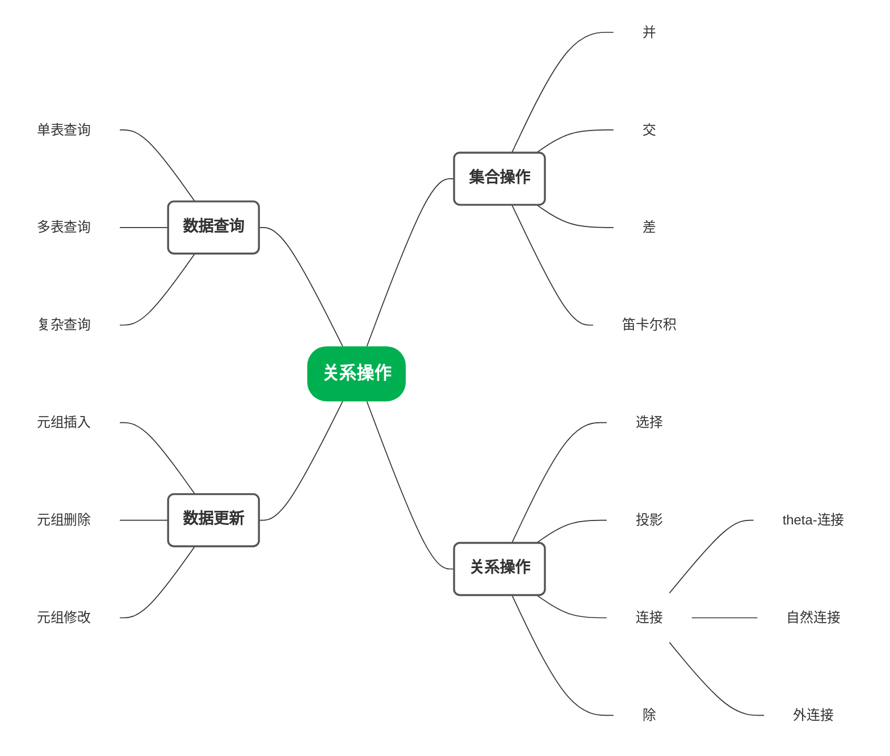

## 1 关系数据结构及形式化定义

### 1.1 关系

**【定义】域**：一组具有相同数据类型的值的集合（二维表的一列）

**【定义】笛卡尔积**

- 给定一组域 $D_1, D_2, \dots, D_n$，允许其中某些域是相同的。
- $D_1, D_2, \dots, D_n$ 的笛卡尔积可表示为：$D_1 \times D_2 \times \cdots \times D_n$
- 笛卡尔积的运算结果也是一个集合，其中的每个元素都是一个具有如下形式的‘n元组’：$(d_1, d_2, \dots, d_n)$，其中 $d_i \in D_i\ (i = 1, 2, \dots, n)$
- 由所有符合上述要求的‘n元组’组成该笛卡尔积的运算结果，即：

  $$D_1 \times D_2 \times \cdots \times D_n = \left\{ (d_1, d_2, \dots, d_n) \mid d_i \in D_i,\ i = 1,\ 2,\ \dots,\ n \right\}$$

**【定义】元组**：笛卡尔积的一个元素 $(d_1, d_2, …, d_n)$（二维表的一行）

**【定义】分量**：笛卡尔积元素 $(d_1, d_2, …, d_n)$ 中的每一个值 $d_i$

**【定义】基数**：一个域允许的不同取值个数

> 若 $D_i\,(i = 1, 2, \dots, n)$ 都为有限集，基数分别为 $m_i\,(i = 1, 2, \dots, n)$，则 $D_1 \times D_2 \times \dots \times D_n$ 的基数 $M$ 为：$M = \prod_{i=1}^{n} m_i$

**【定义】关系**

- 给定一个域的序列 $D_1, D_2, ..., D_n$，==笛卡尔积 $D_1 \times D_2 \times ... \times D_n$ 的子集==叫做在域 $D_1, D_2, ..., D_n$ 上的关系，表示为 $R(D_1, D_2, ..., D_n)$（或简写为关系 $R$）  
- $R$ 是关系名，用于区分不同的关系  
- $n$ 是关系的‘目’或‘度’（Degree）  

**【定义】属性**

- 关系所对应的二维表中的每一列，被称为是该关系中的一个属性
- 关系中的每一个属性都有一个名字，称为属性名。在同一个关系中，属性名互不相同
- 在关系对应的二维表中，表中的第一行被称为是二维表的表头，里面填写的是各个属性的属性名
- $n$ 目关系必有 $n$ 个属性

关系的表示 

- 在域 $D_1, D_2, ..., D_n$ 上的 $n$ 目关系 $R$ 可以被表示为 $R(A_1, A_2, ..., A_n)$，$R$ 是关系名，$A_1, A_2, ..., A_n$ 是属性名  

元组分量的表示  

- 若 $t$ 是关系 $R$ 中的一个元组，那么用 $t[A_i]$ 表示元组 $t$ 在属性 $A_i$ 上的取值，且 $t[A_i] \in D_i\ (i = 1, 2, ..., n)$（元组分量也被称为属性值）  
- 或者，用 $t[i]$ 表示元组 $t$ 在第 $i$ 列上的取值，且 $t[i] \in D_i\ (i = 1, ..., n)$

**【定义】码、候选码**

- 若关系中的某一属性组的值能唯一地标识一个元组，而其所有的真子集都不能，则称该属性组为关系的候选码，简称码

**【定义】主码**

- 在一个关系中，可以选择一个候选码作为该关系的主码
- 在关系模型理论中，只有候选码，不需要为关系定义主码

**【定义】主属性 与 非主属性/非码属性**

- 候选码中的各属性称为该关系的主属性
- 不包含在任何侯选码中的属性称为该关系的非主属性或非码属性

> [!tip] 关系模型是一种逻辑数据模型，不涉及数据的物理存储组织

关系数据模型中，关系的规范性限制

- 属性的原子性
- 属性的无序性
- 元组的唯一性
- 元组的无序性

### 1.2 关系模式

> 关系模式是对关系的描述：元组集合的结构、完整性约束条件

关系模式的形式化表示：$R(U, D, \text{DOM}, F)$

- $R$：关系名
- $U$：组成该关系的属性名集合
- $D$：$U$ 中属性所来自的域
- $\text{DOM}$：属性向域的映象集合（描述各个属性对应的域）
- $F$：属性间数据的依赖关系的集合（关系上的完整性约束条件）

关系模式通常可以简记为 $R(U)$ 或 $R(A_1, A_2, \ldots, A_n)$

> $A_1, A_2, \ldots, A_n$ 是关系中所有属性的属性名  

- 域名及属性向域的映象常常直接说明为属性的类型、长度等

## 2 关系操作

> - 选择、投影、并、差、笛卡尔积是 5 种基本操作
> - 关系操作的特点：操作的对象和结果都是关系

## 3 关系的完整性

### 3.1 实体完整性

- 关系中元组（二维表中的行）的唯一性
- 隐含要求：基本关系（基表）的主码属性不能取空

### 3.2 参照完整性

- 外码要么取空要么是某个元组的主码值

### 3.3 用户定义的完整性

- 唯一性约束、非空约束、取值范围约束

## 4 关系代数

### 4.1 关系代数概述

    <table style="width: 100% !important; min-width: 100%; border-collapse: collapse; text-align: center; border: 1.5px solid var(--mpe-table-border-color, black); font-family: 'Times New Roman', STSong, SimSun, serif; font-size: 18px; table-layout: fixed;">
        <colgroup>
            <col style="width: 20%;">
            <col style="width: 30%;">
            <col style="width: 50%;">
        </colgroup>
        <thead>
            <tr>
                <th colspan="2" style="border: 1px solid var(--mpe-table-border-color, black); padding: 12px; font-size: 20px;">关系运算</th>
                <th style="border: 1px solid var(--mpe-table-border-color, black); padding: 12px; font-size: 20px;">运算符</th>
            </tr>
        </thead>
        <tbody>
            <tr style="background-color: rgba(144, 238, 144, 0.2);">
                <td rowspan="5" style="border: 1px solid var(--mpe-table-border-color, black); padding: 10px;">基本 运算</td>
                <td style="border: 1px solid var(--mpe-table-border-color, black); padding: 10px;">并</td>
                <td style="border: 1px solid var(--mpe-table-border-color, black); padding: 10px; font-size: 24px;">
                    <i style="color: #4169E1;">R</i> &cup; <i style="color: #4169E1;">S</i>
                </td>
            </tr>
            <tr style="background-color: rgba(144, 238, 144, 0.2);">
                <td style="border: 1px solid var(--mpe-table-border-color, black); padding: 10px;">差</td>
                <td style="border: 1px solid var(--mpe-table-border-color, black); padding: 10px; font-size: 24px;">
                    <i style="color: #4169E1;">R</i> - <i style="color: #4169E1;">S</i>
                </td>
            </tr>
            <tr style="background-color: rgba(144, 238, 144, 0.2);">
                <td style="border: 1px solid var(--mpe-table-border-color, black); padding: 10px;">笛卡尔积</td>
                <td style="border: 1px solid var(--mpe-table-border-color, black); padding: 10px; font-size: 24px;">
                    <i style="color: #4169E1;">R</i> &times; <i style="color: #4169E1;">S</i>
                </td>
            </tr>
            <tr style="background-color: rgba(144, 238, 144, 0.2);">
                <td style="border: 1px solid var(--mpe-table-border-color, black); padding: 10px;">选择</td>
                <td style="border: 1px solid var(--mpe-table-border-color, black); padding: 10px; font-size: 24px;">
                    <i>&sigma;</i><i>F</i>(<i>R</i>)
                </td>
            </tr>
            <tr style="background-color: rgba(144, 238, 144, 0.2);">
                <td style="border: 1px solid var(--mpe-table-border-color, black); padding: 10px;">投影</td>
                <td style="border: 1px solid var(--mpe-table-border-color, black); padding: 10px; font-size: 24px;">
                    <i>&pi;</i><i>A</i>1,<i>A</i>2,...,<i>A</i>n(<i>R</i>)
                </td>
            </tr>
            <tr>
                <td rowspan="7" style="border: 1px solid var(--mpe-table-border-color, black); padding: 10px;">扩充 运算</td>
                <td style="border: 1px solid var(--mpe-table-border-color, black); padding: 10px;">交</td>
                <td style="border: 1px solid var(--mpe-table-border-color, black); padding: 10px; font-size: 24px;">
                    <i style="color: #4169E1;">R</i> &cap; <i style="color: #4169E1;">S</i>
                </td>
            </tr>
            <tr>
                <td style="border: 1px solid var(--mpe-table-border-color, black); padding: 10px;"><b>&theta;</b>-连接</td>
                <td style="border: 1px solid var(--mpe-table-border-color, black); padding: 10px; font-size: 24px;">
                    <i style="color: #4169E1;">R</i> &#x22C8;<i>F</i> <i style="color: #4169E1;">S</i>
                </td>
            </tr>
            <tr>
                <td style="border: 1px solid var(--mpe-table-border-color, black); padding: 10px;">自然连接</td>
                <td style="border: 1px solid var(--mpe-table-border-color, black); padding: 10px; font-size: 24px;">
                    <i style="color: #4169E1;">R</i> &#x22C8; <i style="color: #4169E1;">S</i>
                </td>
            </tr>
            <tr>
                <td style="border: 1px solid var(--mpe-table-border-color, black); padding: 10px;">外连接</td>
                <td style="border: 1px solid var(--mpe-table-border-color, black); padding: 10px; font-size: 24px;">
                    <i style="color: #4169E1;">R</i> &#x27D7; <i style="color: #4169E1;">S</i>
                </td>
            </tr>
            <tr>
                <td style="border: 1px solid var(--mpe-table-border-color, black); padding: 10px;">左外连接</td>
                <td style="border: 1px solid var(--mpe-table-border-color, black); padding: 10px; font-size: 24px;">
                    <i style="color: #4169E1;">R</i> &#x27D5; <i style="color: #4169E1;">S</i>
                </td>
            </tr>
            <tr>
                <td style="border: 1px solid var(--mpe-table-border-color, black); padding: 10px;">右外连接</td>
                <td style="border: 1px solid var(--mpe-table-border-color, black); padding: 10px; font-size: 24px;">
                    <i style="color: #4169E1;">R</i> &#x27D6; <i style="color: #4169E1;">S</i>
                </td>
            </tr>
            <tr>
                <td style="border: 1px solid var(--mpe-table-border-color, black); padding: 10px;">除</td>
                <td style="border: 1px solid var(--mpe-table-border-color, black); padding: 10px; font-size: 24px;">
                    <i style="color: #4169E1;">R</i> &divide; <i style="color: #4169E1;">S</i>
                </td>
            </tr>
        </tbody>
    </table>

设有一个 $n$ 目关系 $R(A_1, A_2, ..., A_n)$：$R$ 是关系名，$A_1, A_2, ..., A_n$ 是属性名  
- 它的一个关系（实例）设为 $R$  
- 关系模式可以表示为 $R(A_1, A_2, ..., A_n)$ 或 $\text{head}(R) = \{A_1, A_2, ..., A_n\}$  
- $t \in R$ 表示 $t$ 是关系 $R$ 中的一个元组  
- $t[A_i]$ 则表示元组 $t$ 中相应于属性 $A_i$ 的一个分量（元组 $t$ 在属性 $A_i$ 上的值）  
- 若 $A = \{A_{i_1}, A_{i_2}, ..., A_{i_k}\}$，其中 $A_{i_1}, A_{i_2}, ..., A_{i_k}$ 是来自于 $A_1, A_2, ..., A_n$ 中的属性，则 $A$ 称为‘属性列’或‘属性组’或‘属性集’。  
  - $t[A] = (t[A_{i_1}], t[A_{i_2}], ..., t[A_{i_k}])$ 表示元组 $t$ 在属性组 $A$ 上诸分量的集合  
  - $\overline{A}$ 则表示从 $\{A_1, A_2, ..., A_n\}$ 中去掉 $\{A_{i_1}, A_{i_2}, ..., A_{i_k}\}$ 后剩余的属性组
- 用 $(t_r,t_s)$ 来表示元组的连接

**【定义】象集**

给定一个关系 $R(X, Z)$

- $x_0$ 为属性组 $X$ 定义域上的一个值
- $x_0$ 在 $R$ 中的 象集 定义如下：

  $$Z_{x_0} = \{ t[Z] \mid t \in R \text{ 且 } t[X] = x_0 \}$$

- 它表示 $R$ 中属性组 $X$ 上值为 $x_0$ 的各元组在 $Z$ 上分量的集合（排除自身）

在关系 SC 中，存在三个课程号值

| 学号 Sno | 课程号 Cno | 成绩 Grade |
|----------|------------|------------|
| 201215121 | 1          | 92         |
| 201215121 | 2          | 85         |
| 201215121 | 3          | 88         |
| 201215122 | 2          | 90         |
| 201215122 | 3          | 80         |

- $Z_{Cno=1} = \{ (201215121, 92) \}$
- $Z_{Cno=2} = \{ (201215121, 85), (201215122, 90) \}$
- $Z_{Cno=3} = \{ (201215121, 88), (201215122, 80) \}$

**关系模型中的命名规则：同名同义、异名异义（不同关系的属性名）**

**赋值运算符 $:=$**

- 方式一：$R(A_1, A_2, ..., A_n) := \langle expression \rangle$
- 方式二：$R := \langle expression \rangle$
- 常用于关系自连接的重命名，或保存计算中间结果方便复杂查询

**不等于 $<>$，也可用 $\neq$**

### 4.2 关系代数的基本运算

    <table style="width: 100% !important; min-width: 100%; border-collapse: collapse; text-align: center; border: 1.5px solid var(--mpe-table-border-color, black); font-family: 'Times New Roman', STSong, SimSun, serif; font-size: 18px; table-layout: fixed;">
        <colgroup>
            <col style="width: 40%;">
            <col style="width: 60%;">
        </colgroup>
        <thead>
            <tr>
                <th style="border: 1px solid var(--mpe-table-border-color, black); padding: 12px; font-size: 20px;">关系运算</th>
                <th style="border: 1px solid var(--mpe-table-border-color, black); padding: 12px; font-size: 20px;">运算符</th>
            </tr>
        </thead>
        <tbody>
            <tr style="background-color: rgba(144, 238, 144, 0.2);">
                <td style="border: 1px solid var(--mpe-table-border-color, black); padding: 10px;">并</td>
                <td style="border: 1px solid var(--mpe-table-border-color, black); padding: 10px; font-size: 24px;">
                    <i style="color: #4169E1;">R</i> &cup; <i style="color: #4169E1;">S</i>
                </td>
            </tr>
            <tr style="background-color: rgba(144, 238, 144, 0.2);">
                <td style="border: 1px solid var(--mpe-table-border-color, black); padding: 10px;">差</td>
                <td style="border: 1px solid var(--mpe-table-border-color, black); padding: 10px; font-size: 24px;">
                    <i style="color: #4169E1;">R</i> - <i style="color: #4169E1;">S</i>
                </td>
            </tr>
            <tr style="background-color: rgba(144, 238, 144, 0.2);">
                <td style="border: 1px solid var(--mpe-table-border-color, black); padding: 10px;">笛卡尔积</td>
                <td style="border: 1px solid var(--mpe-table-border-color, black); padding: 10px; font-size: 24px;">
                    <i style="color: #4169E1;">R</i> &times; <i style="color: #4169E1;">S</i>
                </td>
            </tr>
            <tr style="background-color: rgba(144, 238, 144, 0.2);">
                <td style="border: 1px solid var(--mpe-table-border-color, black); padding: 10px;">选择</td>
                <td style="border: 1px solid var(--mpe-table-border-color, black); padding: 10px; font-size: 24px;">
                    <i>&sigma;</i><i>F</i>(<i>R</i>)
                </td>
            </tr>
            <tr style="background-color: rgba(144, 238, 144, 0.2);">
                <td style="border: 1px solid var(--mpe-table-border-color, black); padding: 10px;">投影</td>
                <td style="border: 1px solid var(--mpe-table-border-color, black); padding: 10px; font-size: 24px;">
                    <i>&pi;</i><i>A</i>1,<i>A</i>2,...,<i>A</i>n(<i>R</i>)
                </td>
            </tr>
        </tbody>
    </table>

**选择：从行的角度计算**

- 在关系 $R$ 中选择满足给定条件 $F$（逻辑表达式）的各元组

$$\sigma_F(R) = \{ t \mid t \in R \land F(t) = \text{true} \}$$
$$\sigma_{Sage< 20}  \ (Student)$$

**投影：从列的角度计算**

$$\pi_A(R) = \{ t[A] \mid t \in R \}$$
$$\pi_{Sname, Sdept}(Student)$$

> 可能产生重复的投影结果元组
> 可以简写：$\pi_A \sigma_F(R)$
> 在没有括号的情况下，其运算顺序为：**从右向左**

> **5, 6, 7, 8 重点看**

查询具有最大折扣的顾客的编号： $S := C$

$$ \pi_{cid}(C) - \pi_{C.cid}(\sigma_{C.discnt < S.discnt}(C \times S)) $$

查询具有最大折扣的顾客的姓名

- 是否可以表示如下？

$$ \pi_{cname}(C) - \pi_{C.cname}(\sigma_{C.discnt < S.discnt}(C \times S)) $$

上述查询表示是错误的（结果语义不符），正确的查询表示如下

$$ \pi_{cname}(\pi_{cid, cname}(C) - \pi_{C.cid, C.cname}(\sigma_{C.discnt < S.discnt}(C \times S))) $$

> [!tip] 在减数和被减数关系中，必须含目标对象的码！

> [!question] 求第二大？
> 对 “非最大” 求一次最大，应该可行，但也有别的做法
> 1. 构造两个中间结果：
>    - 集合 A（并非最大）：找到所有折扣比至少一个人小的顾客
>    - 集合 B（并非前两名）：找到所有折扣比至少两个人（且这两个人折扣不同）小的顾客
>    -  A - B 即排在第二的顾客编号
> 2. 用两个表的别名，设 $S := C$, $T := C$
> $$\pi_{C.cid}(\sigma_{C.discnt < S.discnt}(C \times S)) - \pi_{C.cid}(\sigma_{C.discnt < S.discnt \land S.discnt < T.discnt}(C \times S \times T))$$

### 4.3 关系代数扩充运算

    <table style="width: 100% !important; min-width: 100%; border-collapse: collapse; text-align: center; border: 1.5px solid var(--mpe-table-border-color, black); font-family: 'Times New Roman', STSong, SimSun, serif; font-size: 18px; table-layout: fixed;">
        <colgroup>
            <col style="width: 40%;">
            <col style="width: 60%;">
        </colgroup>
        <thead>
            <tr>
                <th style="border: 1px solid var(--mpe-table-border-color, black); padding: 12px; font-size: 20px;">关系运算</th>
                <th style="border: 1px solid var(--mpe-table-border-color, black); padding: 12px; font-size: 20px;">运算符</th>
            </tr>
        </thead>
        <tbody>
            <tr>
                <td style="border: 1px solid var(--mpe-table-border-color, black); padding: 10px;">交</td>
                <td style="border: 1px solid var(--mpe-table-border-color, black); padding: 10px; font-size: 24px;">
                    <i style="color: #4169E1;">R</i> &cap; <i style="color: #4169E1;">S</i>
                </td>
            </tr>
            <tr>
                <td style="border: 1px solid var(--mpe-table-border-color, black); padding: 10px;"><b>&theta;</b>-连接</td>
                <td style="border: 1px solid var(--mpe-table-border-color, black); padding: 10px; font-size: 24px;">
                    <i style="color: #4169E1;">R</i> &#x22C8;<i>F</i> <i style="color: #4169E1;">S</i>
                </td>
            </tr>
            <tr>
                <td style="border: 1px solid var(--mpe-table-border-color, black); padding: 10px;">自然连接</td>
                <td style="border: 1px solid var(--mpe-table-border-color, black); padding: 10px; font-size: 24px;">
                    <i style="color: #4169E1;">R</i> &#x22C8; <i style="color: #4169E1;">S</i>
                </td>
            </tr>
            <tr>
                <td style="border: 1px solid var(--mpe-table-border-color, black); padding: 10px;">外连接</td>
                <td style="border: 1px solid var(--mpe-table-border-color, black); padding: 10px; font-size: 24px;">
                    <i style="color: #4169E1;">R</i> &#x27D7; <i style="color: #4169E1;">S</i>
                </td>
            </tr>
            <tr>
                <td style="border: 1px solid var(--mpe-table-border-color, black); padding: 10px;">左外连接</td>
                <td style="border: 1px solid var(--mpe-table-border-color, black); padding: 10px; font-size: 24px;">
                    <i style="color: #4169E1;">R</i> &#x27D5; <i style="color: #4169E1;">S</i>
                </td>
            </tr>
            <tr>
                <td style="border: 1px solid var(--mpe-table-border-color, black); padding: 10px;">右外连接</td>
                <td style="border: 1px solid var(--mpe-table-border-color, black); padding: 10px; font-size: 24px;">
                    <i style="color: #4169E1;">R</i> &#x27D6; <i style="color: #4169E1;">S</i>
                </td>
            </tr>
            <tr>
                <td style="border: 1px solid var(--mpe-table-border-color, black); padding: 10px;">除</td>
                <td style="border: 1px solid var(--mpe-table-border-color, black); padding: 10px; font-size: 24px;">
                    <i style="color: #4169E1;">R</i> &divide; <i style="color: #4169E1;">S</i>
                </td>
            </tr>
        </tbody>
    </table>

交不是一个基本运算符，其功能可以用差运算来实现

$$R \cap S = R - (R - S) = S - (S - R)$$

- 并、差、交均要求为同类关系
- 并和交满足交换律和结合律
- 差不满足交换律和结合律

**常见的连接运算**

- θ-连接：按照给定的条件 $F$ 实现两个关系之间的元组连接
- 等值连接：在连接条件 $F$ 中，仅使用到等于比较 ‘=’ 这一种逻辑比较运算符
- 自然连接：两个关系**所有同名属性对之间的等值连接**，且**同名属性只保留一份**
- 外连接：在结果集中同时含有自然连接结果元组和悬浮元组
  - 悬浮元组：做自然连接时被丢弃的元组

**除运算**

- 在关系 $R$ 中，$A$ 可以取四个值 $\{a_1, a_2, a_3, a_4\}$
    - $a_1$ 的象集为 $\{(b_1, c_2), (b_2, c_3), (b_2, c_1)\}$
    - $a_2$ 的象集为 $\{(b_3, c_7), (b_2, c_3)\}$
    - $a_3$ 的象集为 $\{(b_4, c_6)\}$
    - $a_4$ 的象集为 $\{(b_6, c_6)\}$
- $S$ 在 $(B, C)$ 上的投影为：
    - $\{(b_1, c_2), (b_2, c_1), (b_2, c_3)\}$
- 只有 $a_1$ 的象集包含了 $S$ 在 $(B, C)$ 属性组上的投影
    - 所以 $R \div S = \{a_1\}$

> 仅出现在除数关系 $S$ 中的属性 $D$ 及其取值，与 $R ÷ S$ 的计算过程和计算结果都无关

- 除运算的引入是为了方便此类查询：“选修过所有课程的学生学号”

$$\pi_{sno, cno}(SC) \div \pi_{cno}(Course)$$

**除运算的推导公式**

- 设关系 $R$ 的属性集为 $\{ A_1 , \dots , A_n , B_1 , \dots , B_m \}$ ，关系 $S$ 的属性集为 $\{ B_1 , \dots , B_m \}$ ，则：

$$R \div S = \pi_{A_1,...,A_n}(R) - \pi_{A_1,...,A_n}((\pi_{A_1,...,A_n}(R) \times S) - R)$$

① $T_{max} := \pi_{A_1,...,A_n}(R)$

> $T_{max}$ 是最大可能的结果元组集合

② $R_{max} := T_{max} \times S$

> $R_{max}$ 与关系 $R$ 是同类关系

③ $T_1 := R_{max} - R$
④ $T_2 := \pi_{A_1,...,A_n}(T_1)$

> $T_2$ 是关系 $T_{max}$ 中不满足除运算的结果要求的那些元组，即：对于关系 $T_2$ 中的任一个元组 $q$，至少能在关系 $S$ 中找到一个元组 $s$，使得由元组 $q$ 和 $s$ 所构成的元组 $(q,s)$ 不在关系 $R$ 中出现

⑤ $R \div S := T_{max} - T_2$

- 学生关系：S (学号 sno，姓名 sn，就读院系 sd，年龄 sa)
- 课程关系：C (课程号 cno，课程名 cn，先修课程号 pno)
- 选课关系：SC (学号 sno，课程号 cno，成绩 g)

1. **查询至少修读过 ‘学生201400101修读过的一门课’ 的学生的姓名**

① 查询学生 `201400101` 修读过的课程的课程号

$$T_1 := \pi_{cno}(\sigma_{sno='201400101'}(SC))$$

② 查询选修过 $T_1$ 中课程的学生的学号

$$T_2 := \pi_{sno}(SC \bowtie T_1)$$

③ 查询 $T_2$ 中学生的姓名（即本题的查询结果）

$$\pi_{sn}(S \bowtie T_2)$$

④ 上述结果依次代入得

$$\pi_{sn}(S \bowtie (\pi_{sno}(SC \bowtie \pi_{cno}(\sigma_{sno='201400101'}(SC)))))$$

2. **查询修读过 ‘学生201400101修读过的所有课程’ 的学生的姓名**

$$\pi _ { s n } ( S \bowtie ( \pi _ { s n o , c n o } ( S C ) \div \pi _ { c n o } ( \sigma _ { s n o = ' 2 0 1 4 0 0 1 0 1 ' } ( S C ) ) ) )$$

> [!fail] 错解
> $$\pi_{sn, cno}(S \bowtie SC) \div \pi_{cno}(\sigma_{sno='201400101'}(SC))$$
> - 原因是 $sn$ 不是主键，可能出现重复而丢失
> - **使用差、除、交时，记得一定用上主键**

**【思考】不使用‘除’运算**，该查询可分步表示如下：

① 学生 201400101 修读过的所有课程：

$$T_1 := \pi_{cno}(\sigma_{sno='201400101'}(SC))$$

② 查询符合下述条件的学生的学号：**存在 $T_1$ 中的某些课程，该同学没有修读过**

$$T_2 := \pi_{sno}((\pi_{sno}(S) \times T_1) - \pi_{sno, cno}(SC))$$

③ 查询修读过 ‘学生 201400101 修读过的所有课程’ 的学生的学号：

$$\pi_{sno}(SC) - T_2$$

④ 查询上述学生的姓名：

$$\pi_{sn}(S \bowtie (\pi_{sno}(SC) - T_2))$$

代入后可得到如下的查询表达式：

$$\pi_{sn}(S \bowtie (\pi_{sno}(SC) - \pi_{sno}((\pi_{sno}(S) \times \pi_{cno}(\sigma_{sno='201400101'}(SC))) - \pi_{sno, cno}(SC))))$$

---

**【典中典】** 查询满足下述条件的顾客的编号：

① 购买过 ‘p01’ 号商品：

$$\pi_{cid}(\sigma_{pid='p01'}(O))$$

② 没有购买过 ‘p01’ 号商品：

$$\pi_{cid}(C) - \pi_{cid}(\sigma_{pid='p01'}(O))$$

③ 只购买过 ‘p01’ 号商品：

$$\pi_{cid}(O) - \pi_{cid}(\sigma_{pid \neq 'p01'}(O))$$

④ 既购买过 ‘p01’ 也购买过 ‘p02’ 号商品：

$$\pi_{cid}(\sigma_{pid='p01'}(O)) \cap \pi_{cid}(\sigma_{pid='p02'}(O))$$

⑤ 既没有购买过 ‘p01’，也没有购买过 ‘p02’ 号商品：

$$\pi_{cid}(C) - (\pi_{cid}(\sigma_{pid='p01'}(O)) \cup \pi_{cid}(\sigma_{pid='p02'}(O)))$$

> 这里是用全集减去买过 ‘p01’ 或 ‘p02’ 号商品的顾客，当然也可以使用 ② 求出二者再取交
 
⑥ 只购买过 ‘p01’ 和 ‘p02’ 号两种商品：

$$(\pi_{cid}(\sigma_{pid='p01'}(O)) \cap \pi_{cid}(\sigma_{pid='p02'}(O))) - \pi_{cid}(\sigma_{pid \neq 'p01' \land pid \neq 'p02'}(O))$$

> 这里是用 ④ 既购买过 ‘p01’ 也购买过 ‘p02’ 号商品，减去购买过其他商品
> 但注意此题不能使用和 ⑤ 类似的方法，否则用 ③ 得出的二者交集为空！

⑦ 没有购买过商品：

$$\pi_{cid}(C) - \pi_{cid}(O)$$

⑧ **只购买过一次商品（只有一份订单）**：

- 令 $R := O$，该查询可表示如下：

$$\pi_{cid}(O) - \pi_{O.cid}(\sigma_{R.cid = O.cid \land R.ordno < O.ordno}(R \times O))$$

> 对主键 `ordno` 比大小，只有该 `cid` 下 `ordno` 唯一（不可比较）时，减数才为空

⑨ **只购买过同一种商品**：

$$\pi_{cid}(O) - \pi_{O.cid}(\sigma_{R.cid = O.cid \land R.pid \neq O.pid}(R \times O))$$

> 对主键 `pid` 判不等，只有该 `cid` 下 `pid` 全部相等时，减数才为空
