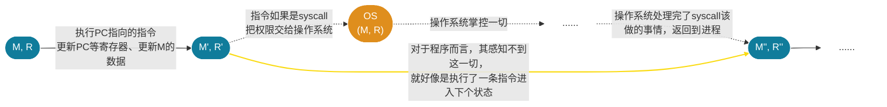

## 1 操作系统概述

操作系统是==对硬件进行管理和抽象==并==为应用提供服务并进行管理的程序==

操作系统的功能：

- 提供简洁、易用的物理层抽象
  - 拥有无限的内存，专属的机器
  - 高级的对象：文件、进程、信号...
  - 屏蔽限制
- 资源的管理
  - 分配
  - 保护
  - 分享
- 操作系统的底线是支持应用程序的运行
  - 自身反而次要
  - 理想情况下操作系统自身的资源开支应该不大
  - 应用程序运行应该尽可能快

## 2 各种视角下的操作系统

操作系统有三条主线：

- “软件 (应用)”
- “硬件 (计算机)”
- “操作系统 (软件直接访问硬件带来麻烦太多而引入的中间件)”

### 2.1 应用视角下的操作系统

#### 2.1.1 程序的状态机模型

- 一个理论模型：**程序就是状态机**
- 对于（二进制）程序而言
  - 状态 = $M$（内存）+ $E$（寄存器）
  - 初始状态 = 程序启动时操作系统给安排的状态
  - 状态转移 = 执行一条指令

* 假设当前状态是 $(M, R)$
  - 从 $R[PC]$ 取一条指令
  - 解析指令，取出指令所必要的数据
  - 计算结果（可能有非确定性，例如 `rdrand`）
  - 更新得到 $(M', R)$

- 调用操作系统 syscall
  - 把 $(M, R)$ 完全交给操作系统，任其修改
- 实现与操作系统中的其他对象交互
  - 读写文件/操作系统状态（例如把文件内容写入 $M$）
  - 改变进程（运行中状态机）的状态，例如创建进程/销毁自己

- 从这个角度看，==程序 = 计算 + syscall，而操作系统就像是 syscall 的解释器==！
  - 普通的指令由cpu解释
  - syscall 则由操作系统解释（当然，最终操作系统还是要借助 cpu 解释）
  - 这也是为什么操作系统可以看成是更加高级的机器

* C 程序的状态机模型
  - 状态 = 堆 + 栈 + 全局变量
    - 寄存器呢？C 是更高的抽象！
  - 初始状态 = 仅有一个 frame main(argc, argv); 全局变量为初始值
  - 迁移 = 执行一条简单语句
    - 执行当前调用栈栈顶的那个栈指针 (frames.top.PC处) 的简单语句
    - 如果是函数调用的话，本质上就是压入一个新的栈帧 (stack frame)，并设置这个新的 frame.PC  = 所调用函数的入口
    - 函数返回 = pop frame
  - 编译器即为汇编指令序列与 C 程序的桥梁：.s = compile(.c)

#### 2.1.2 操作系统上的软件（应用程序）

- 操作系统中的任何程序本质上即为包含 syscall 的状态机
- 操作系统管理着所有的硬件/软件资源
  - 只能用操作系统允许的方式访问操作系统中的对象 (syscall)
    - 这种集中管理有助于解决资源抢占和冲突

* 为什么我们能够 “追踪” 进程（System call trace）
  - 因为所有进程都在 “操作系统” 的监控之下！
    - 进程某种意义上是运行在 “操作系统” 这样的一个虚拟机中，而不是直面硬件，所以操作系统清楚进程的一切，也能修改其一切！
  - 操作系统为进程提供了 ptrace 系统调用，其可以帮助一个进程去查看另外一个进程，甚至是修改另外进程的运行时的寄存器，以至于植入代码！
    - Strace、GDB 背后都是 ptrace 系统调用！

- 操作系统中 “任何程序” 的一生
  - 初始状态
    - 执行 `execve` 加载到内存，设置初始状态
  - 状态机执行
    - 进程管理 (`-e trace=%process`)：`fork`, `execve`, `exit`, ...
    - 文件/设备管理 (`-e trace=%file`)：`open`, `close`, `read`, `write`, ...
    - 存储管理 (`-e trace=%memory`)：`mmap`, `brk`, ...
    - 调用 `exit` 或者 `exit_group` 退出
  - 所有的这些程序都是在操作系统 API (syscall) 和操作系统中的对象上构建
    - 本质都是调用 syscall 的状态机
    - 对于这些应用而言，操作系统就是一个帮助解释这些 syscall 的存在而已，其和能够帮他们解释普通计算指令的 CPU 无异

> [!tip] 简而言之，在应用眼中，操作系统就是 syscall 的解释器！

### 2.2 硬件视角下的操作系统

#### 2.2.1 计算机硬件的状态机模型

- 硬件的核心是一堆数字电路
  - 状态 = 寄存器保存的值（flip-flop）
  - 初始状态 = REST
  - 迁移 = 组合逻辑电路 (`NAND`, `NOT`, `AND`, `OR`, `NOR`)计算寄存器下一时钟周期的值

* 整个计算机系统也是一个状态机
  - 状态：内存和寄存器数值
  - 初始状态：CPU Reset
  - 状态迁移：
    - 任意选择一个处理器 CPU
    - 响应处理器外部中断
    - 从 CPU 的 PC 取指令执行

#### 2.2.2 硬件与程序员的约定

- 为了让 “操作系统” 这个程序能够正确启动，计算机硬件系统必定和程序员之间存在约定：
  - 首先就是 Reset 的状态。
  - 然后是 Reset 以后执行的程序应该做什么。
- 这么想，计算机硬件和操作系统就一点也不神秘了

- 计算机系统的一切行为都是可观测、可理解的
  - 处理器的任务就是重复着进行着取指令和执行指令
  - 厂商配置好处理器 Reset 后的行为：先运行 Firmware，再加载操作系统
  - 操作系统就是一个 C 程序！
    - 只不过其拥有完整计算机的控制权限，包括中断和 I/O 设备

### 2.3 抽象视角下的操作系统

- 操作系统本身就是状态机
  - 内部状态为用户进程的元信息、内核栈、内核堆、操作系统代码区
  - 操作系统在硬件加载完毕和初始化之后就变成了就成为了 interrupt/trap/fault handler
  - 操作系统的状态是被动迁移的，用户程序执行 syscall 才会改变操作系统状态、硬件中断事件发生后（如时钟中断）才会改变操作系统状态

> [!note] 各种视角下的操作系统
> 
> 本身是状态机 (内部的状态为操作系统管理的资源状态，被动进行状态迁移)
> 
> 为在其之上的应用程序服务：应用程序的解释器
> 
> 直接跑在硬件之上的C程序：为硬件中断处理程序