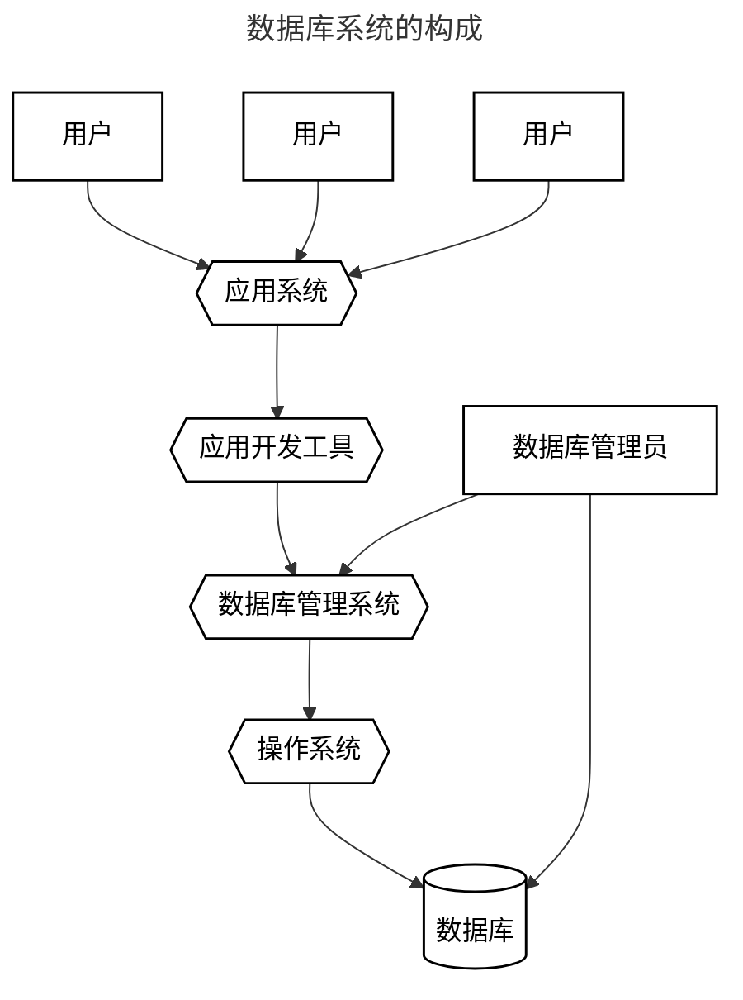
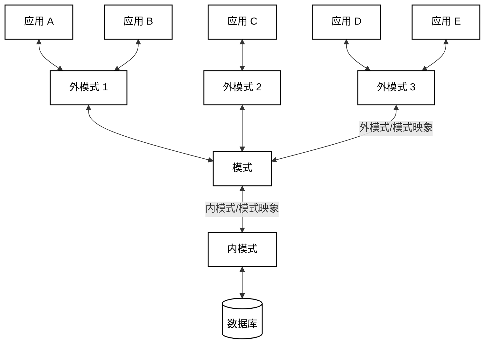

## 1 数据库系统概述

### 1.1 数据库的四个基本概念

1. **数据**
2. **数据库**（DB）
   - 长期存储在计算机内、有组织的、大量的、共享的数据集合
3. **数据库管理系统**（DBMS）
   - 位于用户与数据库之间的一层数据管理软件
   - 科学地组织和存储数据、高效地获取和维护数据
4. **数据库系统**（DBS）
   - 构成：数据库、数据库管理系统、数据库管理员、数据库用户、系统软/硬件平台、应用系统与应用开发工具
   - 存储、管理、处理和维护数据的系统

> 数据库在计算机系统中的位置：基础软件平台（硬件直接之上，和操作系统同级）

> 数据库用户包括：数据库管理员、应用开发人员、最终用户

### 1.2 数据管理技术的产生和发展

- **数据管理**是指对数据进行分类、组织、编码、存储、检索和维护，==是数据处理的中心问题==
- **数据处理**则是指对各种数据进行收集、存储、加工和传播的一些列活动的总和

> 发展历史略

### 1.3 数据库系统（DBNS）的特点

- 数据结构化
- 高共享性、低冗余、易扩充
- 数据独立性高
- 统一管理与控制

> [!summary] 数据库概念小结
> ❑ 数据库是长期存储在计算机内、有组织的、大量的、共享的数据集合
> ❑ 可以供各种用户共享，具有最小数据冗余度和较高的数据独立性
> ❑ 数据库管理系统在数据库建立、运用和维护时对数据库进行统一控制，以保证数据的完整性、安全性，并在多用户同时使用数据库时进行并发控制，在发生故障后对数据库进行恢复

## 2 数据模型

1. 概念模型：按用户的观点来对数据和信息建模，用于数据库设计
2. 逻辑模型：按计算机的观点对数据建模，用于 DBMS 实现
3. 物理模型：是对数据最底层的抽象

> 概念 $\rightarrow$ 逻辑 $\rightarrow$ 物理

数据模型的组成要素（三要素）：

- 数据结构（数据模式）、数据操作、数据约束

## 3 数据库系统的结构

> **三级模式结构**，是数据库系统内部的系统结构

- **模式**（也称 ‘逻辑模式’）
  - 数据库中==全体数据==的逻辑结构和特征的描述
  - 是所有用户的公共数据视图
  - 一个数据库只有一个模式
- **外模式**（也称 ‘子模式’ 或 ‘用户模式’）
  - 是对==数据库用户==（包括应用程序员和最终用户）使用的==局部数据==的逻辑结构和特征的描述
  - 属于数据库用户的数据视图，是与某一应用有关的数据的逻辑表示
  - 模式与外模式的关系：一对多；外模式与应用的关系：一对多
  - 每个用户只能看见和访问所对应的外模式中的数据
- **内模式**（也称 ‘存储模式’ 或 ‘物理模式’）
  - 是==数据物理结构和存储==方式的描述
  - 是数据在数据库内部的表示方式
  - 一个数据库只有一个内模式

* 外模式/模式映像：保证数据的逻辑独立性
* 模式/内模式映像：保证数据的物理独立性

> 外模式可以理解为视图（根据用户处理的要求、安全性的考虑）