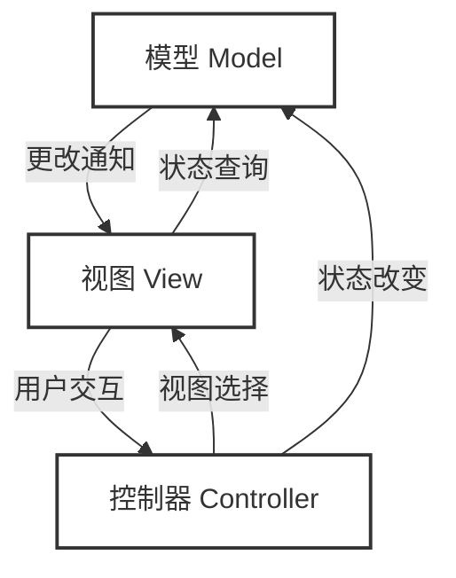

> [!warning] 考前按复习大纲临时整理而成，排版不美观，内容可能有误，且不保证完整性，仅供参考。若有错误或遗漏，请及时指出。

> [!note] 名词解释：软件工程
> 软件工程是将**系统化的、规范化的、可量化的方法**，应用于软件的**开发、运行和维护的过程**；即将工程化的方法应用于软件。以及对上述中各种方法的研究

---

## 软件质量保障有哪些措施？

- 结合实验进行说明

| SQA 活动 | 传统方式 | AI 增强方式 | 
| --- | --- | --- |
| **代码评审** | 人工逐行审查 | AI 预审 + 人工聚焦关键逻辑 | 
| **静态分析** | 规则引擎（SonarQube） | LLM 语义分析 + 规则引擎 | 
| **测试生成** | 人工编写测试用例 | AI 自动生成单元测试 | 
| **缺陷预测** | 历史缺陷密度统计 | ML 模型预测高风险模块 | 
| **文档审查** | 人工一致性检查 | AI 自动检测文档–代码不一致 |

| 里程碑 | 质量保障活动 |
| --- | --- |
| 需求开发 | 需求评审、需求度量 |
| 体系结构 | 体系结构评审、集成测试（持续集成） |
| 详细设计 | 详细设计评审、设计度量、集成测试（持续集成） |
| 实现 | 代码评审、代码度量、测试（测试驱动、持续集成） |
| 测试 | 测试、测试度量 |

## 软件配置管理有哪些活动？

- 实验中是如何进行配置管理的？

配置管理的动机与定义

- 软件开发中产生大量中间制品，是不同阶段协同的基础
- 制品变更的最大挑战：确保使用者获得最新的制品，避免协同问题

| SCM 活动 | 说明 | 具体例子 |
| --- | --- | --- |
| 标识配置项 | 确定哪些制品需要纳入配置管理 | 将需求文档、设计文档、源代码、测试用例、构建脚本等纳入 Git 仓库管理 |
| 版本管理 | 跟踪制品的不同版本，确保版本一致性 | 使用 `git tag v1.0.0` 标记发布版本；通过 commit hash 追踪每次修改的历史 |
| 变更控制 | 管理变更请求的提出、评估、决策、执行和验证 | 通过 GitHub Issue 提出变更请求，经 PR 评审 → CI 通过 → 合并到 `develop` 分支 |
| 配置审计 | 检查配置项是否与规格一致 | CI 流水线自动校验：代码是否通过所有测试、是否满足编码规范、依赖是否安全 |
| 状态报告 | 记录和报告配置管理活动的状态 | 项目周报中汇总：本月合并 PR 数、未解决 Issue 数、测试覆盖率变化趋势 |
| 软件发布管理 | 管理软件产品的发布过程 | 通过 GitHub Release 发布版本，附带 Release Notes 说明新功能、修复的 Bug 和已知问题 |

> 版本控制：两种策略
> 锁定-修改-解锁 vs 复制-修改-合并（git）

- 分支策略：从混乱走向有序

| 分支 | 用途 | 保护规则 |
|------|------|-----------|
| `main` | 生产环境稳定版本 | 禁止直接 push，只接受合并请求 |
| `develop` | 持续集成分支 | 合并前必须通过 CI 测试 |
| `feature/xxx` | 功能开发隔离 | 完成后合并到 `develop` |
| `hotfix/xxx` | 生产紧急修复 | 合并到 `main` 后同步到 `develop` |

- 用 SCM 四大活动（确定·控制·报告·审计）分类，并对应 Git 操作

> | 活动 | 核心问题 |
> | --- | --- |
> | 配置项确定 | 哪些制品需要版本控制？ |
> | 配置控制 | 变更如何审批与执行？ |
> | 状态报告 | 各节点版本处于什么状态？ |
> | 配置审计 | 实际配置是否符合规定？ |

| 情况 | SCM 问题类型 | Git 对应操作 |
|------|----------------|----------------|
| 代码覆盖 | 配置控制缺失 | 分支隔离 + Pull Request 审阅 |
| 环境不一致 | 配置项确定缺失 | 将配置文件纳入版本控制 |
| 版本内容不清晰 | 状态报告缺失 | `git log` + `CHANGELOG.md` |
| 误删配置 | 配置审计缺失 | `git checkout` 恢复历史版本 |
| 版本回滚 | 配置控制 | `git revert` / `git reset` |

---

> [!note] 名称解释：需求
> （1）用户为了解决问题或达到某些目标所需要的条件或能力
> （2）系统或系统部件为了满足合同、标准、规范或其它正式文档所规定的要求而需要具备的条件或能力
> （3）对 (1) 或 (2) 中的一个条件或一种能力的一种文档化表述

## 区分需求的三个层次

- 给出一个实例，给出其三个层次的例子
- 对给定的需求示例，判定其层次（例如课程实验/ATM/图书管理）

| 层次 | 对应产物 | 示例 |
|------|-----------|------|
| **业务需求** | 解决方案与系统特性 | R2：使用 3 个月后，销售额提高 20% |
| **用户需求** | 问题域知识 | R3：系统要帮助收银员完成销售处理 |
| **系统级需求** | 需求分析模型 | R4：收银员输入商品时，显示描述、单价、数量和总价 |

### 需求的层次性：业务、用户与系统级需求

这是从**不同干系人视角**来进行的划分。它们是一个从宏观到微观、逐步细化的过程。

**业务需求**

* **视角：** ==投资人、高层管理者、甲方==。
* **核心：** 为什么要做这个系统？（Why）它关注高层次的业务目标、期望的回报或要解决的核心业务问题。
* **例子：** “为了降低人力成本，公司需要在今年内将线上订单的处理效率提高30%。”

**用户需求**

* **视角：** ==最终使用系统的用户==（终端用户）。
* **核心：** 用户能用这个系统做什么？（What）它描述了用户为了完成其工作，需要系统提供哪些支持。
* **例子：** “作为一名仓库管理员，我需要能够扫描商品条码来快速完成出库登记，以便减少手动录入的错误。”

**系统级需求**

* **视角：** ==开发团队==（程序员、测试员、架构师）。
* **核心：** 系统具体要怎么实现用户的诉求？（How）这是对开发人员最直接的指令，包含了详细的系统行为、接口约束和数据规范。
* **例子：** “当接收到扫码枪发送的条码字符串时，系统需在订单数据库中将对应商品状态更新为‘已出库’，并向前端返回更新成功的回执。”

### 转化关系与规格化表达

#### 1. 转化关系（自顶向下的推导）

* **业务需求 -> 用户需求：** 业务需求圈定了项目的范围和目标。系统分析师根据业务目标，找出相关的用户群体，并推导出他们需要哪些功能（用户需求）来支撑这个业务目标。
* **用户需求 -> 系统需求：** 用户需求通常比较通俗且带有主观色彩。开发团队需要将这些需求转化为精确的、无歧义的“机器逻辑”和“规则”，即系统级需求（==包括功能和非功能需求==）。

#### 2. 规格化表达

**业务需求表达：**

* **常见文档：** 项目愿景与范围文档。
* **表达方式：** 业务背景陈述、目标指标、核心业务流程图。

**用户需求表达：**

* **常见文档：** 用例文档 (Use Case Specification)。
* **表达方式：**
  * **==用例图与用例描述==：** 清晰定义参与者（Actor）与系统的交互流程。
  * **==用户故事==：** 敏捷开发中常用的格式：“作为[角色]，我想要[活动]，以便于[商业价值]”。

**系统级需求表达：**

* **常见文档：** ==软件需求规格说明书== (SRS)。
* **表达方式：**
  * 通过自然语言详细描述前置条件、后置条件、异常流。
  * 结合 **UML图表**（如状态图、顺序图等）辅助表达复杂逻辑。
  * 接口定义（API 参数、返回值说明，即 PO/VO 数据的传递）。

## 掌握需求的类型

- 对给定的实例，给出其不同类型的需求例子
- 对给定的需求示例，判定其类型（例如课程实验/ATM/图书管理）

### 需求的分类：功能性需求 vs 非功能性需求

| 类型 | 描述 | 示例 |
| --- | --- | --- |
| **功能**需求 | 系统必须提供的功能 | 系统允许顾客退回已购买的产品 |
| **性能**需求 | 响应时间、吞吐量等 | 查询响应时间 < 3 秒 |
| **安全性**需求 | 访问控制、数据保护 | 用户密码必须加密存储 |
| **可用性**需求 | 易学性、易用性 | 新用户 10 分钟内学会基本操作 |
| **可靠性**需求 | 系统可用时间、故障恢复 | 系统可用性达到 99.9% |
| **可维护性**需求 | 修改和扩展的容易程度 | 新增支付方式不超过 5 人日 |
| **可移植性**需求 | 跨平台、跨环境运行能力 | 系统需同时支持 `Windows` 和 `Linux` |

> **非功能性需求**：性能需求、安全性需求、可用性需求、可靠性需求、可维护性需求、可移植性需求...

---

## 用例图

| 元素 | 符号 | 说明 |
| --- | --- | --- |
| **用例** | 椭圆 | 系统提供的一项有价值的服务 |
| **参与者** | 小人图标 | 与系统交互的外部角色 |
| **关系** | 连线 | 参与者与用例之间的关系 |
| **系统边界** | 矩形框 | 划定系统内外的边界 |

- **参与者**
  - 一个参与者可以代表多个用户（如 "收银员" 代表所有收银员）
  - 一个用户可以扮演多个参与者（如某人既是收银员又是管理员）
  - 参与者不一定是人 —— 外部系统、硬件设备、定时器都可以是参与者

| 参与者识别误区 | 错误示例 | 正确做法 |
| --- | --- | --- |
| 将系统内部组件当参与者 | "数据库"、"缓存服务器" | 数据库是系统内部组成部分，不是外部实体 |
| 用具体人名代替角色 | "张三"、"李经理" | 应写"收银员"、"总经理"——参与者是**角色**不是个人 |
| 遗漏非人类参与者 | 只列出人类用户 | 外部系统（支付网关）、定时器（每日对账）同样是参与者 |
| 参与者粒度不当 | "青年顾客"和"老年顾客"分两个 | 除非功能需求不同，否则统一为"顾客" |

- **系统边界**
  - 参与者始终在系统边界外部（哪些角色是外部交互方）
  - 用例始终在系统边界内部（哪些功能由系统实现）
  - 系统边界帮助明确项目范围

* **关系**

| 关系类型 | 符号 | 说明 |
| --- | --- | --- |
| 关联 | 实线 | 参与者与用例之间的交互 |
| 包含 | 虚线 + `<<include>>` | 一个用例**必须**包含另一个用例的行为 |
| 扩展 | 虚线 + `<<extend>>` | 一个用例在**特定条件**下扩展另一个用例 |
| 泛化 | 实线 + 空心三角 | 参与者之间的继承关系 |

> [!warning] extend 的方向其实是反向的

| 对比维度 | Include（包含） | Extend（扩展） |
| --- | --- | --- |
| 是否必须执行 | 必须执行 | 有条件执行 |
| 方向 | 基础用例 → 被包含用例 | 扩展用例 → 基础用例 |
| 典型场景 | 多个用例共享同一段行为 | 基础用例在特定条件下的额外行为 |
| 举例 | 销售处理 `<<include>>` 打印收据 | 销售处理 `<<extend>>` VIP 折扣计算 |

- 细化用例：用例应对一个业务事件，由一个用户发起，在一个连续时间段内完成

| 操作 | 原用例 | 调整后 | 原因 |
| --- | --- | --- | --- |
| 合并 | 特价策略制定 + 赠送策略制定 | → 销售策略制定 | 业务目的相同，属于同一业务事件 |
| 拆分 | 会员管理 | → 发展会员 + 礼品赠送 | 两个不同业务事件，不同时间触发 |
| 拆分 | 库存管理 | → 商品出库 + 商品入库 + 库存分析 | 三个独立业务事件 |

- 判断标准：用例必须为参与者提供可感知的、有价值的结果
  - 错误：登录、数据验证、连接数据库
- 用例描述应独立于界面设计和技术实现


> [!tip] 实际画用例图时，也要考虑并画出组合、聚合、继承、多重性等标识

## 概念类图

- 或叫分析类图、领域模型，**只有属性，没有方法**

| 步骤 | 活动 | 关键技巧 |
|------|------|-----------|
| ① | ==识别概念类== | 从用例描述中==提取名词==，筛选有意义的概念 |
| ② | 确定关联关系 | 识别概念之间的 “**有关系**”|
| ③ | 为概念类添加属性 | 识别描述概念类的**关键特征** |
| ④ | 确定关联的多重性 | 标注 `1..*`、`0..1` 等数量约束 |


| 关系名称 | 概念与使用场景（耦合度） | 箭头画法（指向） |
| --- | --- | --- |
| 关联 | 一般的引用。表示两个类之间存在语义上的联系，一个类长期"持有"另一个类的引用作为其成员变量（属性）。场景：学生类中有一个属性是"老师"的对象引用。 | 实线 + 普通箭头 / 无箭头 |
| 聚合 | 部分可以脱离整体 | 实线 + 空心菱形（菱形在整体一端） |
| 组合 | 部分不能脱离整体 | 实线 + 实心菱形（菱形在整体一端） |
| 依赖 | 一个类"使用"了另一个类。通常是被调用类作为调用类的方法参数、局部变量或返回值存在。场景：展示层依赖逻辑层的接口，或在方法中临时使用了一个工具类。 | 虚线 + 鱼骨箭头（指向被依赖的类/接口） |
| 继承 | |实线 + 空心三角形（指向父类）|
| 实现||实线 + 空心三角形（指向接口）|

## 顺序图

- 描述系统中一次交互的行为过程
- 展示参与者、系统对象之间的消息传递时间顺序
- **从用例描述的正常流程映射而来**

> 用例描述中的每一步交互 → 顺序图中的一条消息。
> 正常流程先画，扩展流程用 `alt` / `opt` 片段补充。

| 元素 | 含义 |表示|
|------|------|--|
| 参与者 | 与系统交互的外部角色 |小人|
| 生命线 | 对象在交互过程中的存在时间 |小人/对象下的垂直虚线
| 消息 | 对象之间传递的请求或响应 |同步调用消息（实线 + 箭头），返回消息（虚线 + 箭头）|
| 激活框 | 对象正在执行操作的时间段 |**对象生命线**上的一些垂直细长矩形|

> 注意这里还有 “对象”，顶部的矩形框


- 示例消息编号：

```
1: addCommodity(id, qty)
1.1: addCommodity(id, qty)
　　 1.1.1: <<create>> CreateMessage()
　　 1.1.1.1: CommodityPO find(id)
```

- 同步消息 实线 + 三角实心箭头
  - 发送方需要阻塞自己，等待接收方处理完的消息
- 异步消息 实线 + 鱼骨箭头
- 返回消息 虚线 + 鱼骨箭头


- 交互片段

| 片段 | 含义 | 本图用法 |
|------|------|-----------|
| `opt` | 可选（0 或 1 次） | 查看详情、翻页 |
| `alt` | 互斥分支 | 本图未用 |
| `loop` | 循环（0 到多次） | 本图未用 |

- Gemini 给的综合示例


## 状态图

| 元素 | 符号 | 说明 |
| --- | --- | --- |
| 状态 | 圆角矩形 | 对象在某一时刻的条件或情况 |
| 转换 | 箭头 | 从一个状态到另一个状态的变迁 |
| 事件 | 转换上的标签 | 触发状态转换的外部刺激 |
| 动作 | `/ action` | 状态转换时执行的操作 |
| ==初始状态== | ==实心圆== | 状态机的起点 |
| ==终止状态== | ==圆中圆== | 状态机的终点 |


| 要素 | 说明 |
|------|------|
| 状态（State） | 对象满足某条件、执行某活动的时期 |
| 转移（Transition） | `event [guard] / action` |
| 事件（Event） | 触发转移的信号 |
| 防护条件（Guard） | 允许转移的布尔前提 `[cond]` |
| 动作（Action） | 进入/退出/转移时执行的操作 |
| `entry / do / exit` | 状态的三种内部行为 |


## 例题 1

- 现在需要开发一个简化了的大学图书馆系统，它有几种类型的借书人，包括教职工借书人、研究生借书人和本科生借书人等。借书人的基本信息包括姓名、地址和电话号码等。对于教职工借书人，还要包括诸如办公室地址和电话等信息。对于研究生借书人，还要包括研究项目和导师信息等。对于本科生借书人，还要包括项目和所有学分信息等。
- 图书馆系统要跟踪借出书本信息。当一个借书人捧着一堆书去借书台办理借书手续时，借出这个事件就发生了。随着时间的过去，一个借书人可以多次从图书馆中借书。一次可以借出多本图书。
- 如果借书人想要的书已被借出，他可以预约。每个预约只针对一个借书人和一个标题。预约日期、优先权和完成日期等信息需要维护。当借书完成，系统会将这本书与借出联系起来。
- 借书人根据图书馆的信息来检索书名，同时检索这本书是否可以被借出。如果一本书的所有副本都被借出了，那么借书人可以根据书名预订这本书。当借书人把书拿到借书台的时候，管理员可以为这些书办理归还手续。管理员要跟踪新书到达的情况。
- 图书馆的管理者有属于自己的活动。他们要分类打出关于书的标题的表格，还要在线检查所有过期未还的书，也标出来。而且，图书馆系统还可以从另外一个大学的数据库中访问和下载借书人的信息。

为上述描述建立用例模型（6分），要求明确给出建模过程（4分）

* 第一步：==识别参与者==

* 第二步：==识别用例==

* 第三步：==识别参与者与用例之间的关联==

* 第四步：==识别关系==（泛化、包含、扩展）


## 例题 2

A银行计划在B大学开设银行分部，计划使用ATM机提供全部服务。 ATM系统将通过显示屏幕、输入键盘（有数字键和特殊符号键）、银行卡读卡器、存款插槽、收据打印机等设备与客户交互。客户可以使用ATM机进行存款、取款、余额查询等操作，它们对帐户的更新将交由账户系统的一个接口来处理。安全系统将为每个客户分配一个PIN码和安全级别。每次事务执行之前都需要验证该PIN码。在将来，银行还计划使用ATM机支持一些常规的操作，例如地址和电话号码修改

- 请依据其建立ATM机系统的领域类图


> 其中的虚线 + 箭头表示的是**依赖**关系
> 一个类的实现需要另一个类的协助，是一种 “使用” 关系

---

## 为什么需要需求规格说明？

- 结合实验进行说明

1. 统一团队认知，==消除沟通壁垒==
2. 明确项目边界，==防止范围蔓延==
3. 作为系统设计与编码的直接基石
4. 提供==测试与验收==的客观标准
5. 降低长期的==维护与交接==成本

## 对给定的需求示例，判定并修正其错误

- 对给定的需求规格说明片段，找出并修正其错误

> 要求：简洁、精确、一致和易于理解

| 验证标准 | 检查内容 | 常见问题 |
| --- | --- | --- |
| **正确性** | 每条需求==准确反映用户意图== | 误解用户需求、遗漏约束 |
| **完整性** | 需求集==覆盖所有场景== | 遗漏异常流程、边界条件 |
| **一致性** | 需求之间==无矛盾== | 功能冲突、数据定义不一致 |
| **可读性** | 文档==易于理解== | 术语不统一、表述含糊 |
| **可修改性** | 文档==易于维护和更新== | 耦合过紧、缺乏模块化 |

> 歧义、冲突？

## 对给定的需求示例，设计功能测试用例

- 结合测试方法

> [!tip] 以需求列表为线索，可以开发测试用例套件，覆盖正常和异常流程

> **需求 01：发布代拿任务**
> 用户可以发布一个求助任务。必须填写“任务标题”和“送达地点”。必须设置“赏金”，赏金需大于 0 元且不能超过账户当前余额。

测试套件：代拿任务发布功能

| 用例 ID | 测试场景 | 测试流程分类 | 使用的测试方法 | 输入数据示例 | 预期结果 |
| --- | --- | --- | --- | --- | --- |
| **TC-01** | 填写所有合法信息，成功发布 | **正常流程** | 正向等价类 | 标题："求拿仙林快递"，地点："某栋 101"，赏金：5（账户余额 20） | 提示“发布成功”，任务列表新增该记录，账户扣除 5 元。 |
| **TC-02** | 赏金设置为 0 元 | **异常流程** | 边界值分析 | 标题："求拿快递"，地点："某栋 101"，赏金：0 | 发布按钮变灰或拦截请求，提示“赏金必须大于 0 元”。 |
| **TC-03** | 赏金设置为负数 | **异常流程** | 负向等价类 | 标题："求拿快递"，地点："某栋 101"，赏金：-5 | 拦截请求，提示“金额输入非法”。 |
| **TC-04** | 赏金超出账户当前余额 | **异常流程** | 边界值分析 | 标题："求拿快递"，地点："某栋 101"，赏金：50（账户余额 20） | 拦截请求，提示“账户余额不足，请先充值”。 |
| **TC-05** | 漏填必填项（地点） | **异常流程** | 负向等价类 | 标题："求拿快递"，地点：空，赏金：5 | 拦截请求，输入框标红，提示“送达地点不能为空”。 |

---

> [!note] 名词解释：软件设计
> 软件设计就是由工程师创造的一份包含描述和原型的设计规格说明，它勾勒出了一个将部署在特定物理环境中、受制于各项限制条件，并最终旨在满足需求规格与达成业务目标的软件蓝图

## 软件设计的核心思想是什么？

### 分解和抽象

- 分解：将大问题分而治之，每个子系统独立可理解
- 抽象：隐藏内部细节，暴露必要接口


> 每一层都同时使用分解（拆成子系统）和抽象（每个子系统有接口和实现）

## 软件工程设计有哪三个层次？各层的主要思想是什么？

| 层次 | 关注点 | 产出物 | 案例 |
| --- | --- | --- | --- |
| 低层设计 | 单个类的属性、方法、算法 | 设计类图 | `Order.calculateTotal()` |
| 中层设计 | 包/模块的划分、类的协作 | 包图、交互图 | `com.bookstore.service.order` |
| 高层设计（体系结构） | 系统整体结构、层次、部署 | 组件图、部署图 | 三层架构：展示层/业务层/数据层 |

---

## 体系结构的概念

一个软件系统的体系结构规定了系统的计算部件和部件之间的交互

## 体系结构风格

### 1 主程序-子程序风格

- 自顶向下的调用层次
- 数据通过参数传递

| 优势 | 劣势 |
| --- | --- |
| 结构清晰 | 耦合度高 |
| 易于理解 | 难以复用 |
| 控制流明确 | 不支持并发 |
| 调试方便 | 扩展性差 |

> 适合小规模、逻辑简单的系统

### 2 面向对象风格

面向对象风格以**对象**为基本组件，通过**方法调用**进行交互。

- 三大特性对架构的影响

| 特性   | 架构影响                     |
|--------|------------------------------|
| 封装   | 信息隐藏，降低耦合           |
| 继承   | 代码复用，建立层次             |
| 多态   | 灵活替换，开闭原则           |

### 3 分层风格

> 核心原则：上层依赖下层，下层不依赖上层；每层通过接口暴露服务。


| 层次 | 英文名 | 核心职责 |
|------|--------|-----------|
| 展示层 | Presentation | 接收请求、渲染视图、用户交互 |
| 业务逻辑层 | Business Logic | 实现业务规则、协调工作流 |
| 数据访问层 | Data Access | CRUD 操作、数据映射、事务管理 |

- 展示层不直接访问数据库
- 业务逻辑层不包含 UI 代码
- 数据访问层不包含业务规则
- 各层通过**接口**解耦

### 4 MVC 风格

| 组件 | 职责 | 要点 |
|------|------|------|
| Model | 管理数据与业务逻辑 | 不依赖 View/Controller |
| View | 展示数据给用户 | ==从 Model 获取数据== |
| Controller | 处理用户输入 | ==更新 Model，选择 View== |

- Model 独立于表现形式
- View 只负责展示，不含业务逻辑
- Controller 是 View 与 Model 的协调者



**观察者模式在 MVC 中的角色**（View 观察 Model）

- Model 是被观察者
- View 是观察者
- Model 数据变化时通知所有注册的 View
- View 收到通知后自动刷新 

**好处** 

- Model 与 View 松耦合 
- 支持多视图同步更新 
- 新增 View 无需修改 Model

**MVC 与分层风格的关系**

> 分层关注纵向职责划分，MVC 关注交互逻辑分离，两者可以结合使用


## 体系结构风格优缺点

| 体系结构风格 | 核心优点 | 核心缺点 |
| --- | --- | --- |
| **主程序-子程序** |结构清晰，易于理解，调试方便 | 耦合度高，难以复用和扩展 |
| **面向对象** | ==封装性好，贴合现实，易于复用== | 对象间存在调用耦合，修改易引发级联 |
| **分层** | ==关注点分离，封装性，可替换性，可测试性== | 层间性能开销，级联修改，过度分层 |
| **MVC** | ==界面与业务分离，利于团队并行开发== | 对于小项目属过度设计，增加系统复杂度 |
| **管道-过滤器** | 模块高度独立，支持并发处理 | 数据转换开销大，不擅长交互式应用 |
| **客户端-服务器** | 数据集中安全，客户端交互体验好 | 强依赖网络，服务器易成为单点瓶颈 |
| **事件驱动** | 极度解耦，高并发与异步处理能力强 | 控制流不确定，测试、调试及查错困难 |
| **微服务** | 独立部署与扩展，技术栈灵活，故障隔离 | 分布式运维极复杂，数据一致性难以保证 |


## 体系结构设计的过程

| 步骤 | 名称 | 核心任务 |
|------|------|-----------|
| 1 | **分析关键需求和项目约束** | 识别功能需求、质量属性、项目约束 |
| 2 | **选择体系结构风格** | 根据需求特征选择合适风格 |
| 3 | **逻辑设计** | 将需求分配到子系统和模块 |
| 4 | **接口设计** | 定义模块间的交互接口 |
| 5 | **物理设计** | 决定部署方案（硬件/网络拓扑） |
| 6 | **验证设计方案** | 检查是否满足需求和约束 |
| 7 | **评审与改进** | 团队评审，迭代优化 |

> 步骤 3 (逻辑设计) 是最核心的步骤，需要反复迭代直到模块划分合理

## 体系结构构建之间接口的定义

| 概念 | 全称 | 用途 | 所在层 |
|------|------|------|--------|
| PO | Persistent Object | 与数据库表一一对应 | entity / dao |
| VO | Value Object | 面向展示层的数据传输对象 | controller / service |


**依赖倒置原则（DIP）详解**

- 传统依赖：高层直接依赖低层具体实现，耦合度高
- 依赖倒置后：高层和低层都依赖抽象接口，依赖方向"倒置"

DIP 两条规则：

1. 高层模块不应依赖低层模块，两者都应依赖抽象
2. 抽象不应依赖细节，细节应依赖抽象

```java
public interface BookDao {
  Book findById(Long id);
  Book findByIsbn(String isbn);
  List<Book> search(String keyword, int page, int size);
  void save(Book book);
  void update(Book book);
  void deleteById(Long id);
  List<Book> findByCategory(String category);
}
```

```java
public interface BookService {
  BookVO findById(Long id);
  List<BookVO> search(String keyword, int page, int size);
  boolean checkStock(Long bookId, int quantity);
  void addBook(BookVO bookVO);
  void updateBook(BookVO bookVO);
}
```

- ==入参和返回值使用 VO（面向上层），内部再转换为 PO==
- 方法粒度对应用例步骤，而非数据库 CRUD

> 实现接口的时候，**无状态设计**：Service 不持有请求级别的状态，确保线程安全

## 体系结构开发集成测试用例

- Stub（桩）
  - 替代**被调用**的下层模块
  - 模拟下层返回固定数据
  - 用于自顶向下集成
- Driver（驱动）
  - 替代**调用者**的上层模块
  - 模拟上层发起请求
  - 用于自底向上集成

集成测试验证的架构属性

- 层间连通性：请求能否正确穿透所有层
- 事务管理：跨层操作的事务是否正确传播

## 体系结构例题

- 如果这个薪酬管理系统是Web框架实现的，按照分层体系结构风格设计，画出能体现系统体系结构的具体的物理包图（包括所用分层，注意要体现系统所有功能模块，体现实现跨网络，浏览器（包含前端html，css，js）位于客户端，逻辑层和数据层（后端）位于服务器端，网络通信采用HTTP，基于REST风格API的接口）。（4分）


- 请设计 “社会保险录入” 这个页面对应的展示层和逻辑层交互的接口，以及其涉及的逻辑层与数据层交互的接口（写出接口声明的代码，不用实现）。每个接口都要写出其所属的包名。请考虑接口在包中的分布。（6分）

① 展示层与逻辑层交互的接口 (API 接口)

```java
// 所属包名：逻辑层 API 接口包
package com.payroll.logic.api;

import org.springframework.web.bind.annotation.*;

/**
 * 逻辑层向展示层提供的 RESTful 接口声明
 */
@RequestMapping("/api/social-security")
public interface SocialSecurityApi {

    /**
     * 社会保险录入接口
     * 接收前端发来的 HTTP POST 请求
     * * @param recordDTO 包含社保各项基数的前端传输对象
     * @return 统一的 REST 响应对象
     */
    @PostMapping("/record")
    ResponseEntity<Result> addSocialSecurityRecord(@RequestBody SocialSecurityDTO recordDTO);
    
}
```

② 逻辑层与数据层交互的接口 (DAO/Mapper 接口)

```java
// 所属包名：数据层数据访问包
package com.payroll.data.mapper;

import org.apache.ibatis.annotations.Mapper;

/**
 * 数据层对逻辑层提供的数据访问接口
 */
@Mapper
public interface SocialSecurityMapper {

    /**
     * 将社保数据插入数据库
     * * @param entity 逻辑层处理完毕的社保实体对象
     * @return 数据库受影响的行数（用于判断是否录入成功）
     */
    int insertSocialSecurity(SocialSecurityEntity entity);
    
}
```

---

> [!note] 名词解释：可用性
> | 属性 | 含义 |
> |------|------|
> | **易学性** |用户能在短时间内掌握操作 |
> | **效率** | 熟练用户能高效完成任务 |
> | **易记性** | 中断后无需从头学习 |
> | **容错性** |  错误少，能快速从错误中恢复 |
> | **满意度** | 用户使用时感到愉悦 |

## 能够列出至少 5 个界面设计的注意事项，并加以解释

> 问例子违反了哪些条界面设计原则

| 编号 | 规则 | 说明 |
|------|------|------|
| 1 | **系统状态的可见度** | 长于3-5秒的操作需显式反馈（==进度条==等） |
| 2 | **系统和现实世界的吻合** | 使用==用户熟悉的词汇和概念== |
| 3 | **用户享有控制权和自主权** | 提供==撤销/重做/返回==方法 |
| 4 | **一致性和标准化** | ==术语一致==、无歧义图标、颜色/布局/字体一致 |
| 5 | **避免出错** | 从设计层面预防用户出错 |
| 6 | **依赖识别而非记忆** | 减少用户记忆负担 |
| 7 | **使用的灵活性和高效性** | 新手、专家、老年人 |
| 8 | **帮助用户识别、诊断和恢复错误** | ==错误信息用通俗语言==，精确指出问题并建议解决方案 |
| 9 | **帮助和文档** | 提供帮助/手册，使用简单标准化术语 |
| 10 | **审美感和最小化设计** | 不过多不相关信息；标准控件；适合屏幕显示的字体 |

## 精神模型、差异性

- **精神模型**（心智模型）：
  - 用户基于过往经验、知识和对系统的理解，在头脑中构建的关于 “系统是如何工作的” 内部认知结构
- **差异性**（心智模型与设计模型之间的错位）：
  - **预期违背**：用户基于经验（如：红色通常代表危险/停止）进行操作，但系统给出了相反反馈（如：红色代表“热门”或“点赞”）。
  - **概念断层**：设计师使用了技术术语（如“缓存清除”、“正则匹配”），而用户的心智模型是生活化概念（如“清理垃圾”、“搜索规则”）。
  - **反馈缺失**：用户执行了操作，但系统表象没有给出确认，导致用户怀疑 “我是不是没点上？” 或 “系统是不是卡了？”。
  - **隐喻失效**：早期智能手机的 “拟物化设计” 利用了物理世界的心智模型，但现在的 “扁平化” 如果缺乏引导，用户可能不知道图标代表什么功能。

## 导航、反馈、协作式设计

- 导航：提供完成任务的入口。
- 反馈：视觉、声音上的反馈，让用户能意识到行为的结果，提示用户交互行为的后果。
- 协作式设计：调整计算机以适应并帮助用户
  - 低出错率：避免用户犯错、灰色屏蔽不适当选项、错误时给予建设性指导
  - 易记性：减少短期记忆负担、逐层递进展示信息、设置有意义的缺省值
  - 视觉风格：色彩、字体、图标、插画、布局

---

## 详细设计的出发点

> “**从体系结构到代码**”

- 软件体系结构定义了模块的规格（部件、连接件、配置）
- 详细设计 = 中层设计（过程、调用；类、协作） + 低层设计（数据结构、算法、类型、语句、控制结构）

## 职责与协作

> 面向对象详细设计的两大核心概念

### “职责” 相关核心知识点

**本质与分类：**

* 职责是一个类执行某项任务（操作职责）或维护某些数据（数据职责）的义务
* 操作职责通常由类的**方法**来实现，而数据职责通常由类的**属性**来实现

**职责分配与委托：**

* 详细设计的核心本质就是将 “系统的总体职责” 逐步分配到具体的类与方法上
* 分配良好的职责应当具备 “高内聚、低耦合” 的特征，且模块间的职责不应重叠 
* **委托：** 一个对象可以保留高层职责，而将具体的执行委托给更专门的对象，这有助于解耦和关注点分离

==**GRASP 模式（职责分配指导原则）：**==

* **低耦合**
  - 若 B 已耦合于 A，则把新职责也给 A，不引入额外依赖
  - ==优先依赖接口而非具体类==
  - ==某类的变更对其他类影响极小==；==类更易独立理解与复用==
- **高内聚**
  - 一个类只承担紧密相关的一组职责
  - 不要为了复用而拼凑不相关的操作
  - 类的职责清晰，维护时改动范围小，自然导向低耦合

> 低耦合和高内聚是 GRASP 的两个元原则，是职责分配的评判标准

* **信息专家：** 将职责分配给==拥有执行该职责所需信息的类==（即 “**谁有数据，谁负责**”）
* **创建者：** 决定由哪个类负责创建新对象

| 优先级 | 场景 |
| --- | --- |
| 高 | 唯一属于某个整体的密不可分的一部分（**组合关系**） | 
| ↑ | 被某一对象记录和管理（**单向被关联**） |
| ↓ | 创建所需的数据被某个对象所持有 | 
| 低 | 被某个整体包含（**聚合关系**） | 

* **控制器：** ==决定由谁负责处理系统事件==
  * 加一个控制器类，将表现层（UI）与实际处理事件的领域层对象解耦。表现层绝不能直接调用领域对象

| 控制器类型 | 分配对象 | 典型示例 | 优点 | 缺点 / 风险 |
| :--- | :--- | :--- | :--- | :--- |
| 业务或整体组织<br>| 代表整个业务实体或顶层组织的类 | `Store` (商店)<br>`Company` (公司) | 概念直观，非常符合业务人员的认知。 | 极易随着用例增多而膨胀，沦为"上帝类"（God Class）。 |
| 整体系统<br> | 代表整个计算机系统的根对象 | `System` (系统)<br>`POSTApp` (POS应用) | 避免了业务类承担过多控制职责，职责划分清晰。 | 同样面临单点膨胀的风险，随着系统变大极难维护。 |
| 角色控制器<br> | 现实世界中真实存在、负责执行该操作的角色或实体 | `Cashier` (收银员)<br>`Customer` (客户) | 高度契合现实世界的直觉和领域模型，易于沟通。 | 若该角色在系统中状态较少，单独建类显得冗余；若操作过多，会导致职责不清。 |
| 用例控制器<br> | 现实中不存在，专为处理特定用例而创建的纯虚构类 | `ProcessSaleHandler`<br>`RegisterUserService` | 现代架构最推荐。完美遵循单一职责原则（SRP），高内聚、低耦合，极易测试与维护。 | 类的数量会随着系统用例的增加而显著增多。 |

### “协作” 相关核心知识点

**本质与表现形式：**

* 协作是指类之间如何通过消息的传递来共同完成大职责 
* 系统的一个行为由一组对象之间的协作实现；协作分布在对象网络中，不存在于单一位置

==**控制风格**==：描述了系统行为在对象网络中分布的方式

* **集中式：** 控制器极为复杂，统一发起所有调用（呈星形），其他对象复杂度低，但易导致控制器臃肿和高耦合
* **委托式：** 控制器保留主要决策，将次要子任务委托给专门对象执行。平衡了清晰性与灵活性，是大多数实际系统的折中方案
* **分散式：** 控制流广泛分散，对象交互密集且难以追踪，通常应尽量避免

| 场景 | 推荐风格 | 理由 |
| --- | --- | --- |
| 用例步骤清晰、状态机驱动 | 集中式 | 一个 Controller / FSM 容易调试 |
| 业务复杂、多个子领域协作 | 委托式 | 主控保留决策，子领域专精 |
| 简单 CRUD、消息频繁 | 委托式 | 避免集中式臃肿 |
| 完全 P2P 的对象交互 | ❌ 分散式 | 控制流难追踪，慎用 |

## 信息隐藏

基本思想：==每个模块隐藏一个重要的设计决策（决策改变时，只改这个模块），抽象出类的关键细节（职责）==。即抽象出接口，隐藏实现。 

> 面向对象方法下的信息隐藏
> - 封装类的职责，隐藏职责的实现
> - 预计将会发生的变更，抽象它的接口，隐藏它的内部机制 

- 信息隐藏基础原则

| 编号 | 原则 | 含义 |
|------|------|------|
| P1 | **全局变量有害** | 全局变量穿透所有模块，是隐藏的反词 |
| P2 | **优先显示表达** | 用清晰的接口、命名、文档**显式**表达约束，而不是依赖隐式约定 |
| P3 | **不要重复**（DRY） | 同一个决策不应在多处编码；重复 = 多处都需修改 |
| P4 | **面向接口编程** | 客户端依赖**接口**（抽象），而非具体实现；便于替换 |

> 共同目标：让 "会变的部分" 集中在一个模块里，并对外只暴露稳定的接口。

## 面向对象的耦合类型

- ==**访问耦合**==：类 A 使用类 B 的服务时产生
  - 调用方法
  - 访问字段
  - 作为参数传递
  - 通过消息链跨越多跳
- ==**继承耦合**==：类 A 继承类 B 时产生
  - 子类依赖父类的实现细节
  - 父类修改可能破坏子类
  - 比访问耦合更深、更隐蔽

### 访问耦合

访问耦合的五个级别

| 级别 | 名称 | 说明 | 示例 |
|------|------|------|------|
| 5（高） | 隐式访问耦合 | 依赖**全局变量或单例** | `GlobalConfig.instance.value` |
| 4 | 实现中访问耦合 | 访问另一类的**私有**实现细节 | 反射访问 `private` 字段 |
| 3 | 成员变量访问耦合 | 直接读写另一类的 **public** 字段 | `order.price = 100` |
| 2 | 参数变量访问耦合 | 通过**方法**参数传递，依赖具体类型 | `void process(ConcreteOrder o)` |
| 1（低） | 无访问耦合 | 无直接依赖 | — |

> 级别 3–5 打破封装，应重构为通过方法（消息）访问。级别 1–2 是可接受范围。

#### 消息链问题
```java
String city = customer
    .getAddress()
    .getCity()
    .toUpperCase();
```

问题： `Customer` 的调用方知道了：

- `Customer` 有 `Address`
- `Address` 有 `City`
- `City` 是 `String`

三层实现细节全部暴露！

##### 方案 A：引入局部变量

```java
Address addr = customer.getAddress();
City city = addr.getCity();
String name = city.toUpperCase();
```

可读性提升，但耦合依然存在。

##### ==方案 B：委托（推荐）==

```java
// 在 Customer 中封装
String city = customer.getCityName();
```
调用方只需知道 `Customer`。

#### P5 · 迪米特法则（Law of Demeter）

> 只与你的直接朋友交谈

**合法的调用对象**：

1. this （自身）
2. 方法的参数对象
3. 方法内新创建的对象
4. 类的成员变量（直接持有）

```java
// 违反：通过 getB() 拿到中间对象再调用
a.getB().doSomething();
// 合规：委托给 B 的操作封装在 A 中
a.delegateToB();
```

#### P4 · 面向接口编程

> 面向接口编程，而不是实现

```java
// 不好：依赖具体类
ArrayList<String> list = new ArrayList<>();
// 好：依赖接口
List<String> list = new ArrayList<>();
```

**好处**：

- 调用方只依赖接口契约，不依赖实现
- 切换实现类无需修改调用方
- 支持多态、Mock 测试

#### P6 · 接口隔离原则（ISP）

> 不应该强迫客户端依赖于它们不使用的接口

```java
// 肥接口问题
interface Worker {
    void work();
    void eat(); // Robot 不需要！
    void sleep(); // Robot 不需要！
}

class Robot implements Worker {
    public void work() { ... }
    public void eat() { throw new UnsupportedOperationException(); }
    public void sleep(){ throw new UnsupportedOperationException(); }
}
```

```java
// ISP 重构
interface Workable {
    void work();
}
interface Feedable {
    void eat();
    void sleep();
}

class Robot implements Workable { ... }
class Human implements Workable, Feedable { ... }
```

### 继承耦合

继承耦合的四种类型

| 类型 | 说明 | 耦合强度 | 推荐度 |
| --- | --- | --- | --- |
| **修改**| **子类覆盖父类**方法并改变行为语义 | 最高 | ✖ 避免 |
| **精化** | 子类调用 `super`并在前后添加行为，不改变语义 | 中 | △ 谨慎 |
| **扩展**| ==子类只新增方法，不覆盖父类任何方法== | 低 | ✓ 安全 |
| **无实现** | ==父类是纯抽象接口，子类提供实现== | 最低 | ✓✓ 最佳 |

#### P7 · 里氏替换原则（LSP）

> 子类型必须能够替换其父类型而不改变程序的正确性

经典反例：正方形 ≠ 长方形

```java
class Rectangle {
    void setWidth(int w) { ... }
    void setHeight(int h) { ... }
    // 不变式：w 与 h 独立
}

class Square extends Rectangle {
    void setWidth(int w) {
        super.setWidth(w);
        super.setHeight(w); // 破坏不变式！
    }
}

void resize(Rectangle r) {
    r.setWidth(5);
    r.setHeight(3);
    // 期望面积 = 15
    assert r.area() == 15; // Square 中失败！
}
```

> Square 在几何上是 Rectangle 的子集，但在行为契约上不能替换。**"IS-A" 关系应由行为定义**，而非数学定义。

LSP 反例：企鹅与鸟

```java
class Bird {
    void fly() { ... }  // 所有鸟都会飞?
}

class Penguin extends Bird {
    @Override
    void fly() {
        throw new UnsupportedOperationException("企鹅不会飞!");
    }
}

// 调用方：
void makeBirdFly(Bird b) {
    b.fly(); // Penguin 会抛异常!
}
```

- 修复方案

```java
interface Flyable {
    void fly();
}

class Sparrow extends Bird implements Flyable {
    public void fly() { ... }
}

class Penguin extends Bird {
    // 不实现 Flyable
    void swim() { ... }
}
```

> 用接口分离代替强制继承层次

LSP 要求子类遵守父类的行为契约

| 架约要素 | LSP 要求 |
| --- | --- |
| 前置条件 | ==子类前置条件 ≤ 父类（放宽）== |
| 后置条件 | ==子类后置条件 ≥ 父类（加强）== |
| 不变式 | ==子类必须维护父类的所有不变式（替换）== |

- 违反示例（前置条件更严格）

```java
// 父类：接受任意正整数
void setAge(int age) { assert age > 0; }

// 子类：要求年龄 < 150（更严格）
void setAge(int age) {
    assert age > 0 && age < 150; // 违反!
}
```

#### P8 · 组合优于继承

| 继承的问题|组合的优势|
|---|---|
|白盒复用：子类依赖父类实现细节|黑盒复用：只依赖接口|
|==父类修改可能破坏所有子类==|==运行时可动态切换组合对象==|
|继承层次难以扩展（多个维度变化时）|职责分离更清晰|
|强迫遵守 IS-A 语义|无需父类 IS-A 约束|

```java
// 继承：Stack extends Vector（历史错误）
// 组合：Stack 内部持有 Vector
class Stack<T> {
    private Vector<T> storage = new Vector<>(); // <--
    public void push(T item) { storage.add(item); }
    public T pop() { return storage.remove(...); }
}
```

## 面向对象的信息隐藏

- 主要秘密
  - 职责变更的可能性
  - 这个类应该做什么会变化吗？
- 次要秘密
  - 实现变更的可能性
  - 这个类如何做会变化吗？

> 变化是软件的常态。将变化的可能性封装在模块内部，使得修改只影响该模块，而不波及其他模块

- 类的接口 = 对外承诺的行为能力
- 类的实现 = 内部状态与算法细节

==**封装 = 接口 + 实现**==

- 封装的五种类型（A–E）

| 类型 | 隐藏内容 | 核心手段 |
| --- | --- | --- |
| A — 数据类型（ADT） | 内部数据表示 | ==访问器/修改器替代 `public` 字段== |
| B — 内部结构 | 数据的组织结构 | ==不暴露内部容器/数组== |
| C — 其他对象引用 | 内部持有哪些对象 | ==不直接返回内部对象引用== |
| D — 类型信息（LSP） | 对象的具体运行时类型 | ==面向接口，多态调度== |
| E — 潜在变更 | 可能变化的实现策略 | ==策略模式、依赖注入== |

> 类型 A–C 处理当前实现细节的封装；类型 D–E 处理未来变化的封装

### 类型 A：ADT — 抽象数据类型

> ADT 定义的是概念，不是实现

- 公开字段（违反封装 A）

```java
class Point {
    public double x; // 暴露实现：直角坐标
    public double y;
}
// 调用方直接依赖坐标系！
// 若改为极坐标实现，所有调用方都要修改
```

- ADT 封装（推荐）

```java
class Point {
    private double x, y;
    // 直角坐标接口
    double getX() { return x; }
    double getY() { return y; }
    // 极坐标接口（同一 ADT）
    double getR() {
        return Math.sqrt(x*x + y*y);
    }
    double getTheta() {
        return Math.atan2(y, x);
    }
}
```

访问器与修改器：用方法替代直接的 public 字段访问

- 反模式：直接字段访问

```java
class Person {
    public String name;
    public int age;
}

// 调用方：
person.age = -5;  // 无法验证！
```

- 正确做法：访问器 + 修改器

```java
class Person {
    private String name;
    private int age;

    public int getAge() { return age; }

    public void setAge(int age) {
        if (age < 0 || age > 150)
            throw new IllegalArgumentException();
        this.age = age;
    }
}
```

### 类型 B/C：隐藏内部结构与对象引用

- 问题：暴露内部集合（违反 B+C）

```java
class Route {
    public List<Stop> stops; // 直接暴露！
}

// 调用方可以任意修改内部状态：
route.stops.add(newStop); // 绕过业务规则
route.stops.clear();      // 危险！
```

修复：使用 Iterator 或受控接口

```java
class Route {
    private List<Stop> stops = new ArrayList<>();

    // 只暴露迭代能力
    public Iterator<Stop> getStops() {
        return Collections
                .unmodifiableList(stops)
                .iterator();
    }

    // 受控的修改接口
    public void addStop(Stop s) {
        // 可以在这里加业务验证
        stops.add(s);
    }
}
```

> Iterator 模式是封装集合内部结构的标准手段——调用方只知道可以遍历，不知道内部是 List 、 Set 还是数组

### 类型 D：隐藏类型信息（LSP）

> 调用方应该依赖接口，而不需要知道对象的具体类型

- 违反封装 D：`instanceof` 判断
- 问题：每增加一种 `Shape`，就要修改这段代码

```java
void process(Shape shape) {
    if (shape instanceof Circle) {
        ((Circle) shape).drawCircle();
    } else if (shape instanceof Square) {
        ((Square) shape).drawSquare();
    }
}
```

- 正确：多态调度

```java
interface Shape {
    void draw(); // 统一接口
}

class Circle implements Shape {
    public void draw() { /* 画圆 */ }
}

class Square implements Shape {
    public void draw() { /* 画方 */ }
}

void process(Shape shape) {
    shape.draw(); // 不知道也不需要知道类型
}
```

### 类型 E：封装潜在变更

> 将可能变化的部分隔离为独立模块，其余部分依赖稳定的接口

- 问题：变化硬编码在类内部

```java
class Sorter {
    void sort(int[] arr) {
        // 直接写死冒泡排序
        // 若要换快速排序，必须修改本类
        bubbleSort(arr);
    }
}
``` 

- 策略模式封装变更

```java
interface SortStrategy {
    void sort(int[] arr);
}

class Sorter {
    private SortStrategy strategy; // <--

    Sorter(SortStrategy s) {
        this.strategy = s;
    }

    void sort(int[] arr) {
        strategy.sort(arr); // 委托给策略
    }
}
```

> 封装类型 E 与 **开闭原则（OCP）** 直接对应：对扩展开放，对修改关闭

## 为变更而设计

### P10 · 权限最小化

Java 的四个访问级别

| 修饰符 | 可访问范围 |
| --- | --- |
| `private` | 仅本类内部 |
| （package-private，无修饰符） | 同一包内 |
| `protected` | 同一包 + 子类 |
| `public` | 任何地方 |

### P11 · 开闭原则（OCP）

> 软件实体应该对扩展开放，但对修改关闭

- 违反 OCP 的典型模式

```java
// 每次增加新类型都要修改
class DiscountCalculator {
    double calculate(Order order) {
        if (order.type == VIPORDER)
            return order.total * 0.8;
        else if (order.type == NEWUSER)
            return order.total * 0.9;
        // 增加新类型需改本类...
    }
}
```

- 符合 OCP 的重构

```java
interface DiscountPolicy {
    double apply(double total);
}

class VipDiscount implements DiscountPolicy {
    public double apply(double t) {
        return t * 0.8;
    }
}

class DiscountCalculator {
    private DiscountPolicy policy;
    // 新增类型只需新增实现类！
    double calculate(Order o) {
        return policy.apply(o.getTotal());
    }
}
```

### P12 · 依赖倒置原则（DIP）

> 高层模块不应依赖低层模块；两者都应依赖抽象。
> 抽象不应依赖细节；细节应依赖抽象。

- 违反 DIP


```java
class BusinessLogic {
    private MySQLDatabase db; // 依赖具体类！
    void process() {
        db.query(...);
    }
}
```

- 符合 DIP


```java
class BusinessLogic {
    private Database db; // 依赖接口
    BusinessLogic(Database db) {
        this.db = db; // 依赖注入
    }
}
```

### P13 · 单一职责原则（SRP）

> 一个类应该只有一个改变的理由

- 违反 SRP
- 三个不同的 "变化原因" 混在一个类中

```java
class Employee {
    String name;
    double salary;
    // 职责1：薪资计算（HR 规则）
    double calculatePay() { ... }
    // 职责2：数据库持久化（IT 基础设施）
    void saveToDatabase() { ... }
    // 职责3：报表生成（财务需求）
    String generateReport() { ... }
}
```

- SRP 重构

```java
class Employee {
    // 只管员工数据
    String name;
    double salary;
}

class PayCalculator {
    // 只管薪资计算
    double calculate(Employee e) { ... }
}

class EmployeeRepository { // 只管持久化
    void save(Employee e) { ... }
}

class EmployeeReport { // 只管报表
    String generate(Employee e) { ... }
}
```

> SRP 与信息隐藏直接关联：每个类只隐藏一个 "变化原因"。SRP 违反的症状是 "God Class" —— 一个类知道太多、做太多。

### P14 · SOFA：方法级设计原则

> SOFA = Short · One thing · Few arguments · Abstraction level consistency
> 面向**方法粒度**的设计原则（与 **SOLID 的类粒度**原则互补）

- S — Short（方法要短）
  - 方法体通常 ≤ 20–30 行
  - 过长 → 分解为命名清晰的辅助方法
- O — One thing（只做一件事）
  - 方法名能用一个短句完整描述其行为
  - 若需要 "and" 才能描述 → 考虑拆分
- F — Few arguments（参数要少）
  - 参数越多，调用方知道的细节越多 → 耦合越高
  - 超过 3 个参数时考虑引入参数对象
- A — Abstraction level consistency（抽象层次一致）

```java
// 违反 A：高层业务逻辑混入低层实现
void processOrder(Order o) {
    validateOrder(o); // 高层
    db.execute("INSERT ..."); // 低层！
}
// 修复：把低层细节封装为方法
void processOrder(Order o) {
    validateOrder(o);
    persistOrder(o); // 统一在高层
}
```

## 原则汇总

| 编号 | 缩写 | 原则 | 核心思想 |
|------|------|------|-----------|
| P1 | — | **全局变量有害** | 全局变量穿透所有模块，是隐藏的反义词 |
| P2 | — | **优先显示表达** | 用接口/文档显式表达约束，不靠隐式约定 |
| P3 | DRY | **不要重复** | 同一决策不在多处编码；重复 = 多处修改 |
| P4 | — | **面向接口编程** | 依赖接口而非实现，降低访问耦合 |
| P5 | LoD | **迪米特法则** | 只与直接朋友交谈，避免消息链 |
| P6 | ISP | **接口隔离** | 接口细化，客户端只依赖需要的方法 |
| P7 | LSP | **里氏替换** | 子类前置放宽、后置加强、不变式维持 |
| P8 | — | **组合优于继承** | 黑盒复用，避免继承耦合 |
| P9 | — | **为变而封装** | 隔离可变部分，稳定不变部分 |
| P10 | — | **权限最小化** | 从 `private` 开始，按需放宽 |
| P11 | OCP | **开闭原则** | 对扩展开放，对修改关闭 |
| P12 | DIP | **依赖倒置** | 高层依赖抽象，不依赖具体实现 |
| P13 | SRP | **单一职责** | 一个类只有一个变化原因 |
| P14 | SOFA | **方法设计** | Short · One thing · Few args · Abstraction |

> P1–P4 防止"隐式依赖"；P5–P8 控制"耦合来源"；P9–P13 管理"变化封装"；P14 约束"方法粒度"。

> SOLID 原则
> - SRP（单一职责）
> - OCP（开闭）
> - LSP（里氏替换）
> - ISP（接口隔离）
> - DIP（依赖倒置）

- 封装的五种类型 (A-E)

| 封装类型 | 隐藏内容 | 核心手段 |
| --- | --- | --- |
| A — 数据类型（ADT） | 内部数据表示 | 访问器/修改器替代 `public` 字段 |
| B — 内部结构 | 数据的组织结构 | 不暴露内部容器/数组 |
| C — 其他对象引用 | 内部持有哪些对象 | 不直接返回内部对象引用 |
| D — 类型信息（LSP） | 对象的具体运行时类型 | 面向接口，多态调度 |
| E — 潜在变更 | 可能变化的实现策略 | 策略模式、依赖注入 |

---

## 编程练习 1

给定如下代码，识别所有封装问题并重构：

```java
class Library {
    public List<Book> books = new ArrayList<>();
    public String name;

    public Book findBook(String isbn) {
        for (Book b : books) {
            if (b.isbn.equals(isbn))
                return b;
        }
        return null;
    }
}

class Book {
    public String isbn;
    public String title;
    public double price;
}
```

1. 列出所有违反封装的地方（对应 A–E 哪种类型？）
2. 该设计违反了哪些原则（LSP/ISP/权限最小化/迪米特法则）？
3. 重构后的代码需满足：

- `books` 集合不可从外部直接修改
- `isbn`、`title`、`price` 通过访问器访问
- `findBook` 在无结果时返回 `Optional<Book>`

### 1. 识别所有违反封装的地方（对应 A—E 哪种类型？）

* **`Book` 类中的 `public String isbn;`、`public String title;`、`public double price;`**
  * **违反类型：A 类（数据类型 ADT）**。
  * **原因：** 暴露了内部数据表示，没有使用访问器（getter）和修改器（setter）来替代 `public` 字段。


* **`Library` 类中的 `public String name;`**
  * **违反类型：A 类（数据类型 ADT）**。
  * **原因：** 同样直接暴露了内部属性，未使用访问器。


* **`Library` 类中的 `public List<Book> books = new ArrayList<>();`**
  * **违反类型：A 类（数据类型 ADT） 和 B 类（内部结构）**。
  * **原因：** 字段被声明为 `public` 违反了 A 类封装；同时，直接暴露了 `ArrayList` 这个内部容器/数组，外部可以直接调用 `library.books.add()` 或 `library.books.clear()`，破坏了数据的组织结构，违反了 B 类封装。


* **`Library.findBook` 方法中直接使用 `b.isbn.equals(isbn)`**
  * **违反类型：A 类（数据类型 ADT）**。
  * **原因：** `Library` 直接访问了 `Book` 对象的公开数据字段，打破了 `Book` 的抽象边界。

### 2. 该设计违反了哪些原则？

根据大纲中的面向对象设计原则，该代码主要违反了以下两项：

* **权限最小化原则（P10）**
  * **分析：** 大纲指出，属性和方法的访问级别应“从 `private` 开始，按需放宽”。原代码中所有的成员变量（`books`, `name`, `isbn`, `title`, `price`）全部使用了 `public` 修饰符，向全局暴露了读写权限，完全丧失了访问控制。


* **迪米特法则（Law of Demeter, P5）**
  * **分析：** 迪米特法则要求“只与你的直接朋友交谈，避免消息链”。因为 `books` 集合是 `public` 的，外部客户端可以通过 `library.books.get(0).isbn` 这种“消息链”跨越 `Library` 直接操作底层的 `Book` 对象，导致严重的访问耦合（级别 3：成员变量访问耦合）。


### 3. 重构后的代码与原则对照说明

以下是满足题目要求（隐藏集合修改权限、使用访问器、使用 `Optional` 返回）的重构代码。

#### 重构后的 Java 代码

```java
// 1. Book 类重构
class Book {
    // 权限最小化：字段私有化
    private String isbn;
    private String title;
    private double price;

    public Book(String isbn, String title, double price) {
        this.isbn = isbn;
        this.title = title;
        this.price = price;
    }

    // A类封装：通过访问器提供只读权限
    public String getIsbn() { return isbn; }
    public String getTitle() { return title; }
    public double getPrice() { return price; }
}

// 2. Library 类重构
class Library {
    // B类封装：隐藏内部集合结构，防止外部直接修改
    private List<Book> books = new ArrayList<>();
    
    // 权限最小化
    private String name;

    public Library(String name) {
        this.name = name;
    }

    // 提供受控的添加方法，而不是直接暴露 List
    public void addBook(Book book) {
        if (book != null) {
            this.books.add(book);
        }
    }

    // 如果外部需要遍历图书，返回不可变集合以保护内部结构
    public List<Book> getBooks() {
        return Collections.unmodifiableList(books);
    }

    // 遵循要求：无结果时返回 Optional<Book>，避免返回 null 引发异常
    public Optional<Book> findBook(String isbn) {
        if (isbn == null) return Optional.empty();
        
        // 面向对象风格：通过调用 b.getIsbn() 获取数据，消除直接字段访问耦合
        return books.stream()
                .filter(b -> b.getIsbn().equals(isbn))
                .findFirst();
    }
}

```

#### 原则对照与重构说明

1. **满足“`books` 集合不可从外部直接修改”：** 将 `books` 声明为 `private`。如果外部需要获取图书列表，提供 `Collections.unmodifiableList(books)`，这符合**封装类型 B（隐藏内部结构）**。同时遵循了**权限最小化原则**。
2. **满足“`isbn`、`title`、`price` 通过访问器访问”：** 将 `Book` 类的字段改为 `private`，并提供 `getIsbn()` 等方法。这修复了封装类型 A（数据类型 ADT 暴露）的问题，消除了外部对 `Book` 内部状态的直接读写耦合。
3. **满足“`findBook` 返回 `Optional<Book>`”：** 移除了容易导致空指针异常的 `return null;`，使用 Java 8+ 的 `Optional` 和 Stream API。这使得接口的契约更加清晰（显式表达了“可能找不到结果”的设计约束），符合大纲中“**优先显式表达（P2）**”的思想。

---

## 编程练习 2

数据结构栈有四个功能：压栈、弹栈、得到栈的大小、得到栈是否为空。Akagi同学使用继承如下设计了栈。

```java
public class MyStack extends Vector {
    public void push(Object element) {
        insertElementAt(element, 0);
    }
    public Object pop() {
        Object result = firstElement();
        removeElementAt(0);
        return result;
    }
}
```

Kogure同学在设计雇员类的时候，如下设计：

```java
public Person {
    private string name;
    public string getName(){
        return name;
    }
}
public class Employee extends Person {
}
```

1）指出两个关于继承的设计是否合理？是否违反设计原则？  
2）对两段代码，如果合理，请解释其合理性。如果违反，请解释该原则，并修改

### 一、 Akagi 同学的栈设计（MyStack）

* **是否合理：** 不合理。
* **违反原则：** 违反了 ==**P8 · 组合优于继承** 与 **P7 · 里氏替换原则（LSP）**==。
* **原则解释：**
  * **里氏替换原则（LSP）：** 大纲指出，“IS-A”关系应由行为定义，而非数学或底层数据定义。子类必须能够替换父类而不改变程序的正确性。栈（Stack）的核心行为契约是“后进先出（LIFO）”，而 Vector 是允许任意位置随机读写的动态数组。两者在行为上并不构成“IS-A”关系。
  * **组合优于继承：** 继承是一种“白盒复用”，子类会无条件继承父类所有的公开方法。如果 `MyStack` 继承 `Vector`，外部调用者就可以直接通过 `myStack.removeElementAt(2)` 等方法操作栈中间的元素。这属于“强迫遵守 IS-A 语义”，彻底破坏了栈的数据封装（破坏了内部结构封装）。


* **代码修改：** 应当将继承（白盒复用）改为组合（黑盒复用），并补全题目要求的四个功能（压栈、弹栈、获取大小、判断为空）。

```java
public class MyStack {
    // 使用组合，隐藏内部容器结构（符合封装类型 B）
    private Vector vector = new Vector();

    // 1. 压栈
    public void push(Object element) {
        vector.insertElementAt(element, 0);
    }

    // 2. 弹栈
    public Object pop() {
        if (isEmpty()) {
            return null; // 或抛出异常
        }
        Object result = vector.firstElement();
        vector.removeElementAt(0);
        return result;
    }

    // 3. 得到栈的大小
    public int getSize() {
        return vector.size();
    }

    // 4. 得到栈是否为空
    public boolean isEmpty() {
        return vector.isEmpty();
    }
}
```

---

### 二、 Kogure 同学的雇员设计（Employee）

* **是否合理：** 合理。
* **遵循原则：** 完美符合 **P7 · 里氏替换原则（LSP）**，且体现了合理的信息隐藏。
* **合理性解释：**
  * 在面向对象建模中，雇员（Employee）在概念和行为上完全是一个人（Person）。子类不仅继承了父类的属性，也完全兼容父类的行为契约，符合严格的“IS-A”语义规范。
  * 根据大纲中关于“继承耦合的四种类型”分类，这里的继承属于“扩展”类型。子类仅仅是基于父类新增特性（或作为一个空的占位准备后续扩展），且没有覆盖父类的任何方法。这种设计的耦合强度极低，是大纲中明确标注为“✓ 安全”的最佳实践。
  * 父类 `Person` 中的 `name` 字段被声明为 `private` 并提供了 `getName()` 访问器，这符合 **封装类型 A（数据类型 ADT）** 和 **权限最小化原则**，有效控制了访问耦合。