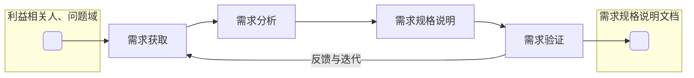
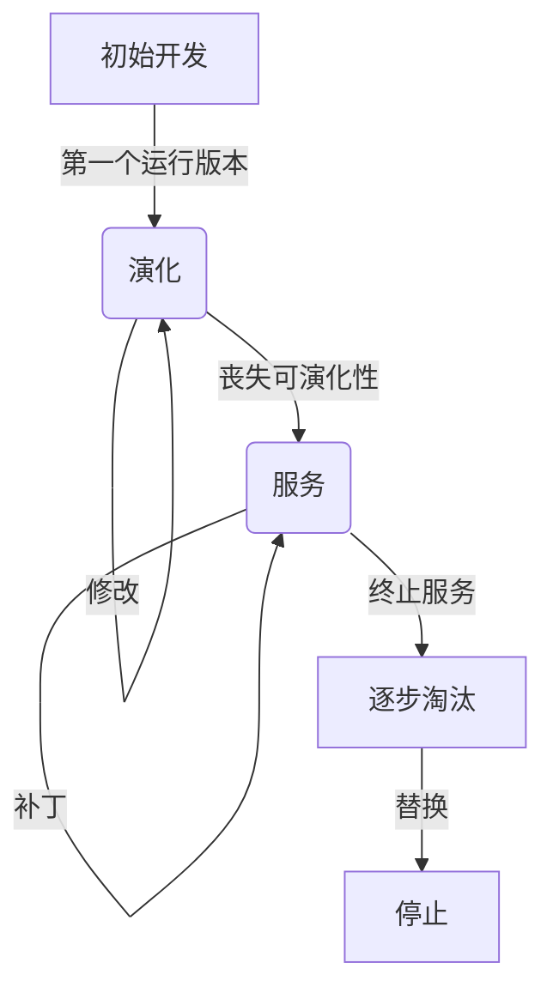

> [!warning] 考前按复习大纲临时整理而成，排版不美观，内容可能有误，且不保证完整性，仅供参考。若有错误或遗漏，请及时指出。

## 1.1 软件工程基础

> [!tip] 软件的本质是信息处理

> [!question] 什么是软件？
> - 软件是独立于硬件的
> - 软件是一种工具
> - 软件 = 程序 + 文档 + 数据+ 知识
> - 软件开发比编程复杂得多
> - 应用软件源于现实，又反过来改进现实

## 1.2 项目管理基础 

> [!tip] 项目是为创建唯一产品、服务或成果而进行的临时性工作

- 项目管理的目标：在铁三角约束下交付质量

```
       范围
       / \
      /   \
     / 质量 \
    /________\
 时间         成本
```

## 2.1 需求工程基础

- 需求开发过程模型



## 2.2 AI 辅助需求获取

- 需求工程的四个核心活动

| 活动 | 核心问题 | 常用方法 |
| --- | --- | --- |
| **获取** | 利益相关者真正需要什么？ | 访谈、问卷、观察、场景分析 |
| **分析** | 需求之间是否冲突？优先级如何？ | MoSCoW、冲突矩阵 |
| **规格说明** | 如何无歧义地描述需求？ | 用户故事、Use Case、IEEE 830 |
| **验证** | 需求是否完整、可测试、可追踪？ | 评审、原型、验收测试 |


> [!note] 用户故事标准格式
> 作为 ＿＿＿（角色），
> 我希望 ＿＿＿（功能），
> 以便 ＿＿＿（价值/目标）。
> 
> 验收标准：
> - Given ＿＿＿（前置条件）
> - When ＿＿＿（触发动作）
> - Then ＿＿＿（预期结果）

> [INVEST] “好需求” 的关键维度为**可测试**

## 2.3 用例建模与用户故事

> [!note] 名词解释：用例
> 用例描述了在不同条件下系统对某一用户的请求的响应。每一个行为序列被称为一个场景。一个用例是多个场景的集合。

- **用例描述**

| 10 字段 | 内容描述 |
|------|-----------|
| ID | 用例的唯一标识（如 `UC1`、`UC2`） |
| 名称 | 对用例内容的精确描述 |
| 参与者 | 描述系统的参与者和每个参与者的目 |
| 触发条件 | 标识启动用例的事件 |
| 前置条件 | 用例能够正常启动和工作的系统状态条件 |
| 后置条件 | 用例执行完成后的系统状态条件 |
| 正常流程 | 在常见和符合预期的条件下，系统与外界的行为交互序列 |
| 扩展流程 | 用例中可能发生的其他场景（异常、分支） |
| 特殊需求 | 和用例相关的其他特殊需求，尤其是非功能性需求 |
| 补充说明 | 其他需要记录的信息 |

> 前 6 个字段描述基本信息，后 4 个字段描述行为与约束

- UC1 销售处理 —— 基本信息

| 字段 | 内容 |
| --- | --- |
| ID | `UC1` |
| 名称 | 销售处理 |
| 参与者 | 收银员 |
| 触发条件 | 顾客携带商品到达销售点 |
| 前置条件 | 收银员必须已经被识别和授权（**登录**） |
| 后置条件 | 存储销售记录，**更新**库存，打印收据 |

> 前置条件描述的是系统在用例开始前必须满足的状态，不是用例自身要执行的步骤（如"登录"不应出现在正常流程中）
> 后置条件描述的是什么改变了（创建对象、修改属性、建立关联），不是怎么做

- UC1 销售处理 —— 正常流程

| 步骤 | 行为描述 |
|------|----------|
| 1 | 收银员开始一次新的销售 |
| 2 | 如果是 VIP 顾客，收银员输入客户编号 |
| 3 | 收银员输入商品标识 |
| 4 | 系统记录商品并显示商品和赠品信息 |
| 5 | 系统显示已购入的商品清单和赠品清单 |
| 6 | 收银员结束输入，系统计算总价 |
| 7 | 系统根据赠送策略补充赠品清单 |
| 8 | 收银员请顾客支付 |
| 9 | 顾客支付，收银员输入现金数额 |
| 10 | 系统给出应找的余额 |
| 11 | 系统记录销售信息并更新库存 |
| 12 | 系统打印收据 |

- UC1 销售处理 —— 扩展流程 

| 编号 | 扩展条件 | 处理方式 |
|------|----------|-----------|
| 2a | 非法客户编号 | 系统提示错误并拒绝输入 |
| 3a | 非法商品标识 | 系统提示错误并拒绝输入 |
| 3b | 多个相同类别商品 | 收银员手工输入商品标识和数量 |
| 3–7a | 顾客要求删除商品 | 收银员输入标识删除，系统更新列表和总价 |
| 3–7b | 顾客要求取消交易 | 收银员在系统中取消交易 |
| 6a | 没有可执行的特价策略 | 系统计算并生成抵价券 |

> 扩展流程的编号规则：数字表示从正常流程的哪一步分支出去，如 "3-7a" 表示在步骤 3 到 7 之间的任意时刻都可能发生

> 注意 *a 编号——表示在任意步骤都可能发生的替代场景
>
> - 任意步骤顾客取消
> - 顾客修改某商品数量
> - 顾客移除某商品

- BDD：用 "测试怎么写" 来倒逼需求精确化（验收标准）
  - Given - When - Then
  - 消除歧义、可直接转为自动化测试、开发/测试/业务三方对齐

```
用例描述（正常流程 + 扩展流程）
         │
         │ 等价转换
         ▼
BDD 场景集（Given-When-Then）
         │
         │ 自动化框架
         ▼    
可执行的验收测试
```

## 2.4 需求分析方法与 AI 辅助建模

> 需求分析是从获取结果到共同理解的桥梁。
> 它的核心目标：消除歧义、建立模型、为设计奠基。

- 需求分析的任务
  - 建立分析模型
    - 抽象：忽略细节，聚焦本质特征和关键关系
    - 分解：将复杂系统拆分为可理解的子部分
  - 创建解决方案

## 2.5 需求文档化、验证与冲突检测

两种核心文档：


| 维度 | 用例文档 | 软件规格说明文档（SRS） |
| --- | --- | --- |
| 视角 | 用户视角 | 系统视角 |
| 侧重点 | 交互流程 | 独立需求 |
| 基础 | 以一次交互为基础 | 以一次交互中的软件系统处理细节为基础 |
| 组织方式 | 按用例组织 | 按功能模块/特性组织 |
| 适用场景 | 需求沟通、用户确认 | 设计、开发、测试 |

需求可追踪性

> 记录需求与其他工作产品之间的对应关系，确保每条需求都有来源、有实现、有验证。

- 前向追踪
  - 需求 → 设计 → 代码 → 测试
  - 确保每条需求都被实现和验证
- 后向追踪
  - 代码 → 设计 → 需求
  - 确保每段代码都有需求依据

需求追踪矩阵

| 需求ID | 来源 | 设计模块 | 代码模块 | 测试用例 |
|--------|------|----------|----------|----------|
| REQ-001 | 客户访谈#3 | M-Auth | auth.py | TC-001, TC-002 |
| REQ-002 | 法规要求 | M-Security | crypto.py | TC-010 |
| REQ-003 | 用户故事#7 | M-Cart | cart.py | TC-020 |

追踪的两个核心用途

1. 一致性审计：每条需求是否都有设计元素来实现？每个设计元素是否都有需求依据？
2. 变更影响分析：如果 `REQ-001` 变更 → 追踪矩阵立刻告诉你受影响的设计、代码和测试

## 3.1 软件设计基础与体系结构概念

什么是架构气味？

- 架构气味是系统体系结构中可能导致**维护困难、性能下降或演化受阻**的结构性问题。

| 气味类型 | 描述 | 后果 |
| --- | --- | --- |
| 循环依赖 | $A \to B \to C \to A$ 形成环 | 无法独立编译/部署/测试 |
| God Component | 一个包/模块承担过多职责 | 修改波及面大，测试困难 |
| 层违观调用 | 展示层直接访问数据层 | 绕过业务规则，安全风险 |
| Feature Envy | 模块频繁访问另一模块的内部数据 | 高耦合，应考虑职责迁移 |
| Scattered Functionality | 同一功能分散在多个模块 | 修改需同时改多处 |

ADR —— 架构决策记录

- 不仅记录决策，还要记录为什么拒绝其他方案

## 3.2 体系结构风格与设计过程

### 体系结构风格

#### 5 管道-过滤器风格


#### 6 客户端-服务器 + REST 风格

- 无状态：每次请求包含所有信息
- 统一接口：HTTP 动词 + URI 资源
- 分层系统：客户端不知道是否直连服务器

#### 7 微服务风格


- 每个服务独立部署、独立数据库
- 通过 REST/消息队列通信
- 团队按服务边界划分

### 体系结构设计过程

**步骤 1：分析关键需求和项目约束**

- **非功能需求**（可维护、性能）和**项目约束**往往对架构选择的影响大于功能需求
- ASR —— 架构重要需求

**步骤 2：选择体系结构风格**

| 需求特征 | 推荐风格 | 原因 |
| --- | --- | --- |
| 企业级业务系统、团队分工 | 分层 | 职责分明、易于分工 |
| 数据流式处理、转换链 | 管道–过滤器 | 数据逐步变换 |
| 高交互、多视图同步 | MVC | ==界面与逻辑分离== |
| 大规模、独立部署、多团队 | 微服务 | 独立开发/部署/扩展 |
| 松耦合、异步通信 | 事件驱动 | 发布/订阅解耦 |
| 小型工具、脚本 | 主程序–子程序 | 简单直接 |

**步骤 3：逻辑设计 — 需求到模块的映射**

设计原则

1. 高内聚 — 相关功能放在同一模块  
2. 低耦合 — 模块间依赖最小化  
3. 单一职责 — 每个模块只做一件事  
4. 信息隐藏 — 隐藏实现细节，暴露接口

**步骤 4：接口设计**

- 定义模块对外暴露的 API
- 确定参数、返回值、异常
- 使用 Interface / DTO 解耦

**步骤 5：物理设计**

- 决定部署拓扑（单机/分布式）
- 数据库选型与部署
- 网络、中间件配置

**步骤 6：验证设计方案**

- 对照需求逐条检查
- 场景走查
- 原型验证关键风险点

**步骤 7：评审与改进**

- 组织架构评审会
- 检查一致性与完整性
- 记录架构决策记录 (ADR)
- 输出《架构设计文档》

### 案例

| 考虑因素 | 分析 | 结论 |
| --- | --- | --- |
| 系统类型 | 企业级业务信息系统 | 适合分层 |
| 团队技术栈 | Java + Spring（天然分层） | 适合分层 |
| 非功能需求 | 安全（认证/鉴权可作为独立层） | 适合分层 |
| 可维护性 | 功能模块多，需要清晰职责划分 | 适合分层 |
| 项目约束 | 进度紧，分层架构成熟度高 | 适合分层 |
| 兼容约束 | IC2 需在数据层封装 ERP 接口 | 适合分层 |


> 改进：三层均按功能域拆分为独立子包，每层约 5 个包，粒度合理，支持团队并行开发

**初步设计方案三 — 接口独立层与依赖倒置**


#### 核心改进

| 改进点         | 说明                                       |
|----------------|--------------------------------------------|
| 接口独立成层   | `Service Interface` 和 `DAO Interface` 作为独立层 |
| 实现继承接口   | `Service Impl → implements → Service Interface` |
| 上层依赖接口   | 展示层依赖 `Service Interface`，不依赖实现     |
| VO/PO分离      | VO用于展示层–逻辑层，PO用于逻辑层–数据层       |

#### 依赖关系

| 依赖方向                         | 说明                     |
|----------------------------------|--------------------------|
| 展示层 → `Service Interface`     | 上层依赖接口             |
| `Service Impl` → `Service Interface` | 实现继承接口             |
| `Service Impl` → `DAO Interface` | 上层依赖接口             |
| `DAO Impl` → `DAO Interface`     | 实现继承接口             |
| ==展示层 + `Service Interface` → VO== | 共同依赖值对象           |
| ==`Service Impl` + `DAO Interface` → PO== | 共同依赖持久化对象       |

## 3.3 体系结构设计实践与验证

| 视图 | 关注点 | 对应 UML 图 | 面向角色 |
| --- | --- | --- | --- |
| 逻辑视图 | 功能需求、类与包的组织 | 包图、类图 | 架构师、开发者 |
| 开发视图 | 代码组织、模块划分 | 组件图 | 开发者 |
| 进程视图 | 并发、同步、性能 | 活动图、序列图 | 系统集成者 |
| 物理视图 | 部署拓扑、硬件映射 | 部署图 | 运维工程师 |
| 场景视图 | 用例驱动、验证其他视图 | 用例图 | 所有利益相关者 |

| 视图 | 核心问题 | 在线书店案例要点 |
|------|----------|------------------|
| 逻辑 | 功能怎么划分？ | `controller / service / dao / entity` 四层包 |
| 开发 | 代码怎么组织和构建？ | 4 个 Maven 模块，`entity` 是公共依赖 |
| 进程 | 运行时线程 / 并发如何？ | 200 worker + 20 DB连接 + 定时器 + 异步池 |
| 物理 | 部署在哪里？ | Browser → Tomcat → MySQL（单体） |
| 场景 | 用例能否穿透所有层？ | 购买图书穿透 4 层 + 库存锁 + 支付幂等 |


案例：在线书店 — **逻辑视图（包图）**


案例：在线书店 — **物理视图（部署图）**


案例：在线书店 — **开发视图（组件图）**


**接口的三大好处**

1. 解耦：上层不依赖下层实现
2. 可替换：实现类可以随时替换
3. 可测试：用 Mock 替代真实实现

**接口设计小结**

| 设计要点 | 说明 |
| --- | --- |
| 接口 = 契约 | 定义层间交互的 What，隐藏 How |
| PO vs VO | 隔离持久化细节与展示需求 |
| DIP | 高层和低层都依赖抽象，不直接耦合 |
| 无状态设计 | Service 不持有请求级别的状态，确保线程安全 |

**案例：Spring Boot 项目结构**

```
bookstore/
├── src/main/java/com/bookstore/
│   ├── BookStoreApplication.java          ← 启动类
│   ├── controller/
│   │   ├── BookController.java
│   │   └── OrderController.java
│   ├── service/
│   │   ├── BookService.java               ← 接口
│   │   ├── OrderService.java              ← 接口
│   │   └── impl/
│   │       ├── BookServiceImpl.java
│   │       └── OrderServiceImpl.java
│   ├── dao/
│   │   ├── BookDao.java                   ← 接口
│   │   └── OrderDao.java                  ← 接口
│   └── entity/
│       ├── Book.java
│       └── Order.java
├── src/main/resources/
│   └── application.properties
└── pom.xml
```

**持续集成（CI）**

- 开发者提交代码 -> 编译构建 -> 单元测试 -> 集成测试 -> 代码质量检查 -> 部署到测试环境

* 快速反馈：提交后几分钟内知道是否破坏了集成
* 降低风险：频繁小集成 vs 一次大集成
* 工具链：Git + GitHub Actions + Maven/Gradle

**集成验证小结**

| 阶段 | 方法 | 目的 |
| --- | --- | --- |
| 设计阶段 | `ATAM` / `SAAM` 评审 | 发现架构风险与权衡 |
| 编码阶段 | 持续集成 CI | 快速反馈集成问题 |
| 测试阶段 | `Stub` / `Driver` | 隔离测试各层 |
| 测试阶段 | 集成测试 | 验证端到端链路 |

**包级度量**

| 指标 | 公式 | 含义 |
|------|------|------|
| $Ca$ (传入依赖) | 依赖本包的外部包数 | 越高越稳定 |
| $Ce$ (传出依赖) | 本包依赖的外部包数 | 越高越不稳定 |
| $I$ (不稳定性) | $Ce / (Ca + Ce)$ | $0=$完全稳定, $1=$完全不稳定 |
| $A$ (抽象度) | 抽象类数 / 总类数 | 接口包→高, 实现包→低 |

**ADL —— 架构描述语言**

| ADL 工具 | 用途 | 示例 |
|------|------|------|
| PlantUML | 包图、组件图、部署图 | `@startuml ... package ... @enduml` |
| Mermaid | 流程图、时序图 | `graph TD; A-->B` |
| Spring Boot 目录结构 | 架构的代码级表达 | `com.bookstore.controller/service/dao` |

## 4.1 详细设计

**详细设计的输入**：

| 来自需求工程（RE） | 来自体系结构 |
|-------------------|--------------|
| 用例（Use Case）—— 功能场景 | 模块的规格（Specification） |
| 领域模型 / 概念类图 —— 业务实体 | 导入/导出接口（Export / Import） |
| 系统顺序图 —— 系统级交互 | 风格约束（分层、MVC、微服务……） |
| 状态图 —— 复杂对象生命周期 | 构件间接口（如 `SalesBLService`） |
| 非功能需求 —— 性能、可靠性、安全等 | |

**面向对象详细设计的过程**

```planetext
设计模型建立
├── 通过职责建立静态设计模型
│   ├── 抽象类的职责（数据职责 + 行为职责）
│   ├── 抽象类之间的关系（关联/聚合/组合；继承/实现）
│   └── 添加辅助类（DTO、Helper、Util...）
└── 通过协作建立动态设计模型
    ├── 抽象对象之间协作（顺序图 / 通讯图）
    ├── 明确对象的创建（GRASP-Creator）
    └── 选择合适的控制风格（集中 / 委托 / 分散）

设计模型重构
├── 根据模块化的思想进行重构（目标：高内聚、低耦合）
├── 根据信息隐藏的思想进行重构（目标：隐藏职责与变更）
└── 利用设计模式重构（GoF 23 / DDD / ...）
```

**协作的集成测试：**

* 针对逻辑复杂、交互较多的类间协作，需要进行集成测试。
* 在测试中，通常使用 **Mock Object（模拟对象）** 来替代外部依赖。Mock 是一种可控的“假对象”，使开发者能只关注被测的协作逻辑

### 16 设计模式

#### 16.1 可修改性

**组合优于继承**：为了获得更高的灵活性，推荐使用类与类之间的 “组合” 关系而非仅仅依赖继承（父改子必改）。组合不仅解除了前后端在接口上的耦合，还能让底层实现类的对象进行动态创建、动态配置和动态销毁。

```java
class Backend{
    public int method_2(){
    }
}

class Frontend{
    public Backend back = new Backend();
    public int method_2(){
        back.method_2();
    }
}

class Client{
    public static void main(String[] args){
        Frontend front = new Frontend();
        int i = front.method_2();
    }
}
```

### 17 软件构造

**重构的时机**

- 增加新的功能时
- 发现了缺陷进行修复时
- 进行代码评审时

**代码的坏味道**

- 太长的方法
- 太大的类
- 太多的方法参数
- 多处相似的复杂控制结构
- 重复的代码
- 过多的注释

**测试驱动开发（TDD）的三个阶段**

1. 🔴 **阶段一：红灯（Red）—— 编写失败的测试**

* **动作：** 编写测试代码，运行测试。
* **结果：** 此时因为真实的业务逻辑尚未实现（甚至连类或方法名都还不存在，会导致编译错误），测试必然会**失败**（通常在测试框架中显示为红色）。
* **目的：** 明确需求和接口设计。这个失败的测试定义了成功的标准。

2. 🟢 **阶段二：绿灯（Green）—— 编写刚好通过测试的代码**

在这个阶段，你的唯一目标是用最快、最简单的方式让刚刚失败的测试通过。

* **动作：** 编写实现代码，再次运行测试。
* **结果：** 测试**成功通过**（显示为绿色）。
* **注意：** 此时**不要**考虑代码的优雅性、性能优化或架构设计。哪怕是用最粗暴的 `if-else` 或硬编码（Hardcode）把数据凑出来，只要能让测试变绿即可。
* **目的：** 快速提供一个可运行的、满足当前需求的基线版本。

3. **阶段三：重构（Refactor）—— 优化代码结构**

现在你有了一个由测试保护的安全网，可以放心地对刚才匆忙写出的代码进行整理。

* **动作：** 消除重复代码、提取方法/类、优化命名、改善设计模式。
* **结果：** 每次修改后都要重新运行所有测试，确保它们**依然保持绿色**。
* **目的：** 在不改变软件外部行为的前提下，提升代码的内部质量、可读性和可维护性。


### 19 软件测试

- 随机测试：从所有可能的输入值中选择输入子集，建立测试用例

### 20 软件交付

- 安装/部署（单安装包不行）将软件产品移交给用户
- 培训/文档支持保障用户能够有效掌握和使用软件

### 21 软件维护与演化

**软件维护的过程**

1. 问题/修改的标识、分类与划分优先级
2. 分析：可行性分析、详细分析
3. 设计
4. 实现
5. 回归测试
6. 验收测试
7. 交付

> 回归测试：在代码修改后，重新运行之前的测试，以确保旧功能没有被破坏

> [!note] 演化
> 意指软件交付后的 “修改” 活动，有时是开发与维护的综合

**软件演化生命周期模型**



- **初步开发**：建立一个好的软件体系结构
  - 可扩展性、可修改性
- **演化**
  - 预先安排的需求增量
  - 变更请求
  - 修正缺陷
  - 新增需求

> [!info] 演化阶段的软件产品要具备两个特征：
> (1) 软件产品具有较好的可演化性
> (2) 软件产品能够帮助用户实现较好的业务价值
> 
> - 不满足第（2）条特征 -> 停止阶段
> - 满足第（2）条同时不满足第（1）条 -> 服务阶段
> - 由于竞争产品的出现或者其他市场考虑，也可以让同时满足上面两条特征的软件产品提前进入服务阶段

- **服务**
  - 不再持续的增加自己的价值，而只是周期性的修正已有的缺陷
  - 进入该阶段，可能由于无法继续演化，也可能是出于市场考虑，不再重点关注该产品
- **逐步淘汰**
  - 不再提供软件产品的任何服务
  - 用户仍在使用
  - 考虑是否可以作为有用的遗留资源用于新软件的开发
- **停止**
  - 开发者不再维护，用户不再使用


### 22 软件开发过程模型

#### 6 螺旋模型

- ==充分利用原型方法，尽早解决比较高的风险==
- 风险驱动，完全按照风险解决的方式组织软件开发活动
- 迭代与瀑布的结合
  - 开发阶段是瀑布式的
  - 风险分析是迭代的

**优点**

- 降低风险，减少项目因风险造成的损失

**缺点**：

- 存在==原型自身带来的风险，与原型模型相同==
- 模型过于复杂，不利于组织软件开发活动

**适用性**：

- 高风险的大规模软件系统开发


> [!tip] 原型模型 vs 螺旋模型
> 原型模型：使用原型解决需求的不确定性
> 螺旋模型：使用原型解决项目开发中的技术风险

#### 7 Rational 统一过程（RUP）模型

**核心实践方法**

1. 迭代式开发
2. 管理需求
3. 使用基于组件的体系结构
4. 可视化建模
5. 验证软件质量
6. 控制软件变更

**RUP 裁剪**

> RUP 是一个==通用的过程模板==，在一个项目使用 RUP 指导开发活动组织时，需要对 RUP 进行==裁剪和配置==

1. 确定本项目需要哪些工作流
2. 确定每个工作流需要哪些制品
3. 确定 4 个阶段之间如何演进
4、确定每个阶段内的迭代计划
5、规划工作流的组织

**优点**

- 吸收和借鉴了传统上的最佳实践方法，保证软件开发过程的组织是基本有效和合理的
- 大小型项目开发均适用，适用面广泛
- 有一套软件工程工具的支持，帮助有效实施

**缺点**：

- 没有考虑交付之后的软件维护问题
- 裁剪和配置工作不是一个简单的任务

**适用性**：

- RUP 是重量级过程，能够胜任开发大型项目时的活动组织，但经过裁剪，也可以变为轻量级过程，也能够胜任小团队的开发活动组织

#### 8 敏捷过程

敏捷思想：

- 个体和互动 高于 流程和工具
- 工作的软件 高于 详尽的文档
- 客户合作 高于 合同谈判
- 响应变化 高于 遵循计划

敏捷原则：

1. 我们最重要的目标，是通过持续不断地及早交付有价值的软件使客户满意。
2. 欣然面对需求变化，即使在开发后期也一样。为了客户的竞争优势，敏捷过程掌控变化。
3. 经常地交付可工作的软件，相隔几星期或一两个月，倾向于采取较短的周期。
4. 业务人员和开发人员必须相互合作，项目中的每一天都不例外。
5. 激发个体的斗志，以他们为核心搭建项目。提供所需的环境和支援，辅以信任，从而达成目标。
6. 不论团队内外，传递信息效果最好效率也最高的方式是面对面的交谈。
7. 可工作的软件是进度的首要度量标准。
8. 敏捷过程倡导可持续开发。责任人、开发人员和用户要能够共同维持其步调稳定延续。
9. 坚持不懈地追求技术卓越和良好设计，敏捷能力由此增强。
10. 以简洁为本，它是极力减少不必要工作量的艺术。
11. 最好的架构、需求和设计出自自组织团队。
12. 团队定期地反思如何能提高成效，并依此调整自身的举止表现。

践行敏捷思想与原则的过程方法

- 极限编程 XP 的一个重要思想是极限利用简单、有效的方法解决问题

> 敏捷过程包含的方法众多，各有特点，除了共同的思想和原则之外，很难准确描述它们的共同点，所以也无法确切界定它们的优缺点

---

- 敏捷开发：侧重于开发阶段，强调==通过迭代和客户反馈来应对需求变化==，确保 “**做正确的事**”。
- DevOps：侧重于交付和运维阶段，强调通过自动化和跨部门协作来加速软件上线，确保 “**快速、稳定地把事做完**”
- 总结：敏捷开发是 DevOps 的基础，而 DevOps 则是敏捷开发在运维和交付环节的延伸与补全