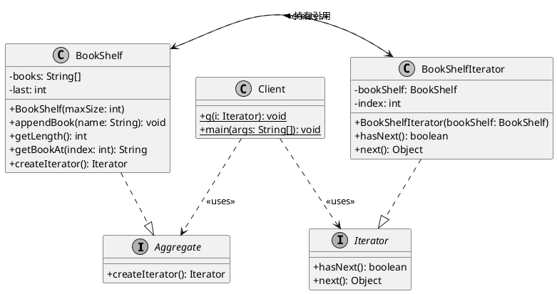
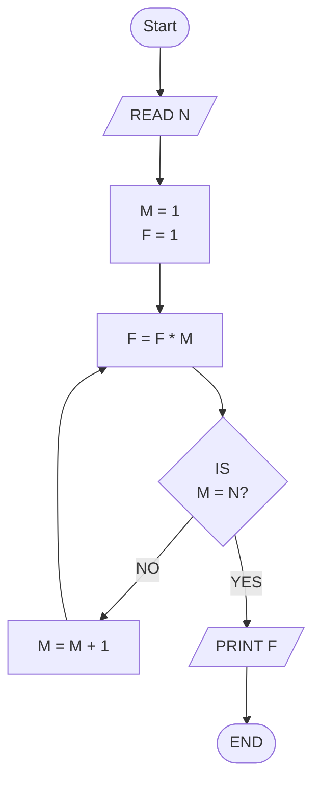
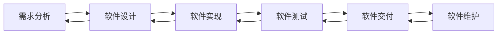

> [!warning] 考前按复习大纲临时整理而成，排版不美观，内容可能有误，且不保证完整性，仅供参考。若有错误或遗漏，请及时指出。

## 包的设计原则

### 内聚性三原则 

| 原则 | 全称 | 含义 |
|------|------|------|
| REP | 重用-发布等价原则 | 重用的粒度 = 发布的粒度 |
| CRP | 共同重用原则 | 一起被使用的类放同一个包 |
| CCP | 共同封闭原则 | 因同一原因变更的类放同一个包 |

**REP 重用–发布等价原则**

- 如果你要复用一个包中的某个类，你就得依赖整个包
- 因此，**包中的类必须有理由被一起重用**

案例：在线书店

| 包 | 是否满足 REP | 理由 |
|---|---|---|
| `entity` (Book, Order, Customer...) | 满足 | 所有层都引用 `entity`，整体发布 |
| 假如把 `Book` 和 `PaymentGateway` 放同一包 | 违反 | 用图书搜索功能不需要支付网关 |


**CRP 共同重用原则**

- CRP 告诉我们哪些类 **不该** 放在一起：如果用了包中 A 类但不需要 B 类，说明 A 和 B 不该在同一个包

案例：连锁超市

| 功能 | 对应逻辑包 | CRP 分析 |
|---|---|---|
| 销售 | SalesUI, Sales, SalesData | 三个总是一起使用 ✅ |
| 库存 | CommodityUI, Commodity, CommodityData | 三个总是一起使用 ✅ |
| 销售 + 库存放一个包？ | 违反 CRP | 修改库存时被迫重新测试销售 |

**CCP 共同封闭原则**

- 当需求变更时，**变更应该集中在尽可能少的包中**
- 违反 CCP = 一次需求变更要改多个包 = 高维护成本

需求变更："支付方式新增微信支付"

| 如果按 CCP 划分 | 变更范围 |
|----------------|----------|
| `service.payment` + `dao.payment` | 只改 2 个包 ✅ |
| 如果支付和订单混在一起 | 改动波及订单逻辑 ✖ |


**CRP 与 CCP 的权衡**

CRP 和 CCP 是互斥的 —— 不可能同时完美满足两者。

| 维度 | CRP（共同重用） | CCP（共同封闭） |
|------|------------------|-----------------|
| 服务对象 |  重用者（Reusers） |维护者（Maintainers） |
| 包的大小 | 倾向让包更小（减少不必要的依赖） |倾向让包更大（变更集中） | 
| 优先场景 | 项目成熟期：对外发布 / 复用 |项目早期：需求频繁变更 | 


- 项目生命周期中的演进策略
- 早期：以 CCP 为主导 → 大包、便于开发和维护
- 后期：架构稳定后，重构包结构 → 以 CRP 为主导，方便外部复用

### 耦合性三原则

| 原则 | 全称 | 含义 |
|------|------|------|
| ADP | 无环依赖原则 | 包之间的依赖关系不能形成环 |
| SDP | 稳定依赖原则 | 依赖方向朝着更稳定的包 |
| SAP | 稳定抽象原则 | 越稳定的包应越抽象 |

- ADP: `controller → service → dao`，无环
- SDP: `entity` 最稳定（很少变化），所有层都依赖它
- SAP: `dao` 包对外暴露的是**接口**（抽象），实现类放在 `dao.impl` 中

**ADP 修复方案**


**SDP 稳定依赖原则**

- **稳定** = 很多包依赖它（被需要） → 改动代价大 → 不容易变
- **不稳定** = 它依赖很多包 → 容易变

| 包         | Ca(传入) | Ce(传出) | I = Ce/(Ca+Ce) | 稳定性         |
|------------|----------|----------|----------------|----------------|
| `entity`   | 4        | 0        | 0.00           | 最稳定 — 正确！ |
| `controller` | 0        | 3        | 1.00           | 最不稳定 — 正确！ |
| `service`  | 1        | 2        | 0.67           | 中等           |

`controller`（不稳定）→ `service`（中等）→ `dao` → `entity`（稳定）

**SAP 稳定抽象原则**

越稳定的包应越抽象；越不稳定的包应越具体。

## 如何实现可修改性、可扩展性、灵活性

**可修改性**

- **定义**：对已有实现的修改，例如修改现有的促销策略 
- **如何实现**：接口与实现的分离
  - 通过接口与实现该接口的类，将接口与实现相分离
  - 通过子类继承父类，将父类的接口与子类的实现相分离

* 实现接口

```java
public class Client {
    public static void main(String[] args) {
        // 创建
        Interface_A a = new Class_A1();

        // 调用
        a.method_A();
    }
}

public interface Interface_A {
    // 接口
    public void method_A();
}

public class Class_A1 implements Interface_A {
    // 实现
    public void method_A() {
        System.out.println("Class_A1's method_A()");
    }
}
```

* 继承

```java
public class Client {
    public static void main(String[] args) {
        // 创建
        Super_A a = new Sub_A1();

        // 调用
        a.method_A();
    }
}

public class Super_A {
    public void method_A() {
        // 父类的接口和父类的实现
        System.out.println("Super_A's method_A!");
    }
}

public class Sub_A1 extends Super_A {
    public void method_A() {
        // 子类的实现
        System.out.println("Sub_A1's method_A!");
    }
}
```

**可扩展性**

* **定义**：对新的实现的扩展，例如在系统中增加一条全新的促销策略
* **如何实现**：在需要扩展新功能时，可以直接通过**创建新的具体实现类或继承新的子类**来完成，而==不需要改动原有的接口框架==


**灵活性**

* **定义**：对实现的动态配置，例如在运行时动态更改某件商品对应的促销策略
* **如何实现**：客户端代码调用的接口保持不变，但只要让该接口指向不同的具体类对象，系统就能动态选择不同的执行逻辑

## 策略模式

- **定义**：策略模式定义了算法族，并将它们分别封装起来，让它们之间可以互相替换
- **目的**：此模式让算法的变化独立于使用算法的客户
- **动机**：在处理像 “不同雇员薪水支付方式（钟点工、月薪、提成）” 这类问题时，如果将所有逻辑硬编码在 `switch-case` 语句中，系统将极难修改和扩展

**角色组成与协作**

* **上下文（Context）**：被配置了具体的策略对象，拥有策略对象的引用，并提供方法供策略访问其内部数据
* ==**策略（Strategy）**：声明了**所有支持的算法或策略的公共接口**==
* **具体策略（ConcreteStrategy）**：实现了策略声明的接口，提供具体的算法实现
* **协作方式**：客户通常负责创建具体策略的对象，并将其传递给上下文，从而灵活地配置和动态替换具体的算法实现

- **考点 1：为什么==选用 “组合” 而不是 “继承” ？==**
  - **继承的缺点**：对象在创建时就选定了策略实现，无法动态修改；且父类接口的改变会强耦合所有子类
  - **组合的优点**：使得上下文和策略之间的耦合度极低 。
  - **动态配置**：通过组合，上下文可以维护一个策略队列（n 选多），实现==运行时的动态配置==，而继承只能在创建时进行 n 选一 
- **考点 2：体现的设计原则**
  - **减少耦合**：减少了策略的使用类（上下文）和策略的实现类（具体策略）之间的直接耦合
  - **依赖倒置**：策略的使用类依赖的是策略的 “抽象接口”，而不是具体的实现类

---

这段代码使用的是 Java 语言，完整展示了策略模式如何消除 `switch-case`，并实现运行时的动态配置：

### 1. 策略接口（Strategy）

声明所有支持的薪水计算算法的公共接口

```java
public interface PaymentClassification {
    // 策略接口定义的方法
    public double calculatePayment();
}
```

### 2. 具体策略实现（ConcreteStrategy）

实现了接口，提供具体的算法逻辑。这里展示“钟点工”和“月薪”两种薪水计算变体

```java
// 具体策略 A：钟点工薪水计算策略
public class HourlyClassification implements PaymentClassification {
    private int hourlyRate;
    private int hours;

    public HourlyClassification(int rate, int h) {
        this.hourlyRate = rate;
        this.hours = h;
    }

    @Override
    public double calculatePayment() {
        return hourlyRate * hours; // 薪水=时薪*工作小时数
    }
}

// 具体策略 B：固定月薪计算策略
public class SalariedClassification implements PaymentClassification {
    private double monthlySalary;

    public SalariedClassification(double salary) {
        this.monthlySalary = salary;
    }

    @Override
    public double calculatePayment() {
        return monthlySalary; // 薪水=固定月薪
    }
}
```

### 3. 上下文类（Context）

这是策略的使用者。它**拥有 Strategy 对象的引用**，但通过组合的方式与具体实现解耦

```java
public class Employee {
    private String name;
    // 拥有 Strategy 对象的引用
    private PaymentClassification pc; // <--

    public Employee(String name) {
        this.name = name;
    }

    // 允许在运行时动态配置和修改策略
    public void setPaymentClassification(PaymentClassification pc) {
        this.pc = pc;
    }

    // 执行策略：将具体的计算请求转发给策略类
    public void getPayment() {
        double payment = pc.calculatePayment();
        System.out.println(name + " get " + payment + " dollars!");
    }
}
```

### 4. 客户端调用（Client）

客户负责创建具体的策略对象，并传递给 Context 进行灵活配置

```java
public class TestDrive {
    public static void main(String[] args) {
        // 创建上下文对象（雇员 Tom）
        Employee tom = new Employee("Tom");

        // 场景 1：Tom 最初是钟点工，配置时薪策略
        PaymentClassification hourlyStrategy = new HourlyClassification(10, 40);
        tom.setPaymentClassification(hourlyStrategy);
        tom.getPayment(); // 输出: Tom get 400.0 dollars!

        System.out.println("--- 晋升后 ---");

        // 场景 2：Tom 晋升为正式员工，无需修改 Employee 类代码，直接动态替换策略对象
        PaymentClassification salariedStrategy = new SalariedClassification(3000);
        tom.setPaymentClassification(salariedStrategy);
        tom.getPayment(); // 输出: Tom get 3000.0 dollars!
    }
}
```

## 抽象工厂模式

### 一、核心设计动机与解决的痛点（为什么需要工厂？）

* **传统对象创建的痛点**：在软件系统中，对象的创建往往比较复杂。普通的行为我们可以通过多态来实现，但是**构造方法却无法多态**
* **代码耦合与扩展性差**：如果客户端直接通过复杂的 `if-else` 或 `switch` 逻辑来决定实例化哪个具体子类，会导致 Client 严重依赖具体类。一旦子类发生改变或增加新类，都需要大量修改 Client 代码
* **简单工厂的解决方案**：引入一个专门的 “工厂” 类，为对象的创建提供一个统一接口，将  “具体如何创建对象” 的实现逻辑封装并隐藏起来。这样就降低了客户端与具体产品类之间的耦合


### 二、进阶考点：抽象工厂模式

当系统面临更复杂的对象组合时，简单的工厂模式就不够用了，这时通常会考查**抽象工厂模式**

* **面临的 “组合爆炸” 挑战**：当我们需要创建多种有着组合关系的对象时（例如：一个汽车装配车间需要组合不同类型的引擎、轮胎、车身），如果为每一种型号的车都建一个工厂，就会遇到 “组合爆炸” 问题，导致工厂类泛滥
* **核心定义**：抽象工厂模式定义了一个创建对象的接口，由子类决定要实例化哪一个类，将类的实例化延迟到子类
  


- **设计原则体现（重点考点）**：
  - **职责抽象**：抽象了对于对象创建的职责
  - **接口的重用**：提供了对于对象创建的标准化接口

### 三、抽象工厂的角色组成与协作

* **抽象工厂（AbstractFactory）**：声明创建一系列抽象产品的各个接口
* **具体工厂（ConcreteFactory）**：真正执行实例化，实现了具体产品的创建过程
* **抽象产品（AbstractProduct） & 具体产品（ConcreteProduct）**：声明并定义了工厂所生产的产品的具体实现
* **客户端（Client）与协作**：==客户端只依赖于抽象工厂和抽象产品的接口==。客户端通过获得不同的具体工厂实例，就能灵活配置并获得不同的产品族 

### 四、应用场景与需要注意的 “坑”（优缺点分析）

**优点 / 适用场景**：

* **隔离实现**：成功隔离了客户和具体的实现，客户视野里只有抽象的接口
* **保证一致性**：强制使得同一个产品族的产品被绑定在一起使用，系统可以很灵活地在不同产品族之间切换
* **隐藏实现**：如果你想提供一个产品的库，抽象工厂可以帮你只暴露接口，不暴露实现细节

**缺点 / 使用限制（常考的“坑”）**：

* ==**难以支持新种类的产品**==：抽象工厂最大的代价是**对产品类型的扩展极其困难**。因为抽象工厂的接口一旦定义好，想要增加一种全新的产品部件，就需要修改整个抽象工厂的接口定义及其所有的具体工厂子类
* **使用前提**：该模式适用的前提条件是 —— **具体产品的种类是稳定的**

---

这段 Java 代码展示了如何应对“组合爆炸”问题：通过抽象工厂，我们可以将属于同一个产品族（例如华为的鼠标和键盘、戴尔的鼠标和键盘）的对象绑定在一起创建，同时让客户端与具体的实现类解耦。

### 1. 抽象产品（AbstractProduct）

声明了一系列产品的标准化**接口**

```java
// 抽象产品：鼠标
public interface Mouse {
    void sayHi();
}

// 抽象产品：键盘
public interface Keybo {
    void sayHi();
}
```

### 2. 具体产品（ConcreteProduct）

**实现**了抽象产品接口，定义了具体的细节

```java
// 具体产品族 A：华为外设
public class HuaweiMouse implements Mouse {
    public void sayHi() { System.out.println("我是华为鼠标"); }
}
public class HuaweiKeybo implements Keybo {
    public void sayHi() { System.out.println("我是华为键盘"); }
}

// 具体产品族 B：戴尔外设
public class DellMouse implements Mouse {
    public void sayHi() { System.out.println("我是戴尔鼠标"); }
}
public class DellKeybo implements Keybo {
    public void sayHi() { System.out.println("我是戴尔键盘"); }
}
```

### 3. 抽象工厂（AbstractFactory）

声明了创建一系列抽象产品（鼠标和键盘）的接口 **`produceXXX()`**

```java
public interface PcFactory {
    Mouse produceMouse();
    Keybo produceKeybo();
}
```

### 4. 具体工厂（ConcreteFactory）

真正执行实例化，决定生产哪个具体品牌的产品族

```java
// 具体工厂 A：专门生产华为族产品
public class HuaweiPcFactory implements PcFactory {
    public Mouse produceMouse() { 
        return new HuaweiMouse(); 
    }
    public Keybo produceKeybo() { 
        return new HuaweiKeybo(); 
    }
}

// 具体工厂 B：专门生产戴尔族产品
public class DellPcFactory implements PcFactory {
    public Mouse produceMouse() { 
        return new DellMouse(); 
    }
    public Keybo produceKeybo() { 
        return new DellKeybo(); 
    }
}
```

### 5. 客户端调用（Client）

客户端**只依赖于抽象工厂（`PcFactory`）和抽象产品（`Mouse`, `Keybo`）的接口**

```java
public class Client {
    public static void main(String[] args) {
        // 客户决定使用华为工厂配置
        PcFactory factory = new HuaweiPcFactory();
        
        // 生产出的必定是完美匹配的华为鼠标和键盘，保证了产品族的一致性
        Mouse mouse = factory.produceMouse();
        Keybo keybo = factory.produceKeybo();
        
        mouse.sayHi();
        keybo.sayHi();
        
        System.out.println("--- 切换配置 ---");
        
        // 随时可以极低成本切换到戴尔工厂，客户端后续逻辑完全不用改
        factory = new DellPcFactory();
        factory.produceMouse().sayHi();
        factory.produceKeybo().sayHi();
    }
}
```

**隔离了客户和具体实现**：客户端完全不知道 `HuaweiMouse` 到底是怎么 `new` 出来的，它的视野里只有 `PcFactory` 和 `Mouse` 的接口。这使得系统能够非常灵活地在不同产品族之间进行整体切换，并且强制保证了同族产品的配套使用。

## 单件模式

### 一、核心定义与解决的痛点

* **核心定义**：单件模式确保一个类只有一个实例，并提供一个全局访问点
* **典型问题（场景动机）**：在有些场景中，对于某个类，在内存中只希望有唯一一个对象存在。无论我们创建多少次这个类的对象，其实总共还是只创建了一个对象，每次想得到对象的引用时，都指向那唯一的对象

### 二、设计分析与代码实现步骤

* **第一步：==私有化构造方法==**：首先必须让类的构造方法变为私有的，这是为了防止外部随意创建新对象 。
* **第二步：==静态引用变量==**：在类的成员变量中，需要拥有一个静态的自身类型的引用变量（例如 `uniqueInstance`） 
* **第三步：==提供全局访问点（`getInstance` 方法）==**：只能通过专门的 `getInstance` 方法来获得单例对象的引用
* **内部逻辑判断**：`getInstance` 方法负责返回引用变量 `uniqueInstance`。如果 `uniqueInstance` 等于 `null`，则说明是首次创建，此时通过 `new` 关键字创建对象，并将引用赋值给 `uniqueInstance`。如果 `uniqueInstance` 不等于 `null`，则说明不是首次创建，直接返回已创建好的对象引用即可

### 三、体现的设计原则

* **职责抽象**：单件模式体现了“职责抽象”的设计原则，它将单件实例创建的具体实现细节隐藏了起来

---

- 绝对管控创建权：通过 `private DatabaseFactoryTxtFileImpl()`，切断了外部实例化的可能，这是单件模式的基础
- 按需延迟加载：在 `getInstance()` 方法中，对象是在第一次被真正调用时（`== null` 的判断成立时）才会被 `new` 出来。这就保证了内存中只存在唯一一个对象，且无论后续调用多少次，返回的总是这唯一对象的引用

```java
public class DatabaseFactoryTxtFileImpl implements DatabaseFactory {
    // 1. 静态引用变量：用于存储类的唯一实例，初始为 null
    private static DatabaseFactoryTxtFileImpl databaseFactoryTxtFile = null;

    // 2. 私有化构造方法：防止外部通过 new 关键字随意创建新对象
    private DatabaseFactoryTxtFileImpl() {
    }

    // 3. 提供全局访问点：外部只能通过这个 getInstance 方法获取单例对象
    public static DatabaseFactory getInstance() {
        // 内部逻辑判断：如果等于 null，说明是首次调用，此时创建新对象
        if(databaseFactoryTxtFile == null){
            databaseFactoryTxtFile = new DatabaseFactoryTxtFileImpl();
        }
        // 如果不等于 null，说明对象已经创建过了，直接返回唯一引用即可
        return databaseFactoryTxtFile;
    }
}
```

## 迭代器模式

### 一、 核心定义与问题动机

* **核心定义**：迭代器模式提供一种==顺序访问一个聚合对象（集合）中各个元素的方法，而又无需暴露该对象的内部表示==
* **传统遍历的痛点（动机）**：
  * **灵活性不足**：如果一个方法 `g()` 需要接收一个集合作为参数进行遍历，若参数类型写死为具体的集合（如 `LinkedList`），当后续需求改变需要更快的查询而换成 `HashSet` 时，代码将很难适应。为了灵活性，虽然可以改成抽象类型 `Collection`，但 `g()` 方法往往只想单纯地逐个访问元素，根本不关心底层到底是链表还是散列表。
  * **暴露修改权限（破坏值传递意图）**：如果直接将集合传递给方法，该方法不仅能遍历，还能直接修改（如 `add` 或 `remove`）原集合，这大大增强了对象间的耦合性，使得 “只读访问” 的初衷失效。

### 二、 设计分析与体现的原则

* **设计思路（如何抽象）**：对遍历操作进行抽象，主要提取两个核心行为：
  * 1）判断是否有下一个元素（`hasNext()`）
  * 2）获取下一个元素（`next()`）
  * 有了这两个接口，就可以完成遍历。
* **解决耦合与权限问题**：将 `g()` 方法的参数转换为迭代器的引用后，迭代器仅仅提供了访问集合的方法，却**屏蔽了对集合修改的方法**，从而实现了对集合安全的 “值传递” 效果 。
* **体现的设计原则**：
  * **减少耦合**：减少了遍历的使用类（Client/方法）和遍历的实现类（具体的集合类型）之间的直接耦合。
  * **依赖倒置**：遍历的使用类依赖的是“迭代器的抽象接口”，而不是具体的集合或遍历实现类。

### 三、 角色组成与协作

在类图或代码设计题中，需要清楚迭代器模式的四大核心角色：

* **迭代器（Iterator）**：定义了访问和遍历元素的公共接口（如 `First()`, `Next()`, `IsDone()`, `CurrentItem()` 或 Java 中的 `hasNext()`, `next()`） 。
* **具体迭代器（ConcreteIterator）**：实现了迭代器接口。它负责在对聚合对象进行遍历时跟踪当前的访问位置，并计算出待遍历的后继对象。
* **聚合（Aggregate）**：定义了创建相应迭代器对象的接口（例如 `CreateIterator()` 方法）。
* **具体聚合（ConcreteAggregate）**：实现了创建相应迭代器的接口，该操作会实例化并返回一个对应的 `ConcreteIterator` 对象。

### 四、 应用场景与使用注意点

* **适用场景**：
  * 需要访问一个聚合对象的内容，但又不想暴露它的内部结构/实现时。
  * 希望支持对同一个聚合对象的多种不同遍历方式时。
  * 需要为遍历各种不同的聚合结构提供一个统一的接口时。

- **使用注意点（优势）**：
  * 它支持以不同的方式遍历同一个聚合对象。
  * 迭代器将遍历的职责从集合中抽离，从而**简化了聚合对象的接口** 。
  * 在同一个聚合对象上，可以同时进行多个互相独立的遍历（因为每个迭代器对象都各自维护着自己的遍历状态）。

---

这段代码完整展示了如何将“遍历职责”从“集合对象”中抽离出来，实现客户端与具体集合底层结构的解耦：

### 1. 迭代器接口 (Iterator)

定义了访问和遍历元素的公共接口，也就是课件中提到的提取出来的两个核心行为

```java
public interface Iterator {
    // 判断是否有下一个元素
    boolean hasNext();
    // 获取下一个元素
    Object next();
}

```

### 2. 聚合接口 (Aggregate)

定义了创建相应迭代器对象的规范接口

```java
public interface Aggregate {
    // 返回一个迭代器实例
    Iterator createIterator();
}

```

### 3. 具体聚合 (ConcreteAggregate)

实现了聚合接口。这里我们用一个简单的书架（基于数组实现）作为例子，它负责实例化并返回对应的具体迭代器

```java
public class BookShelf implements Aggregate {
    private String[] books;
    private int last = 0;

    public BookShelf(int maxSize) {
        this.books = new String[maxSize];
    }

    public void appendBook(String name) {
        this.books[last] = name;
        last++;
    }

    public int getLength() {
        return last;
    }

    public String getBookAt(int index) {
        return books[index];
    }

    // 核心：创建并返回专门针对自身结构的迭代器
    @Override
    public Iterator createIterator() {
        return new BookShelfIterator(this);
    }
}

```

### 4. 具体迭代器 (ConcreteIterator)

实现了迭代器接口，负责跟踪当前的访问位置，并计算出待遍历的后继对象

```java
public class BookShelfIterator implements Iterator {
    private BookShelf bookShelf;
    private int index;

    public BookShelfIterator(BookShelf bookShelf) {
        this.bookShelf = bookShelf;
        this.index = 0;
    }

    @Override
    public boolean hasNext() {
        // 判断当前位置是否小于集合的总长度
        return index < bookShelf.getLength();
    }

    @Override
    public Object next() {
        // 返回当前元素，并将游标移向下一个位置
        String book = bookShelf.getBookAt(index);
        index++;
        return book;
    }
}
```

### 5. 客户端调用 (Client)

重现课件中的 `g(Iterator i)` 方法场景。客户端完全不需要知道集合底层是数组还是链表，只需要使用迭代器接口即可 。

```java
public class Client {
    // 课件中提到的方法，参数转为抽象的迭代器引用，屏蔽了集合的具体类型和修改权限
    public static void g(Iterator i) {
        while (i.hasNext()) {
            System.out.println("正在阅读: " + i.next());
        }
    }

    public static void main(String[] args) {
        BookShelf shelf = new BookShelf(4);
        shelf.appendBook("《设计模式》");
        shelf.appendBook("《Java编程思想》");

        // 客户端调用：直接传入创建好的迭代器
        g(shelf.createIterator());
    }
}
```

**屏蔽底层结构**：客户端方法 `g()` 只和 `Iterator` 接口打交道。如果以后 `BookShelf` 底层为了优化查询速度，从数组改成了 `HashSet`，`g()` 方法的代码**完全不需要修改**，只需要新增一个对应的 `HashSetIterator` 即可。
* **权限控制（安全的“值传递”）**：传入 `g()` 方法的是 `Iterator` 对象，而不是 `BookShelf` 本身 。迭代器仅仅提供了 `hasNext()` 和 `next()`，**屏蔽了对集合修改的方法**（例如 `appendBook`），完美防止了在遍历过程中原集合被意外修改的风险。



---

> [!note] 名词解释：重构
> 修改软件系统的严谨方法，它在不改变代码外部表现的情况下改进其内部结构

> [!note] 名词解释：测试驱动开发
> 又被称为测试优先的开发，要求程序员在编写一段代码之前，优先完成该段代码的测试代码

> [!note] 名词解释：结对编程
> 两名程序员在同一台计算机上平等地协同工作，分为驾驶员负责编码实现和观察者负责评审，双方定期互换角色，共同完成软件开发任务的一种协作模式

## 软件构造包含的活动

- 详细设计
- 编程
- 测试
- 调试
- 代码评审
- 集成与构建
- 构造管理

## 给定代码段示例，对其进行改进或者发现其中的问题

**1. 易读性**

- **格式**：使用缩进和对齐、将相关逻辑组织在一起（类定义）、使用空行分割逻辑、语句分行
- **命名**：有意义、惯例（驼峰）和规范（临时变量 `i` `j` 命名整数，`c` `s` 字符）
- **注释**：文档注释（包的总结和概述、类和接口的描述、类方法的描述、重要字段）

**2. 易维护性**

- **小型任务**：分解为多个高内聚、低耦合的小型任务
- **复杂决策**：新的布尔变量简化决策、有意义的名称来封装决策、表驱动编程
- **数据使用**：
  - 不要将变量应用于与命名不相符的目的
  - 不要将单个变量用于多个目的
  - 限制全局变量的使用
- **明确依赖关系**：类之间的依赖关系

**3. 变量使用**

- 使用前声明和初始化
- 减小作用域
- 缩短存活时间


**4. 使用数据结构消减复杂判定**

- 在执行时间与设计质量、标准、和客户需求之间平衡考虑


**5. 控制结构**

- 布尔表达式
  - 用 `true` 或 `false` 而不是 `0` `1`
  - 编写肯定形式的布尔表达式
- 复合语句括号的使用
- 空语句的强调
- 简化深层嵌套

**6. 防御与错误处理**

- 在一个方法与外界环境交互时，不能确保外界都是正确的，所以要在外界发生错误时，保护方法内部不受损害
- 异常和断言都可以用来实现防御式编程

**7. 圈复杂度**

- 计算方法一：建立程序的流程图 $G$，假设图的节点数为 $N$，边数为 $E$，那么复杂度 $V(G) = E - N + 2$
- 计算方法二：直接计数程序中决策点的数量：
  - ==从 1 开始，一直往下通过程序==
  - 一旦遇到下列关键字，或者同类的词，就==加 1：`if`, `while`, `repeat`, `for`==
  - 给 case 语句中的每一种情况都加 1



> - 法一：其节点数为 8，边数为 8，则程序的复杂度为 2。通过直接分析右图也可以发现，它的确有两条路径
> - 法二：只有一个 DO-While 语句，所以复杂度为 2

圈复杂度的度量意义：

- ==0-5 子程序可能还不错==
- 6-10 得想办法简化子程序了
- ≈10+ 把子程序的某一个部分拆分成另一个子程序并调用它

## 单元测试用例的设计

- 基于规格：等价类划分和边界值分析
- 基于代码：路径覆盖、分支覆盖、语句覆盖
- 类的测试：除了测试类的每一个方法之外，还要测试类不同方法之间的互相影响情况

## 契约式设计

核心思想是：**软件组件之间应该通过明确的“契约”来进行协作。** 就像现实生活中的商业合同一样，调用方（Client）和被调用方（Supplier）双方都有各自必须履行的义务，也有权享受对方提供的保障。

这种 “契约” 主要由三个核心要素构成：

### 1. 前置条件

这是**调用方（使用者）必须满足的义务**。

* **定义：** 在调用某个函数或方法之前，必须为真的条件。
* **责任：** ==如果前置条件不满足，说明**调用方写了 Bug**。被调用的函数没有义务去处理这种错误，它可以直接报错（抛出异常或崩溃），而不必尝试去“优雅地恢复”。==
* *例子：* 一个计算平方根的函数，前置条件是“输入的数字必须大于或等于 0”。

### 2. 后置条件

这是**被调用方（函数自身）必须满足的保证**。

* **定义：** 当函数执行完毕并返回时，必须为真的条件（前提是前置条件已经被满足了）。
* **责任：** 如果前置条件满足了，但函数执行完后后置条件不为真，说明**函数本身有 Bug**。
* *例子：* 存款函数执行完毕后，后置条件是“账户余额 = 之前的余额 + 存款金额”。

### 3. 不变式

这是**类的整体状态保证**。

* **定义：** 在对象的整个生命周期中（或者说在任何公开方法调用之前和之后），必须始终为真的条件。
* **责任：** 确保对象的状态始终是合法且一致的。
* *例子：* 银行账户对象的余额不变式是“账户余额永远不能小于信用额度的负数”。

### 4. 契约式设计的优点

* **提早发现 Bug：** 责任划分非常明确。如果是前置条件报错，去查调用它的代码；如果是后置条件报错，去查函数内部的代码。
* **代码即文档：** 明确的契约直接说明了函数的使用方法和预期结果，比长篇大论的注释更可靠。
* **减少冗余检查：** 被调用方不需要再写一堆 `if` 语句去检查调用方传来的垃圾数据，因为“不传垃圾数据”是调用方在契约中承诺的义务。

### 5. 实现方式

- 使用**异常或断言**来检查前置条件，结束执行后检查后置条件，不符合则抛出异常

## 防御式编程

- 基本思想：在一个方法与外界环境交互时，不能确保外界都是正确的，所以要在外界发生错误时，保护方法内部不受损害。
- 异常和断言都可以用来实现防御式编程，两种实现方式的差异与契约式设计的实现一样
- *不能直接崩溃，至少要有优雅提示或默认数据兜底*

## 表驱动编程

- 用表格分级的方式化简冗长的 `if` - `else`
- 配合数组键值使用

```java
// 如果首次积分超过1000，触发1级礼品赠送事件
if ((prePoint < 1000) && (postPoint >= 1000)) {
    triggerGiftEvent(1);
}

// 如果首次积分超过2000，触发2级礼品赠送事件
if ((prePoint < 2000) && (postPoint >= 2000)) {
    triggerGiftEvent(2);
}

// 如果首次积分超过5000，触发3级礼品赠送事件
if ((prePoint < 5000) && (postPoint >= 5000)) {
    triggerGiftEvent(3);
}

// 表驱动编程
prePointArray = { 1000, 2000, 5000 };
postPointArray = { 1000, 2000, 5000 };
levelArray = { 1, 2, 3 };
for (int i=0; i<=2; i++) {
    if (prePoint < prePointArray[i] && postPoint >= postPointArray[i]) {
        triggerGiftEvent(levelArray[i]);
    }
}
```

| 级数 | 预扣预缴应纳税所得额 | 预扣率 (%) | 速算扣除数 |
|------|----------------------|------------|-------------|
| 1    | 不超过 36000 元的部分 | 3          | 0           |
| 2    | 超过 36000 元至 144000 元的部分 | 10         | 2520        |
| 3    | 超过 144000 元至 300000 元的部分 | 20         | 16920       |
| 4    | 超过 300000 元至 420000 元的部分 | 25         | 31920       |
| 5    | 超过 420000 元至 660000 元的部分 | 30         | 52920       |
| 6    | 超过 660000 元至 960000 元的部分 | 35         | 85920       |
| 7    | 超过 960000 元的部分 | 45         | 181920      |

```java
public class TaxCalculator {
    // 区间下限 (起征点)
    private static final double[] BRACKETS = {
        0, 36000, 144000, 300000, 420000, 660000, 960000
    };
    
    // 预扣率 (转化为小数形式)
    private static final double[] RATES = {
        0.03, 0.10, 0.20, 0.25, 0.30, 0.35, 0.45
    };
    
    // 速算扣除数
    private static final double[] DEDUCTIONS = {
        0, 2520, 16920, 31920, 52920, 85920, 181920
    };


    public static double calculateTax(double taxableIncome) {
        if (taxableIncome <= 0) {
            return 0.0;
        }

        // 2. 查表定位逻辑
        // 技巧：从最高级(数组末尾)开始往下查，只要收入大于该级的起征点，就说明匹配成功
        for (int i = BRACKETS.length - 1; i >= 0; i--) {
            if (taxableIncome > BRACKETS[i]) {
                // 3. 套用公式直接返回结果
                // 应纳税额 = 收入 × 适用税率 - 速算扣除数
                return taxableIncome * RATES[i] - DEDUCTIONS[i];
            }
        }

        return 0.0;
    }
}
```

---

## 掌握白盒测试和黑盒测试的常见方法，并进行能够优缺点比较

- 黑盒测试（基于规格）：
  - 等价类划分（有效/无效，各可多个，每个一个测试）
  - 边界值分析
  - 决策表
  - 状态转换
- 白盒测试（基于代码）
  - 语句覆盖：保证每一行代码都至少执行一次
  - 条件覆盖：保证每个判断结果都至少满足一次
  - 路径覆盖：保证每条独立的执行路径都至少执行一次


| 测试类型 | 优点 | 缺点 |
|:---:|---|---|
| **黑盒测试** | 1. 贴近真实用户视角<br>2. 测试与实现解耦<br>3. 能发现"遗漏的逻辑" | 1. 存在盲区<br>2. 定位问题困难<br>3. 冗余测试 |
| **白盒测试** | 1. 极致的逻辑严密性<br>2. 精准定位 Bug<br>3. 便于代码优化 | 1. 门槛高，成本大<br>2. 维护成本极高<br>3. 无法发现需求缺失 |


## 给出一个场景，判断应该使用哪种测试方法，如何去写*

- 给出功能需求，则要求写功能测试用例
- 给出设计图，则要求写集成测试用例，Stub and Driver
- 给出方法的描述，则要求写单元测试用例，Mock Object
- JUnit 基本使用方法
  - `assertEquals(expected, actual)`
  - `assertTrue(condition)`
  - `assertNull(object)`
  - `assertThrows(ExceptionClass.class, () -> { ... })`

---

## 如何理解软件维护的重要性

- ==**维持和延续软件的价值**==
- **解决不可避免的缺陷**
- ==**决定软件工程的整体成败与成本**==

## 开发可维护软件的方法

- **考虑软件的可变更性**
  - 需求易变性预测
  - 关注点分离
- **为降低维护困难而开发**
  - 编写详细的技术文档并保持及时更新
  - 保证代码可读性
  - 维护需求跟踪链
  - 维护回归测试基线

## 用户文档、系统文档

- **用户文档**
  - 面向最终用户或客户的说明性材料，旨在帮助他们理解并使用产品以完成特定任务
- **系统文档**
  - 系统文档是主要面向开发人员、系统架构师和后续维护团队的内部技术资料

## 逆向工程、再工程

> 都是处理和演化遗留软件系统的核心方法

### 逆向工程 

**1. 核心关注点**

* 逆向工程的核心关注点在于 ==**理解软件**，而不在于修改软件==

**2. 主要应用场景**

* 识别可复用资产；在过程程序中寻找对象
* 发现软件体系结构；推导数据的需求分析模型和设计模型
* 检测代码中的重复冗余
* 将二进制程序转换为某种源代码
* 重写用户界面；将串行化程序并行化
* 转换、约减、移植和包装遗留软件代码

### 再工程

**1. 核心概念与目的**

* 再工程的目的是对遗留软件系统进行**分析和重新开发**，以便利用新技术来改善系统，或促进现存系统的再利用

**2. 核心关注点**

* 与逆向工程恰恰相反，再工程的关注点在于**如何修改软件**，它本身不会花费很大力气来理解软件

### 逆向工程与再工程的关系

* **侧重点完全相反**：逆向工程侧重于**理解**软件而不修改；再工程侧重于**修改**软件而不负责理解 。

* **流程上的先后依赖**：在处理遗留系统时，因为再工程需要建立在对原有系统理解的基础上，所以==再工程之前通常都需要有前导的逆向工程==

* **整体演化路径**：已有系统 $\rightarrow$ （通过**逆向工程**） $\rightarrow$ 提取出抽象视图 $\rightarrow$ （分析、重新设计、调整与增强等） $\rightarrow$ （通过**正向工程**） $\rightarrow$ 最终形成再工程系统

---

## 软件生命周期模型

- **需求分析 -> 软件设计 -> 软件实现 -> 软件测试 -> 软件交付 -> 软件维护**

## 软件过程模型（要求、特征描述、优点、缺点）

- 对给定的场景，判定适用的开发过程模型

### 1 构建-修复模型

- 不能算是一个软件过程模型，它对软件开发活动没有任何规划和组织，是完全==依靠开发人员个人能力==进行软件开发的方式

**缺点**：

- 没有进行规范和组织，随复杂度提升将失败
- 没有分析需求的真实性
- 没有考虑软件结构的质量
- 没有考虑可维护性

**适用性**：

- **软件规模小**，开发复杂度是个人能力能够胜任的
- **对质量的要求不高**，即使出错也无所谓
- **对后期维护的要求不高**，只关注开发活动


### 2 瀑布模型

- 将软件开发活动==划分为不同的阶段==
- 允许==活动出现反复和迭代==
- 要求每个活动的结果必须要**进行验证**
- **文档驱动**




**优点**

- 为软件开发活动定义了**清晰的阶段划分**
- 开发者能够**关注点分离**

**缺点**

- 对==文档的过高期望==具有局限性
- 对==开发活动的线性顺序假设==具有局限性
- 客户、用户参与具有局限性
- 里程碑粒度具有局限性
  - 里程碑粒度过粗，基本丧失了 “早发现缺陷早修复” 这一思想

**适用性**

- **需求**非常成熟、稳定
- 所需的**技术**成熟、可靠
- 复杂度适中

### 3 增量迭代模型

- ==**迭代式、渐进交付、并行开发**==
- 需要在项目早期就确定项目的目标和范围，项目需求要比较成熟和稳定
- 少量的不确定性和影响不大的需求变更通过迭代的方式加以解决
- 每个迭代的增量需求相对独立，被开发为产品的独立部分交付给用户
- 需求驱动


**优点**：

- ==迭代式开发具有更好的适用性==
- ==并行开发缩短开发时间==
- ==渐进交付加强用户反馈，降低开发风险==

**缺点**：

- 需要软件具备==开放式的体系结构==（加新不破坏旧）
- 需要一个==完备、清晰的项目前景和范围==以并行开发


**适用性**：

- ==比较成熟和稳定的领域==

### 4 演化模型

> [!tip] 演化模型 vs 增量迭代模型
> 都是**迭代、并行开发和渐进交付**，都适合大规模软件开发
> 演化模型更适用于==需求变更比较频繁或不确定性较多==的领域
> 演化模糊了维护与新开发的界限


**优点（和增量迭代模型一致）**：

- 迭代式开发具有更好的适用性
- 并行开发缩短开发时间
- 渐进交付加强用户反馈，降低开发风险

**缺点**：

- 无法在项目早期阶段建立项目范围
- 后续迭代容易忽略设计工作，蜕变为构建-修复方式

**适用性**：

- 不稳定领域的大规模软件系统开发

### 5 原型模型

- 抛弃式原型
 - 通过模拟 “未来” 的产品，将 “未来” 的知识置于 “现在” 进行推敲，解决不确定性
- 演化式原型
  - 在迭代中构建，是系统的核心，并不断扩充，最终成为真正的软件产品

* 原型模型的基本特征是**注重使用抛弃式原型，适用于不确定性较多的软件开发**

**优点**

- 加强了与客户、用户的交流，让最终产品取得更好的满意度
- 适用于非常新颖的领域

**缺点**：

- ==自身带来新的风险，开发成本较高==
- ==不舍得抛弃 “抛弃式原型”，最终产品的质量低==

**适用性**：

- 有着大量**不确定性的新颖领域**


| 模型 | 定义/要求 | 优点 | 缺点 | 适用性 |
|:---:|---|---|---|---|
| **构建-修复** | 无规划和组织，完全依靠开发人员个人能力进行软件开发 | 启动快，无需学习成本 | 没有规范和组织，随复杂度提升将失败；没有分析需求的真实性；没有考虑软件结构的质量；没有考虑可维护性 | 软件规模小；对质量要求不高；对后期维护要求不高 |
| **瀑布** | 将软件开发活动划分为不同阶段，允许反复和迭代，每个活动结果必须验证，**文档驱动** | 为软件开发活动定义了清晰的阶段划分；开发者能够关注点分离 | 对文档的过高期望具有局限性；对开发活动的线性顺序假设具有局限性；客户、用户参与具有局限性；里程碑粒度过粗 | 需求非常成熟、稳定；所需技术成熟、可靠；复杂度适中 |
| **增量迭代** | 迭代式、渐进交付、并行开发；需在项目早期确定目标和范围；每个迭代增量相对独立；**需求驱动** | 迭代式开发具有更好的适用性；并行开发缩短开发时间；渐进交付加强用户反馈，降低开发风险 | 需要软件具备开放式的体系结构（加新不破坏旧）；需要一个完备、清晰的项目前景和范围以并行开发 | 比较成熟和稳定的领域 |
| **演化** | 迭代、并行开发、渐进交付；适用于需求变更频繁或不确定性较多的领域；模糊了维护与新开发的界限 | （同增量迭代）迭代式开发具有更好的适用性；并行开发缩短开发时间；渐进交付加强用户反馈，降低开发风险 | 无法在项目早期阶段建立项目范围；后续迭代容易忽略设计工作，蜕变为构建-修复方式 | 不稳定领域的大规模软件系统开发 |
| **原型** | 注重使用**抛弃式原型**，通过模拟"未来"产品将"未来"知识置于"现在"推敲，解决不确定性 | 加强了与客户、用户的交流，让最终产品取得更好的满意度；适用于非常新颖的领域 | 自身带来新的风险，开发成本较高；不舍得抛弃"抛弃式原型"，最终产品的质量低 | 有着大量不确定性的新颖领域 |

> 螺旋模型、Rational 统一过程（RUP）模型、敏捷过程
